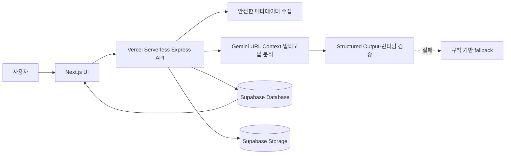

# Later

> 저장만 해두면, AI가 다시 찾기 좋게.

Later는 인터넷과 SNS에서 발견한 URL·텍스트·이미지를 한곳에 저장하면 Gemini가
한국어 제목, 핵심 요약, 대·소분류를 생성해 주는 AI 콘텐츠 인박스입니다. 저장한
자료는 검색과 카테고리로 다시 찾고, 다 본 항목은 스와이프로 아카이브할 수 있습니다.

- 운영 서비스: <https://later-theta-fawn.vercel.app>
- 데모 영상: <https://youtu.be/Gy70h9Bd3eM>
- 쇼케이스 자료: [`showcase/showcase.json`](showcase/showcase.json)

## 현재 제공 기능

- URL·일반 텍스트·JPEG·PNG·WebP 이미지 저장
- Gemini 기반 한국어 제목·핵심 요약·대분류·소분류 생성
- URL Context와 안전한 웹 메타데이터를 함께 활용한 원문 분석
- 이미지 inline data를 이용한 멀티모달 분석
- 제목·요약·원문·출처·카테고리 통합 검색
- 카테고리 필터, 펼침형 요약, 원문 링크
- 스와이프 아카이브, 복원·삭제
- YouTube·Instagram·X 등 회색 출처 아이콘과 사이트명 표시
- 설치 가능한 PWA
- Gemini 실패 시 규칙 기반 분류 fallback

리마인더 알림, 공유 시트, 로그인과 사용자별 데이터 격리는 디자인 및 후속 로드맵이며
현재 운영 버전에는 포함되지 않습니다.

## 처리 흐름



URL은 프로토콜·DNS·리다이렉트·응답 크기·Content-Type을 검증한 뒤 메타데이터를
수집합니다. Gemini에는 URL Context, 추출된 메타데이터, 사용자 텍스트 또는 이미지가
전달됩니다. 응답은 JSON Schema와 런타임 검증을 통과해야 저장됩니다.

Instagram 같은 플랫폼이 공개 페이지에 영상 데이터를 제공하지 않는 경우에는 공개
캡션과 메타데이터까지만 분석할 수 있습니다. 현재 구현은 로그인 우회나 비공개 콘텐츠
수집을 시도하지 않습니다.

## 기술 스택

| 영역 | 기술 |
| --- | --- |
| UI | Next.js 14 App Router, React, TypeScript, Tailwind CSS, next-pwa |
| API | Express 5, Vercel Serverless Function |
| AI | Gemini API, URL Context, Structured Output, 이미지 inline data |
| 데이터 | Supabase PostgreSQL, Supabase Storage |
| 검증 | Vitest, React Testing Library, Supertest, TypeScript, Next.js Build |

## 로컬 실행

```bash
npm install
npm run dev
```

별도 Express 개발 서버로 확인하려면 다음 명령을 함께 실행합니다.

```bash
npm run dev:server
```

환경변수 이름은 `.env.local.example`과 `server/.env.example`을 참고합니다. 실제 API
키와 service-role key는 저장소나 `NEXT_PUBLIC_*` 변수에 넣지 않습니다.

```env
SUPABASE_URL=
SUPABASE_SERVICE_ROLE_KEY=
SUPABASE_STORAGE_BUCKET=later-images
GEMINI_API_KEY=
GEMINI_MODEL=
NEXT_PUBLIC_API_BASE_URL=
```

운영 Vercel에서는 같은 origin의 `/api/[...path]`가 Express 앱을 실행하므로
`NEXT_PUBLIC_API_BASE_URL`을 비워 둘 수 있습니다.

## 데이터베이스

다음 migration을 순서대로 적용합니다.

```text
supabase/migrations/202607230001_add_item_images.sql
supabase/migrations/202607230002_add_item_summary.sql
supabase/migrations/202607260001_add_item_archive.sql
```

이미지는 5MB 이하만 허용하며 파일은 Storage, 메타데이터와 분석 결과는 `items`
테이블에 분리 저장합니다.

## 검증

```bash
npm test
npx tsc --noEmit
npm run build
git diff --check
```

`npm run lint`는 현재 ESLint 구성 파일이 없어 Next.js 초기 설정 프롬프트를 표시합니다.
CI용 lint를 사용하려면 먼저 저장소에 ESLint 구성을 명시적으로 추가해야 합니다.

## 문서

- [API 명세](api.md)
- [서비스 아키텍처](docs/SERVICE_ARCHITECTURE.md)
- [배포·검증 워크플로](docs/DEPLOYMENT_WORKFLOW.md)
- [AI 개발 워크플로](docs/AI_DEVELOPMENT_WORKFLOW.md)
- [쇼케이스 소개](docs/SHOWCASE.md)
- [제품 계획](docs/plan.md)
- [완료 현황](docs/checklist.md)
- [후속 백로그](docs/task.md)
