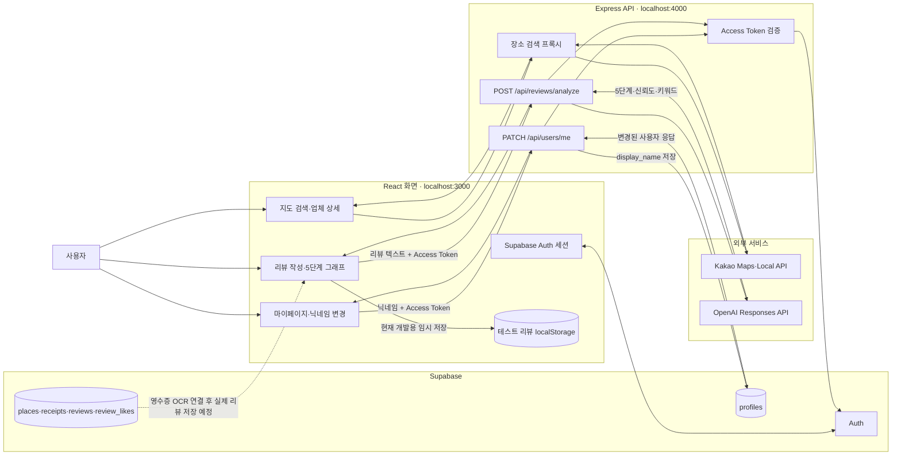

# Hub

네이버커넥트 AI Agent Challenge에서 진행 중인 네이버지도 기반 식당 리뷰 서비스입니다.

네이버지도와 카카오맵의 기존 리뷰 경험에서 느껴지는 문제를 줄이고, 지도 위 업체 정보와 영수증 인증 리뷰를 자연스럽게 결합하는 것을 목표로 합니다.

## 핵심 문제

- 네이버지도는 별점이 없어 식당 평판을 한눈에 파악하기 어렵다.
- 카카오맵은 방문 인증 없는 리뷰가 섞여 있어 신뢰 판단이 어렵다.
- 방문 인증 없는 리뷰는 실제 방문자의 평가인지 판단하기 어렵다.

## 핵심 기능

- 지도 기반 업체 탐색: 현재 위치 주변 식당 마커, 검색, 업체 요약 카드
- 영수증 OCR 인증 리뷰: 상호명과 결제일을 확인한 리뷰만 등록/집계
- 가중 별점: 좋아요 수와 90일 부스트를 반영하되 오래된 인기 리뷰 왜곡 방지
- 네이버지도형 업체 상세: 식당 정보, 대표 메뉴, 인증 리뷰, 리뷰 작성 흐름 제공

## 문서

- 기획서: [plan.md](./plan.md)
- 작업 분해: [checklist.md](./checklist.md)
- AI 작업 지침: [AGENTS.md](./AGENTS.md)
- 디자인 시스템: [docs/design-system.md](./docs/design-system.md)
- 개발 환경 결정: [docs/dev-setup.md](./docs/dev-setup.md)
- 디자인 Skill: [docs/skills/trusted-place-design/SKILL.md](./docs/skills/trusted-place-design/SKILL.md)
- 코드 검증 Skill: [docs/skills/code-verification/SKILL.md](./docs/skills/code-verification/SKILL.md)
- AI Agent Workflow: [docs/ai-workflow.md](./docs/ai-workflow.md)
- TDD 기록: [docs/tdd-nickname-normalization.md](./docs/tdd-nickname-normalization.md)

## 화면·서버·DB 데이터 흐름



### 현재 수직 슬라이스

닉네임 변경은 `마이페이지 입력 → Express 인증·검증 → Supabase profiles 저장 → 변경된 사용자 응답 → 화면 갱신`까지 한 바퀴로 동작한다. 리뷰 분석은 Express와 OpenAI까지 연결되어 있지만, 리뷰 최종 저장은 영수증 OCR 연결 전까지 개발용 `localStorage`를 사용한다.

## 현재 개발 상태

현재 저장소는 Create React App 기반 React 화면, Express API, Supabase Auth/Postgres, Kakao 지도·장소 검색, OpenAI 리뷰 분석이 연결된 MVP입니다. 영수증 이미지 사전검사, 인증 상태 UI, OCR 결과 검증 규칙, 비공개 Storage 마이그레이션까지 준비했으며 외부 OCR API 호출과 인증 리뷰의 DB 최종 저장은 다음 구현 범위입니다. 자세한 연결 순서는 [영수증 OCR 연결 준비](docs/ocr-integration.md)에서 확인할 수 있습니다.

## 실행

먼저 `.env.example`을 참고해 `.env.local`을 만들고 네이버 API 키를 넣습니다.

```env
REACT_APP_NAVER_MAP_NCP_KEY_ID=...
REACT_APP_API_BASE_URL=http://localhost:4000
NAVER_SEARCH_CLIENT_ID=...
NAVER_SEARCH_CLIENT_SECRET=...
```

개발 중에는 API 프록시 서버와 React 개발 서버를 각각 실행합니다.

```bash
npm install
npm run api
```

다른 터미널에서:

```bash
npm start
```

브라우저에서 <http://localhost:3000>을 엽니다.

프로덕션 빌드 확인은 다음 순서로 실행합니다.

```bash
npm run build
npm run serve
```

브라우저에서 <http://localhost:4000>을 엽니다.

## 커밋 규칙

- `feat`: 기능 추가
- `fix`: 버그 수정
- `refactor`: 구조 개선
- `docs`: 문서 수정
- `style`: UI/CSS 정리
- `test`: 테스트 추가/수정
