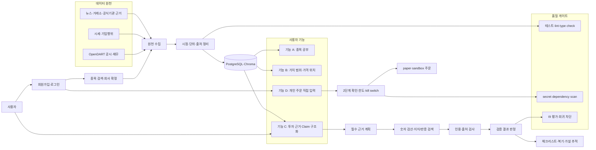

# hub

대학생 소액 투자자를 위한 **근거 검증 Agent**입니다.

종목을 추천하는 서비스가 아니라, 사용자가 세운 투자 근거가 공시·재무·시세·외부 근거와 맞는지 확인하는 프로젝트입니다. 자연어로 쓴 판단을 검증 가능한 Claim으로 나누고, 기준시점과 출처가 있는 근거로 판정하는 것을 목표로 합니다.

관련 문서:

- 전체 제품 범위: [docs/plan.md](docs/plan.md)
- 스킬 계약: [docs/skills.md](docs/skills.md)
- 구현 순서·상태: [docs/backlog.md](docs/backlog.md)
- 완료 조건: [docs/checklist.md](docs/checklist.md)
- 개발·안전 지침: [CLAUDE.md](CLAUDE.md) / [AGENTS.md](AGENTS.md)

## 다이어그램

## 계획 테이블

| 순서 | 작업 | 상태 | 이슈 |
|---:|---|:---:|---|
| T00 | 계약·저장소 품질 게이트 | 완료 | [#1](https://github.com/Batwan01/hub/issues/1) |
| T01 | Backend·DB 기반 | 완료 | [#1](https://github.com/Batwan01/hub/issues/1) |
| T02 | 종목·OpenDART 수집 | 완료 | [#2](https://github.com/Batwan01/hub/issues/2) |
| T03 | 시세·외부 근거 수집 | BLOCKED | [#3](https://github.com/Batwan01/hub/issues/3) |
| T04 | Temporal Integrity·재무 계산 | 대기 | [#4](https://github.com/Batwan01/hub/issues/4) |
| T05 | I9 평가 기반 | 대기 | [#5](https://github.com/Batwan01/hub/issues/5) |
| T06 | 기능 C 숫자 검증 | 대기 | [#6](https://github.com/Batwan01/hub/issues/6) |
| T07 | 기능 C RAG·반증·인용 | 대기 | [#7](https://github.com/Batwan01/hub/issues/7) |
| T08 | 기능 A 종목 공부 | 대기 | [#8](https://github.com/Batwan01/hub/issues/8) |
| T09 | 기능 B 가치·가격 위치 | 대기 | [#9](https://github.com/Batwan01/hub/issues/9) |
| T10 | 복기·가설 추적 | 대기 | [#10](https://github.com/Batwan01/hub/issues/10) |
| T11 | FastAPI·React 전체 통합 | 대기 | [#11](https://github.com/Batwan01/hub/issues/11) |
| T12 | I9 전체 평가·회귀 차단 | 대기 | [#12](https://github.com/Batwan01/hub/issues/12) |
| T13 | 배포·운영 | 대기 | [#13](https://github.com/Batwan01/hub/issues/13) |
| T14 | 기능 D 개인 주문 | 대기 | [#14](https://github.com/Batwan01/hub/issues/14) |
| T15 | 전체 릴리스 검증 | 대기 | [#15](https://github.com/Batwan01/hub/issues/15) |
