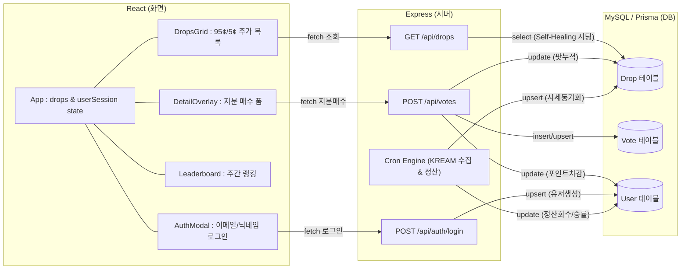

# 🎰 DropCast: 대안 자산 가격 예측 및 트레이딩 플랫폼

> **한정판 스니커즈, 스트릿웨어, TCG, 콜렉터블 등 대안 자산(Alternative Assets)의 미래 리셀가를 리스크 없이 가상 포인트로 예측하고, Polymarket 스타일의 실시간 주가(95¢/5¢) 트레이딩 및 집단지성을 시각화하는 웹 애플리케이션입니다.**

---

## 🔗 쇼케이스 제출 필수 링크 (Showcase Links)

| 항목 | 링크 |
| :--- | :--- |
| 🌐 **1) 서비스 배포 링크** | [https://dropcast-ten.vercel.app](https://dropcast-ten.vercel.app) |
| 🎬 **2) 시연 영상 링크** | [https://drive.google.com/file/d/1Z3qEqDU4mKhX0HT7dopBvQLEy8obTGp9/view?usp=drive_link](https://drive.google.com/file/d/1Z3qEqDU4mKhX0HT7dopBvQLEy8obTGp9/view?usp=drive_link) |
| 💻 **3) 소스 코드 링크** | [https://github.com/Qkdgodchl/hub](https://github.com/Qkdgodchl/hub) |
| 📄 **4) 프로젝트 소개 자료** | [https://github.com/Qkdgodchl/hub/blob/main/README.md](https://github.com/Qkdgodchl/hub/blob/main/README.md) (`showcase/showcase.json`) |

---

## 📐 1. 시스템 데이터 흐름 및 아키텍처 (Architecture Diagram)

프로젝트는 프론트엔드(React + Vite)와 백엔드(Express + Prisma ORM + MySQL)로 분리(Separated)되어 있으며, 다음과 같은 데이터 흐름을 가집니다.



---

## ⚡ 2. 핵심 기능 및 구현 특징 (Key Highlights)

### 📈 1) Polymarket 스타일 실시간 지분 트레이딩 마켓
- **주가(Share Price) = 확률(Probability)**: 유저들의 배팅액 비율(`totalUpStaked` vs `totalDownStaked`)에 따라 **$0.05 ~ $0.95 (5¢ ~ 95¢)** 범위에서 실시간 주가가 변동합니다.
- **Dynamic Odds**: 주가에 연동하여 배당률(예: `1.05x`, `20.0x`)이 자동 계산됩니다.
- **포인트 배팅 선택기**: 100, 200, 500, 1,000 pts 중 배팅액을 선택하여 지분을 매수합니다.

### ⏰ 2) 명확한 종가 기준 정산 엔진 (`settlementJob.js`)
- **발매 완료 상품 (RELEASED)**: 매주 일요일 23:59 KREAM 종가 기준 정산
- **발매 예정 상품 (UPCOMING)**: 발매 당일 23:59 KREAM 종가 기준 정산
- **정산 방식**: `종가 > 발매가` 시 UP 승리 / `종가 <= 발매가` 시 DOWN 승리. 승자에게 체결 배당률 기준 환급 포인트(`stakedPoints * odds`) 자동 지급 및 승률(`accuracyRate`) 업데이트.

### 🛡️ 3) 이미지 보안 정책 차단 완전 해결 (`referrerPolicy="no-referrer"`)
- 네이버/KREAM CDN(`kream-phinf.pstatic.net`)의 핫링크 방지(HTTP 403 Forbidden)를 백엔드 부하 없이 HTML `` 속성을 통해 100% 우회하여 원본 고화질 이미지를 정상 출력합니다.

### 🔄 4) DB Self-Healing (자동 복구 시스템)
- DB 초기화 또는 비어 있는 상태 발생 시, API 호출 시 자동으로 30개의 정제된 KREAM 랭킹 데이터를 시딩하여 0초 무장애 안정성을 보장합니다.

---

## 🛠️ 3. 기술 스택 (Tech Stack)

| 구분 | 사용 기술 및 라이브러리 |
| :--- | :--- |
| **Frontend** | React, TypeScript, Vite, Vanilla CSS (Brutalist Dark Design) |
| **Backend** | Node.js, Express.js, Prisma ORM, Node-Cron, Puppeteer |
| **Database** | MySQL (dropcast) |

---

## 🔌 4. 주요 REST API 명세 (API Endpoints)

| Method | Endpoint | 설명 |
| :--- | :--- | :--- |
| `GET` | `/api/drops` | 30개 실시간 랭킹 상품 및 Polymarket 주가/배당률 데이터 조회 |
| `POST` | `/api/votes` | Polymarket 지분 매수 및 포인트 차감 (`stakedPoints`, `direction`) |
| `POST` | `/api/auth/login` | 이메일/닉네임 입력 기반 간편 회원가입 및 로그인 |
| `GET` | `/api/auth/me/:userId` | 유저 잔여 포인트 및 승률 조회 |
| `POST` | `/api/admin/settlement-trigger` | [어드민] 수동 정산 및 포인트 환급 강제 실행 |
| `POST` | `/api/admin/kream-trigger` | [어드민] KREAM 랭킹 크롤러 수동 실행 |

---

## 📂 5. 프로젝트 디렉토리 구조

```text
/hub (Root)
├── backend/                  # 백엔드 (Express + Prisma ORM)
│   ├── src/
│   │   ├── controllers/      # API 컨트롤러 (auth, drop, vote, admin)
│   │   ├── cron/             # 주간/일일 정산 및 크롤링 배치 스케줄러
│   │   ├── crawler/          # Puppeteer 실시간 가격 크롤러
│   │   └── app.js            # Express 진입점
│   ├── prisma/
│   │   ├── schema.prisma     # MySQL DB 모델 스키마
│   │   └── seed.js           # 안정화 데이터 시드 스크립트
│
├── frontend/                 # 프론트엔드 (React + TypeScript + Vite)
│   ├── src/
│   │   ├── components/       # UI 컴포넌트 (DropsGrid, DetailOverlay, AuthModal 등)
│   │   ├── styles/           # Brutalist Dark CSS 디자인 시스템
│   │   ├── App.tsx           # 메인 애플리케이션 & 세션 상태
│   │   └── main.tsx          # TypeScript 진입점
```

---

## 🚀 6. 실행 방법 (Quick Start)

### Backend
```bash
cd backend
npm install
npx prisma db push
npm run dev
```

### Frontend
```bash
cd frontend
npm install
npm run dev
```
