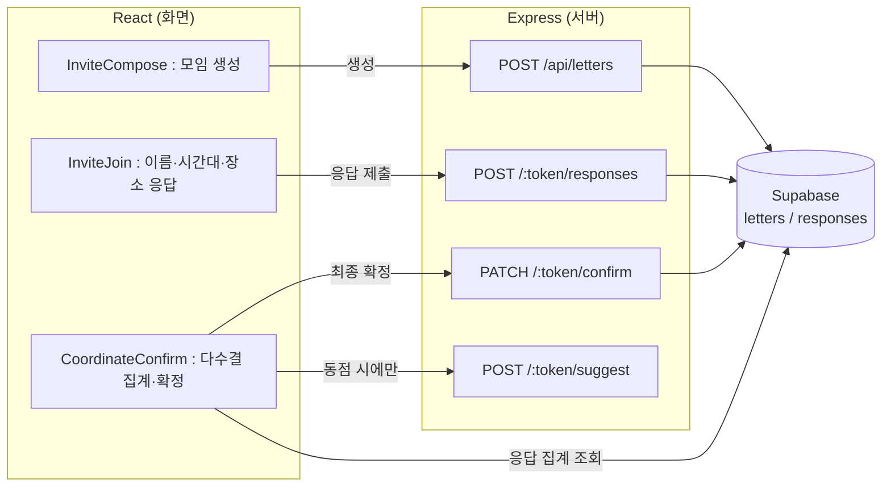
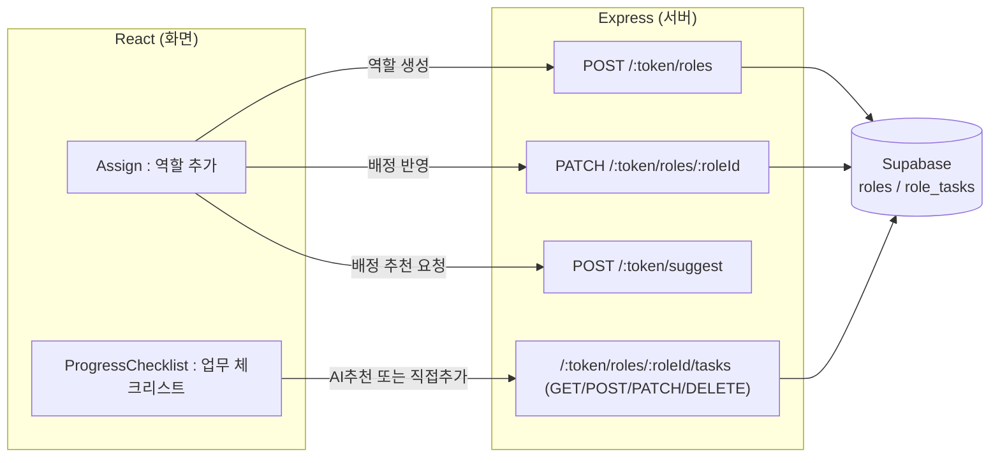

# Letter&Co

소모임 초대부터 시간대·장소·역할 조율까지 한 곳에서 끝내는 모임 조율 서비스입니다.

## 프로젝트 소개

카톡방·설문 앱·메모에 흩어져서 진행되던 모임 조율(시간·장소 정하기, 역할 나누기, 진행 상황 챙기기, 비용 정산)을 한 곳으로 모았습니다. 참여자들의 응답을 다수결로 집계해 시간·장소를 정하고, 동점일 때만 AI가 판단을 보탭니다. 필요한 역할은 참여자가 직접 만들고, 그 역할에 누가 어울릴지는 AI가 배정을 추천합니다.

> Naver Connect Foundation·서울대 주최 AI Agent Challenge 2026 개인 프로젝트 (N025 김민솔)

## 배포

| | URL |
|---|---|
| 프론트엔드 (Vercel) | https://letterandco.vercel.app |
| 백엔드 API (Render) | https://letterandco.onrender.com |

Render 무료 인스턴스는 일정 시간 요청이 없으면 슬립 상태가 되어 첫 요청 응답이 몇십 초 걸릴 수 있습니다.

## 주요 기능

- 모임을 만들고 참여 링크를 공유합니다.
- 참여자가 링크로 접속해 이름, 가능한 시간대, 선호 장소를 입력합니다.
- 시간·장소는 참여자 다수결로 정해지고, 동점일 때만 AI가 판단을 보탭니다.
- 필요한 역할은 참여자가 직접 만들고, 그 역할에 누가 어울릴지는 AI가 배정을 추천합니다.
- 진행 상황을 체크리스트로 관리하며, 항목은 AI 추천과 직접 추가 중 선택할 수 있습니다.
- 모임 종료 후 결산 리뷰와 비용 정산(지출 등록, 1/N 자동 분배)을 확인합니다.
- 응답 마감일을 정해두면 마감이 가까울 때 배너로 알려줍니다.
- 확정된 일정을 `.ics` 파일로 내려받아 캘린더 앱에 바로 추가할 수 있습니다.
- 정산 결과를 이미지로 저장해 공유할 수 있습니다.
- 공유 링크를 메신저에 붙여넣으면 모임명이 담긴 미리보기 카드로 표시됩니다.

## Tech Stack

### Frontend
- React 19.2 (Vite 8.1)
- React Router 7.18
- Howler.js 2.2 (사운드)
- 순수 CSS 변수 기반 디자인 시스템 (Tailwind 등 UI 라이브러리 미사용)
- Vitest 4.1 + Testing Library 16.3 (컴포넌트/유닛 테스트), oxlint 1.71 (lint)

### Backend
- Node.js (ESM) / Express 5.2
- @supabase/supabase-js 2.110, nanoid 6.0 (그룹 링크 토큰), cors 2.8, dotenv 17.4
- API 응답은 `{ data, error }` 형태로 고정 래핑
- `/api/letters` 하위 쓰기 요청은 자체 rate limit 미들웨어로 IP당 60초에 30회 제한 (Render 프록시 뒤에서도 실제 클라이언트 IP를 보도록 `trust proxy` 설정)

### Database
- Supabase (Postgres)
- 모임(letters) · 참여자 응답(responses) · 역할(roles) · 역할별 업무(role_tasks) · 결산(harvest_reviews) · 정산(expenses) 테이블
- 스키마 변경은 `server/migrations/`에 SQL 파일로 작성 후 Supabase 대시보드에서 수동 실행 (DB 비밀번호를 코드/env에 노출하지 않기 위함)

### AI
- Groq API (OpenAI 호환, llama-3.3-70b-versatile) — 무료로 사용 가능해 선택
- 시간·장소 동점 시 판단 보조, 역할 배정 추천에 사용. 호출은 사용자가 버튼을 눌렀을 때만 발생하며(자동 확정 없음), 실패 시 폴백과 10초 타임아웃 처리

### Deployment
- Vercel (프론트엔드)
- Render (백엔드)

## 아키텍처 / 데이터 흐름

기능별로 화면(React) · 서버(Express) · DB의 데이터 흐름을 정리했습니다.

### ① 모임 조율 흐름 (생성 → 응답 → 다수결 확정)

동점이 아니면 AI 호출 없이 참여자 응답만으로 확정됩니다. 최종 확정은 참여자 전원이 응답을 마쳐야 버튼이 활성화됩니다.

### ② 역할 배정 · 체크리스트 흐름

역할은 항상 참여자가 먼저 만들고, AI는 이미 만들어진 역할에 누가 어울릴지만 추천합니다. 추천이 실패해도 역할 목록 자체는 이미 있어 흐름이 막히지 않습니다.

## API 문서

엔드포인트별 요청/응답은 [`docs/api.md`](docs/api.md)에 정리되어 있습니다.

## 기획서

프로젝트 기획서·개발 task·주간 계획은 아래 링크에서 확인할 수 있습니다.

👉 [기획서·task·주간계획 보기](https://app.notion.com/p/angelnumb8r/3986bcbf066983a487bf81d1af95d0d4?source=copy_link)

## 나만의 워크플로우

4주간 반복해서 사용한 작업 순서를 정리했습니다. 버그 수정이든 신규 기능이든, 거의 모든 작업이 아래 흐름을 따랐습니다.

### 반복 워크플로우

| 단계 | 입력 | 작업 순서 | 확인 기준 | 결과물 |
|---|---|---|---|---|
| 1. 요구사항 파악 | 실제 사용 중 발견한 버그/스크린샷, 또는 새 기능 아이디어 | 요구사항을 코드/스키마 조사로 검증하고, 애매한 부분(예: "전원 응답"을 어떻게 판단할지, 다수결 집계 기준)은 구현 전에 먼저 질문하고 결정함 | 사람이 결정한 사항이 명확히 정리됐는지 | 결정 사항 요약 |
| 2. 작업 지시서 작성 | 결정된 요구사항 | Claude Code에 넘길 MD 지시서를 작성. plan mode·모델(opusplan)·effort(auto)를 항상 먼저 명시하고, 조사가 필요한 항목은 "구현 전에 먼저 보고" 하도록 못박음 | 지시서만 보고도 재현 가능한 수준으로 구체적인지 | 작업 지시서(MD) |
| 3. 구현 | 작업 지시서 | Claude Code가 plan mode로 계획을 먼저 제시 → 승인 후 구현 → 자체 테스트(lint/test/build) 실행 | 자동 테스트 통과 여부와 별개로, 실제 화면 재현 확인을 요구 | 코드 변경, 커밋 |
| 4. 검증 | 구현 결과 | 로컬에서 `npm run dev`로 서버·클라이언트를 직접 켜서 실제로 클릭·입력해보며 재현. 서버 콘솔 로그가 필요한 문제(추천 실패, DB 에러 등)는 로그 원문을 직접 확인 | "완료했다"는 보고를 그대로 믿지 않고, 재현 테스트 결과만 인정 | 검증 결과(정상/재발 확인) |
| 5. 반영 | 검증된 변경사항 | `git status`로 변경 확인 → 작업 단위로 커밋(`type: 한글 설명`) → push | 커밋 메시지가 실제 변경 내용과 일치하는지 | GitHub 커밋/PR |

### 문제가 생겼을 때 다시 확인한 단계

"완료했다"는 보고와 실제 상태가 다른 경우가 여러 번 있었습니다. 이때 아래 순서로 되짚었습니다.

1. **보고 내용과 실제 요청 내용을 대조**한다 — 다른 작업(예: 다수결 투표 구현)을 완료했다는 보고가, 정작 요청한 버그(은쟁반 장식, 결산 버튼)와는 무관한 경우가 있었음.
2. **AI가 스스로 판단해서 요청과 다르게 처리한 부분이 없는지 확인**한다 — 예: "장식 요소를 복구해달라"는 요청을, AI가 "디자인 방향과 안 맞아 의도적으로 제거된 것"이라 임의로 판단해 복구하지 않은 사례가 있었음. 이후 지시서에 "판단이 필요하면 임의로 결정하지 말고 먼저 물어볼 것"을 명시함.
3. **근본 원인을 추측이 아니라 로그로 확인**한다 — 예: Supabase 컬럼을 추가했는데도 500 에러가 반복된 사례는, 실제로는 PostgREST의 스키마 캐시가 자동 갱신되지 않는 문제였고, `NOTIFY pgrst, 'reload schema';`로 해결함. 브라우저 콘솔·서버 로그를 직접 보지 않고서는 원인을 알 수 없는 경우가 많았음.
4. **같은 문제가 재발했는지 목록으로 관리**한다 — 한 번 지시했다고 끝내지 않고, 재확인 지시서를 별도로 만들어 "이전에도 요청했는데 재발한 항목"임을 명시하고 우선순위를 높여 다시 전달함.

## Agent 협업 과정

기획부터 배포까지, 단계별로 어떤 도구를 썼고 어떤 결정을 사람이 내렸는지 정리했습니다.

| 단계 | 사용한 도구 | 사람이 결정한 것 | AI(Agent/Skill)가 수행한 것 |
|---|---|---|---|
| 기획 | 대화 기반 요구사항 정리 | 4주 로드맵, 주차별 우선순위, 범위 축소 결정(예: 결산 기능 제외 후 재포함, 장소 추천을 위치 기반 자동계산 대신 텍스트 후보+AI 추천으로 축소) | 결정된 우선순위를 바탕으로 작업 목록 초안 정리 |
| 설계 | 설계 문서화 Skill | 테이블 스키마와 화면 데이터 요구사항을 구현 전에 검토·승인. 조율 로직을 "누구나 즉시 확정" → "참여자 다수결 + 동점 시 AI 보조"로, 역할 추천을 "AI가 역할 생성" → "사람이 역할 생성 + AI는 배정만 추천"으로 바꾸는 구조적 판단을 직접 내림 | 스키마 후보와 화면 요구사항 문서 초안 제안 |
| 구현 | Claude Code (plan mode, opusplan, effort auto) | 매 작업마다 구현 계획을 사전에 검토·승인. DB를 직접 조작하는 작업(마이그레이션 실행)은 AI가 하지 못하게 하고, SQL 파일 생성까지만 맡김 | 계획에 따른 실제 코드 작성, 자체 lint/test/build 실행 |
| 검증 | feature-verifier 에이전트 + 로컬 재현 테스트 | 코드 리뷰가 아니라 실제 클릭 재현으로만 완료를 인정. 서버 로그 원문 확인을 요구 | 코드 수정 권한 없이 구현이 API·DB에 실제로 반영됐는지만 검증 |
| 배포 | Render, Vercel 콘솔 | 환경변수·CORS·브랜치 설정 값 결정, 리스크가 있는 작업(예: push된 브랜치에 force-push로 커밋 합치기)은 지양하기로 판단 | 배포 설정 가이드, CORS/스키마 캐시/SPA 라우팅 문제 진단 지원 |

역할 구분 원칙은 한 줄로 요약하면: **결정은 사람이, 실행과 초안 제안은 AI가.** 특히 AI의 "완료 보고"는 검증 완료가 아니라 검증이 필요한 하나의 입력으로 다뤘습니다.
