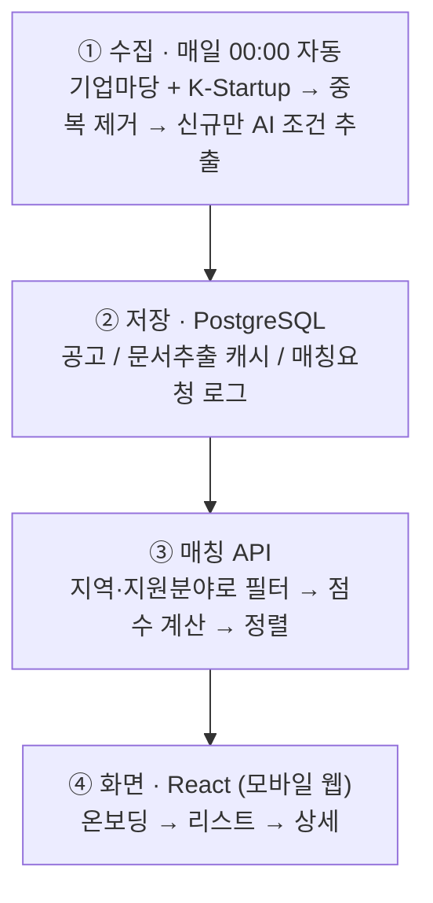

# 소상공인 정부 지원금 큐레이터

정부 지원금 정보가 여러 기관 사이트에 흩어져 있어, 소상공인이 자신에게 맞는
지원금을 한눈에 파악하기 어려운 문제를 해결하는 서비스입니다.

**[데모: hub.syd348.com](https://hub.syd348.com)** · 개인 프로젝트 · 4주 · 이슈 42개 · PR 61개 ·
수집 공고 1,500건+ · 지역정보 구조화 98%

## 문제점

- 지원금 공고가 정부24 · 소상공인시장진흥공단 · 지자체 · 기업마당 등 사이트마다 흩어져 있어,
  조건에 맞는 지원금이 있는지조차 파악하기 어렵다.
- 사이트마다 형식이 달라 조건 비교가 전부 수작업이다.
- 실제 수집 데이터로 확인한 문제: 업종 정보는 6.2%만 확보 가능해 매칭 기준으로 신뢰할 수
  없었다 → 결측률 0%인 "지원분야"로 매칭 기준을 전환했다.

## 기술 스택

| 영역 | 스택 | 비고 |
|------|------|------|
| 프론트엔드 | React 19 + TypeScript + Vite | `src/` |
| 백엔드 | Express 4 + TypeScript | `server/` |
| 공유 타입 | TypeScript | `shared/` |
| DB | PostgreSQL (Supabase) | |
| 크롤러 | Node.js + 기업마당 Open API | 스크래핑이 아닌 공식 REST API 사용 |
| AI 추출 | Gemini | 첨부문서(PDF/HWP/HWPX)에서 조건 추출, 무료 티어 하루 20건 |
| 스케줄링 | GitHub Actions cron | 매일 00:00 UTC 자동 수집 |
| 배포 | GitHub Pages(client) · Render(server) | main push마다 자동 배포 |
| 테스트/린트 | Vitest · oxlint | |

## 기술 흐름도



## 개선해야 할 점

- 관심 지원금 저장·마감 알림 기능 없음
- 서비스 내 신청서 작성 미지원 — 신청은 외부 기관 사이트로 연결만 함
- Gemini 무료 티어 한도(하루 20건)로 신규 공고에만 AI 추출을 적용, 기존 공고는 소급 처리하지
  못함
- 데이터 소스가 기업마당·K-Startup 2종뿐 — 소진공·지자체 공고는 미착수

## 개선 방향

- 상세 화면의 "신청" 버튼은 다음 단계만 교체하면 자체 신청서 작성 기능을 붙일 수 있도록 이미
  설계함
- AI 추출은 유료 티어 전환 또는 배치 처리 최적화로 기존 공고까지 소급 적용
- 후순위 데이터 소스(소진공, 지자체) 순차 추가
- 관심 지원금 저장·마감 알림을 다음 단계 기능으로 명시적으로 예정

## 문서 지도

| 파일 | 역할 |
|------|------|
| [`CONTEXT.md`](./CONTEXT.md) | 제품 언어·현재 기술스택/제약을 빠르게 파악 |
| [`AGENTS.md`](./AGENTS.md) | 작업 유형별 확인할 문서, 코딩·커밋·PR 규칙 (`CLAUDE.md`는 이 파일의 심볼릭 링크) |
| [`docs/plan.md`](./docs/plan.md) | 기획서 — 문제 정의, MVP 범위, 화면 흐름 (제품 스펙 단일 소스) |
| [`docs/user-stories.md`](./docs/user-stories.md) | Epic·유저 스토리·인수 조건 |
| [`docs/week2_plan.md`](./docs/week2_plan.md) / [`docs/week3_plan.md`](./docs/week3_plan.md) | 주차별 계획·이슈 진행 현황 (유일한 상태 소스) |
| [`prototype/gov_subsidy_home_wireframe.html`](./prototype/gov_subsidy_home_wireframe.html) | UI/UX 와이어프레임 |
| [`.cursor/skills/gov-subsidy-design/`](./.cursor/skills/gov-subsidy-design/) | 디자인 구현 Skill |
| [`.cursor/skills/issue-workflow/`](./.cursor/skills/issue-workflow/) | 이슈 계획→구현→PR 워크플로우 Skill |
| [`docs/print/`](./docs/print/) | 부스 전시 자료 — A3 포스터 2종(기획·주제 / AI 워크플로우), 모니터 자동 시연·루프 HTML |

## 로컬 실행

```bash
git clone <repo-url>
cd hub
npm install
cp .env.example .env
npm run dev          # client + server 동시 실행
```

- API 헬스체크: `GET http://localhost:3001/api/health`
- 지원금 목록: `GET http://localhost:3001/api/subsidies`

## 스크립트

| 명령 | 설명 |
|------|------|
| `npm run dev` | 클라이언트 + 서버 동시 실행 |
| `npm run dev:client` / `npm run dev:server` | 각각 단독 실행 |
| `npm run build` | 서버 + 클라이언트 빌드 |
| `npm test` | 전체 워크스페이스 테스트 |
| `npm run lint` | oxlint |
| `npm run run -w @hub/crawler` | 기업마당 크롤러 수동 실행 |
