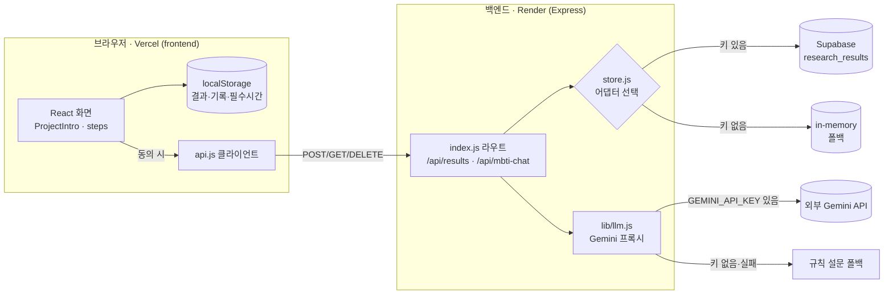

# MBTI 기반 공부법 및 스트레스 관리 웹앱

사용자가 외부 공식 MBTI 평가에서 받은 결과를 직접 입력하거나 공식 결과 없이 진행하고, 짧은 공부습관·스트레스 자체 점검을 통해 오늘 실행할 학습 전략과 공부·회복 루틴을 제안하는 웹앱입니다. task/state-only baseline과 MBTI 힌트 추가 결과를 함께 기록해 MBTI가 실제로 추가 가치를 제공하는지 검증합니다.

MBTI는 사람을 고정적으로 판단하는 기준이 아닙니다. 이 프로젝트는 유형명만으로 결과를 만들지 않고, 사용자의 실제 응답을 행동지표로 정리해 인지과학 기반 학습 전략과 연결합니다. 스트레스 관련 기능은 생활관리 관점의 피로 신호와 회복 루틴만 다룹니다. 현재 점수와 가중치는 검증된 심리검사나 진단 결과가 아니라 설명 가능한 규칙 기반 프로토타입의 추천 신호입니다.

## 핵심 기능

1. 성향·상태 점검  
   공식 MBTI 결과 직접 입력 또는 공식 결과 없음 경로를 선택하고, 독자적인 공부·스트레스 문항으로 행동·상태를 점검합니다.
2. 인지과학 학습법 매칭  
   인출 연습, 분산 학습, 자기설명, 교차 학습, 오답 분석, 환경 설계, 짧은 집중 블록 중 사용자 응답에 맞는 학습법을 추천합니다.
3. 오늘의 공부·회복 루틴  
   결과를 20~30분 공부 루틴과 짧은 회복 루틴으로 바꾸고, 완료 여부와 집중도·피로도를 저장합니다.
4. 추천 검증 피드백
   추천의 적합도·이해도·실행 가능성을 분리해 평가합니다. 만족도와 실제 실행·학습성과를 같은 정확도로 취급하지 않습니다.
5. baseline 비교
   공식 결과가 있으면 task/state-only 추천과 MBTI 힌트 추가 추천을 별도로 산출해 순위 변화만 기록합니다. 변화가 곧 효과 향상을 뜻하지는 않습니다.

공부습관 자체 점검에서 표시하는 4축 코드는 **공식 MBTI 판정이 아닌 탐색 신호**이며 현재 추천 가중치에 자동으로 사용하지 않습니다.

## 제품 단계

- **현재 MVP:** 공식 결과 직접 입력, 독자 탐색 신호, baseline 비교, 규칙 기반 추천, 실천 카드와 로컬 피드백
- **검증 베타:** 문헌 근거 카탈로그, 알고리즘 버전, 적합도·이해도·실행 가능성, 결측·NMAR 분석
- **동의 기반 베타:** 개인정보·동의·삭제·보존·보안 게이트를 통과한 뒤 로그인과 서버 저장 검토
- **장기 확장:** 학업·논문·연구 과업 가이드 및 공식 대학 플랫폼/OpenAI 연동을 조건부 검토

“빅데이터”는 현재 기능이 아니라 장기 검증 전략입니다. 데이터 양보다 측정 기준, 비교 대상, 이탈과 결측, 개인정보 경계를 먼저 설계합니다.

## 기술 스택

- Vite
- React
- JavaScript
- CSS
- localStorage

현재 프런트 `package.json` 기준의 실제 기술 스택만 정리했습니다. 연구 데이터 저장·LLM 프록시는 아래 백엔드(Express)에서 처리합니다.

## 아키텍처

화면(프런트) → 백엔드 프록시 → 저장소/외부 LLM 의 실제 데이터 흐름입니다. 백엔드는 환경변수 유무에 따라 저장소(Supabase↔in-memory)와 LLM(Gemini↔규칙 폴백)을 자동 분기합니다. 개인정보·대화 원문은 연구 저장 경로로 흐르지 않습니다(ADR-001/008).



- **저장 경로(비식별):** 결과 화면 동의 → `POST /api/results` → `store.js`가 Supabase(`research_results`) 또는 in-memory에 비식별 파생값만 저장. 컬럼·쿼리 설명은 [docs/db-notes.md](docs/db-notes.md).
- **LLM 경로(동의 원문 한정):** 간이 MBTI 추정 채팅만 `POST /api/mbti-chat`로 대화 원문을 Gemini에 전달(저장 안 함). 설계는 [docs/AI_Pipeline_Design.md](docs/AI_Pipeline_Design.md).

## 공개 데모

- 공개 URL: https://mbti-study-routine-demo.byounggwan94.chatgpt.site

방문자는 별도의 포트폴리오식 소개 페이지를 거치지 않고, 첫 화면에서 바로 MBTI 선택과 공부·스트레스 설문 흐름을 시작할 수 있습니다.

## 프로젝트 문서

| 문서 | 설명 |
| --- | --- |
| [docs/plan.md](docs/plan.md) | 최종 기획서, 문제 정의, 사용자 흐름, MVP 범위 |
| [docs/checklist.md](docs/checklist.md) | MVP 구현 현황과 검증 베타·장기 확장 게이트 |
| [docs/evidence-data-roadmap.md](docs/evidence-data-roadmap.md) | 문헌 근거, 측정, NMAR, 개인정보, 알고리즘 검증 기준 |
| [GitHub Wiki](https://github.com/bricepark94/hub/wiki) | 발표·공유용 프로젝트 문서 허브 |

## 실행 방법

```bash
npm install
npm run dev
```

브라우저에서 Vite가 안내하는 로컬 주소로 접속하면 프로토타입을 확인할 수 있습니다.

## 검증

```bash
npm run build
npm run lint
```

현재 데모는 새로고침 후 저장된 결과를 이어볼 수 있도록 localStorage 결과를 복구하고, 깨진 저장값이나 누락 응답이 있어도 앱 흐름이 멈추지 않도록 보강했습니다.

## MVP 포함 범위

- MBTI 선택 또는 모름 선택
- 공식 MBTI 결과 입력 출처 구분
- 공식 판정이 아닌 공부습관 기반 4축 탐색 신호
- 공부 성향 설문
- 스트레스 반응 설문
- 행동지표 기반 결과 요약
- 추천 공부법 TOP 3와 추천 이유
- 피해야 할 공부 방식
- 피로 신호와 회복 루틴
- 오늘의 20~30분 실천 카드
- 완료 여부, 집중도, 피로도 localStorage 저장
- 추천 적합도와 선택 의견 localStorage 저장
- 적합도·이해도·실행 가능성 분리 저장
- task/state-only와 MBTI 힌트 추가 추천 동시 저장
- 앱에서 결과·루틴 기록·추천 평가 일괄 삭제

## MVP 제외 범위

- 회원가입
- AI API
- 의학적 판단
- 성적 예측
- 커뮤니티
- 캘린더/알림
- 결제
- 사용자 응답의 Git repository 저장
- 검증되지 않은 빅데이터·AI 정확도 주장
- 비공식 학교 플랫폼 연동
- 공식 MBTI 문항의 무단 복제·번역·표현 변경
- 자체 탐색 코드를 공식 MBTI 결과로 표시

로그인, 서버 저장, OpenAI 기능, 에브리타임·학교 사이트 부가기능은 현재 MVP에 포함하지 않습니다. 구체적 사용자 가치, 공식 연동 방식, 데이터 거버넌스가 확인된 뒤 다음 단계에서 판단합니다.

## 표현 원칙

- MBTI는 학습 선호를 탐색하는 출발점으로만 사용합니다.
- 결과는 "그럴 가능성이 있습니다", "이 방식이 더 편할 수 있습니다", "먼저 시도해볼 수 있습니다"처럼 가능성 중심으로 표현합니다.
- 스트레스 관련 결과는 피로 신호와 회복 루틴을 다루는 생활관리 기능으로 제한합니다.
- 점수는 능력·우열·정상 여부를 평가하지 않고 추천 방향을 정하는 신호로만 사용합니다.
- 문헌 근거와 제품 사용 데이터를 분리하고, 검증되지 않은 정확도를 주장하지 않습니다.
- 사용자 응답과 자유의견을 코드 저장소나 GitHub issue에 저장하지 않습니다.
- 사용자 만족도는 알고리즘 정확도나 학습효과와 동일하지 않습니다.
- 선호에 맞춘 공부법이 더 효과적이라는 learning-styles 가정을 기본값으로 사용하지 않습니다.
- MBTI의 추가 가치는 task/state-only baseline 대비 증분타당도와 조절효과로 검증합니다.

## 상표 및 평가 도구 고지

이 프로젝트는 공식 MBTI 평가를 제공·복제하지 않으며 The Myers-Briggs Company 또는 Myers & Briggs Foundation과 제휴하지 않습니다. MBTI와 Myers-Briggs Type Indicator는 해당 권리자의 상표 또는 등록상표입니다. 공식 평가 도입은 라이선스·사용 자격·해석 절차를 확인한 별도 단계에서만 검토합니다.
