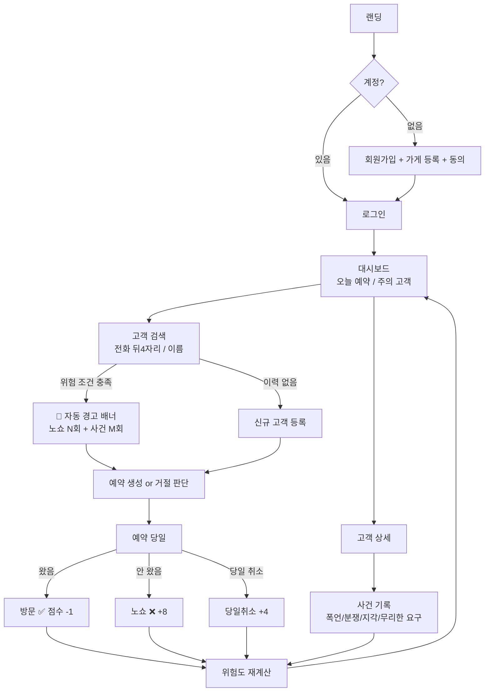

# 📦 ShowUp 기획서

**ShowUp: 소상공인을 위한 노쇼·악성 고객 이력 관리 및 위험도 경고 웹서비스**

- 프로젝트 기간: **2026-07-07 ~ 2026-07-30** (3주 + 2일)
- 프론트엔드: **React** (Vite + TypeScript)
- 진행 방식: **Hermes Agent 4세션** (프론트 / 백엔드 / 시큐리티 / 리드)
- 세션별 모델 (Ollama 연결):

| 세션 | 모델 |
|------|------|
| **리드** | GLM 5.2 |
| **프론트** | Kimi K2.7 Code |
| **백엔드** | Kimi K2.7 Code |
| **시큐리티** | GPT-OSS 120B |

---

## 1. 문제 정의 (한 문장)

> **예약제로 운영하는 소상공인(카페·식당·미용실·공방 사장님)이, 노쇼·상습 지각·폭언·환불 분쟁 같은 문제 고객을 반복해서 겪으면서도, 어떤 고객이 위험한지 기록하고 예약 전에 확인할 수단이 없어 같은 피해를 계속 반복한다.**

- 해결책이 아니라 불편으로 정의
- 기존 예약 앱(네이버예약, 캐치테이블)은 예약 접수에 집중 — **문제 고객 이력 관리·사전 경고** 기능 부재가 시장 공백
- 노쇼만이 아니라 **악성 행동 전반**을 기록 대상으로 확장 (v3 방향 전환)

---

## 2. 사용자 시나리오

### 시나리오 A — 사장님 (핵심)

1. 전화로 예약이 들어온다. 이름과 전화번호를 받는다
2. ShowUp에 전화번호 뒤 4자리를 입력해 검색한다
3. **🚨 "위험 고객: 노쇼 3회 + 응대 사건 1회"** 경고 배너가 자동으로 뜬다
4. 사장님은 예약금을 요청하거나, 정중히 거절하거나, 전날 확인 전화를 하기로 판단한다 (자동 차단 아님 — 최종 판단은 사장님)
5. 예약 당일: 손님이 오면 `방문` / 안 오면 `노쇼` 버튼 하나로 기록
6. 손님이 매장에서 폭언·무리한 요구를 하면, 고객 상세에서 **사건(incident) 기록** — 사전 정의 카테고리 선택 + 사실 메모
7. 월말에 노쇼·사건 통계를 보고 예약 정책을 조정한다

### 시나리오 B — 고객 (Phase 2, 동의 기반)

1. 고객이 본인 전화번호로 인증하고 자기 이력을 조회한다 (열람권)
2. 허위 또는 부정확한 기록이 있다고 판단하면 정정·삭제 요청 또는 이의제기를 접수한다
3. 사장님은 요청 내역을 확인하고 내부 기록을 수정하거나 유지 사유를 남긴다

> Phase 2는 고객용 서비스 확장이 아니라, 고객 권리 보장을 위한 최소 기능이다.

---

## 3. 핵심 기능 — MVP 2개 확정

| # | 기능 | 필수성 | 적합성 |
|---|------|--------|--------|
| **1** | **고객 이벤트 기록** — 예약 상태(방문/노쇼/취소) 원터치 + 악성 행동 사건 기록(카테고리+메모) | 기록 없으면 서비스가 안 돌아감 | 문제의 원인 데이터 축적 |
| **2** | **위험도 조회 + 자동 경고** — 전화 뒤 4자리/이름 검색, 위험도 3등급 표시, 임계치 초과 시 강제 경고 배너 | 조회·경고 없으면 기록이 무의미 | "예약 받기 전 확인" = 문제 정의 직결 |

나머지 전부 확장: 통계 차트(Phase 1.5), 고객 본인 조회·정정·삭제 요청·이의제기(Phase 2), 외부 예약 플랫폼 연동(Phase 3)

---

## 4. 이벤트·위험도 설계 (v3 핵심)

### 4.1 이벤트 타입과 가중치

| 이벤트 | 기록 방법 | 점수 |
|--------|----------|------|
| 노쇼 (no-show) | 예약 상태 버튼 | +8 |
| 당일 취소 (late-cancel) | 예약 상태 버튼 (당일 취소 시 자동 구분) | +4 |
| 상습 지각 30분+ (late) | 사건 기록 | +2 |
| 폭언·위협·무례 (abuse) | 사건 기록 | +10 |
| 환불·결제 분쟁 (dispute) | 사건 기록 | +6 |
| 무리한 요구 반복 (unreasonable) | 사건 기록 | +4 |
| 정상 방문 (visited) | 예약 상태 버튼 | **−1 (회복)** |

- 정상 방문 시 점수 차감 → **개선된 고객은 등급이 내려감** (낙인 방지, 총점 최소 0)
- 최근 30일 내 노쇼 존재 시 +5 (최신성 가중)

### 4.2 위험도 등급

```
총점 0–23  → 안심 (low)    초록
총점 24–39 → 주의 (medium) 노랑   ← 노쇼 3회(24점)부터
총점 40+   → 위험 (high)   빨강   ← 노쇼 5회(40점)부터

특별 규칙:
- abuse 1회+ → 최소 '주의' 보장 (폭언·위협은 노쇼와 질적으로 다른 사안)
```

### 4.3 자동 경고 시스템 (임계치 알림)

| 조건 | 동작 |
|------|------|
| 노쇼 3회 이상 **또는** abuse 1회 이상 | 검색 결과·예약 생성 화면 상단에 **🚨 경고 배너 강제 표시** |
| 위험(high) 등급 | 대시보드 "주의 고객" 목록에 자동 노출 |
| 배너 내용 | "노쇼 3회 · 최근 사건 1회 — 예약금 요청 또는 사전 확인을 권장합니다" |

> 업계 관행 조사 반영: 병원·미용실 예약 시스템은 대부분 "2회 노쇼 시 경고, 3회 시 예약 제한"을 쓴다. ShowUp은 업계보다 **완화된 3회 기준 + 제한 대신 경고·판단 위임** — 참고 지표 성격을 강화해 낙인 리스크를 줄이고, 법적으로 안전하며 사장님 재량 보존.

### 4.4 법적 가드레일 (악성 기록 확장에 따른 필수 설계)

| 리스크 | 대응 |
|--------|------|
| 주관적 비방 메모 → 명예훼손 소지 | 사건은 **사전 정의 카테고리 선택식**. 메모는 "사실만 기록" 가이드 문구 표시 |
| 제3자 제공 → 개인정보보호법 제17조 | 가게 간 공유 **없음**. 가게 내부 참고용 한정 |
| 고객 권리 | 열람·정정·삭제 요청 대응 (Phase 2 본인 조회 = 제35조 열람권) |
| 표현 | "블랙리스트" 용어 전면 금지. "고객 이력" / "참고 지표"로 통일 |

---

## 5. 화면 흐름 (User Flow)



---

## 6. 화면 목록 (IA)

```
/                  랜딩
/login             로그인
/register          회원가입 + 가게 등록 + 개인정보 동의
/dashboard         오늘 예약 + 주의 고객 목록
/customers         고객 검색 + 목록          ← 핵심 기능 2
/customers/:id     고객 상세: 이벤트 타임라인, 위험도, 사건 기록 버튼
/reservations      예약 목록 + 상태 원터치    ← 핵심 기능 1
/reservations/new  예약 생성 (위험 고객이면 경고 배너)
/stats             월별 통계 (Phase 1.5)
/privacy, /terms   법적 필수 페이지
/me                고객 본인 조회 (Phase 2)
```

**MVP 범위 확정**

| 구분 | 화면 |
|------|------|
| MVP 필수 | `/login` `/register` `/dashboard` `/customers` `/customers/:id` `/reservations` `/reservations/new` |
| 필수 문서 (최소 정적 페이지) | `/privacy` `/terms` |
| MVP 제외 | `/stats` (Phase 1.5) · `/me` (Phase 2) |

## 7. 와이어프레임 (텍스트 스펙)

### 고객 검색 (가장 중요)
```
┌─────────────────────────────────┐
│ 🔍 [ 전화 뒤 4자리 / 이름      ] │  ← 300ms debounce
├─────────────────────────────────┤
│ 🚨 위험: 노쇼 3회 · 응대 사건 1회 │  ← 임계치 초과 시 강제 배너
│    예약금 요청/사전 확인 권장     │
├─────────────────────────────────┤
│ 김철수  010-****-1234  [위험]    │
│ 이영희  010-****-5678  [안심]    │
├─────────────────────────────────┤
│         [ + 신규 고객 등록 ]      │
└─────────────────────────────────┘
```

> **뒤 4자리 충돌 처리**: 같은 끝자리 고객이 여러 명일 수 있으므로 검색 결과는 항상 **후보 목록**으로 표시한다. 동명이인/동일 끝자리 가능성이 있으므로 이름 + 마스킹 번호를 함께 확인 후 선택한다. 단일 자동 매칭 금지.

### 고객 상세 — 사건 기록
```
┌─────────────────────────────────┐
│ 김철수 [위험 16점] (참고용 지표)  │
│ ── 이벤트 타임라인 ──            │
│ 7/05 ❌ 노쇼                     │
│ 6/28 ⚠️ 폭언·무례 "환불 요구하며…"│
│ 6/10 ✅ 방문                     │
│ [ + 사건 기록 ]                  │
│   └ 카테고리 선택(5종) + 사실 메모 │
│     "사실만 기록해주세요" 안내     │
└─────────────────────────────────┘
```

- **Mobile-First**: 하단 네비 4탭, 터치 타겟 44px+

---

## 8. 기술 설계

### 스택
| 영역 | 선택 |
|------|------|
| 프론트 | **React** + Vite + TypeScript + Tailwind CSS |
| 상태 | TanStack Query(서버) / Zustand(UI) — 서버 데이터는 Zustand 금지 |
| 폼 | React Hook Form + Zod |
| 백엔드 | Firebase: Auth / Firestore / Cloud Functions / Hosting |
| 결제(P2) | 토스페이먼츠 |

> **백엔드 Firebase 확정** — Express 등 자체 서버 구축 없음. 이유: 인증·가게별 데이터 격리가 핵심인데 Firestore Security Rules가 이에 정확히 부합, 배포 빠름, 3주 기간에 서버+DB+Auth 직접 구축은 범위 초과.

### Firestore 데이터 모델
```
stores/{storeId}
  ownerUid, name, category, createdAt

stores/{storeId}/customers/{customerId}
  name, phone(원본), phoneLast4(검색용), createdAt
  riskStats: {
    totalVisits, noShowCount, lateCancelCount,
    incidentCounts: { abuse, dispute, late, unreasonable },
    score, lastNoShowAt, updatedAt
  }   ← 비정규화 캐시, Cloud Function이 갱신 (검색 1회 = 읽기 1회)

stores/{storeId}/reservations/{resId}
  customerId, date, time,
  status: pending → confirmed → visited | noShow | cancelled,
  cancelledSameDay: boolean (cancelled일 때 당일 취소 여부 — lateCancel +4 판정용),
  memo, createdAt

stores/{storeId}/customers/{customerId}/incidents/{incidentId}
  type: 'abuse' | 'dispute' | 'late' | 'unreasonable',
  memo(사실 기록), occurredAt, createdAt
```

### riskStats 갱신 트리거

```
Cloud Function 트리거 (확정):
- reservations/{resId}.status → visited | noShow | cancelled 로 변경될 때
- incidents/{incidentId} 생성/수정/삭제될 때
→ 해당 customer의 riskStats 재계산 (§4 가중치 로직)
```

> **MVP 단계 대안**: Cloud Function이 초기 부담이면 `src/utils/risk.ts` 순수 함수로 계산 로직을 먼저 구현하고 이벤트 기록 시점에 클라이언트에서 riskStats를 갱신, 이후 동일 로직을 Function으로 이관한다. 계산 로직은 어느 쪽이든 **한 곳(risk.ts)에만** 존재.

### 보안 규칙 (가게 격리 — 서버 강제)
```
match /stores/{storeId}/{document=**} {
  allow read, write: if request.auth != null
    && get(/databases/$(database)/documents/stores/$(storeId)).data.ownerUid == request.auth.uid;
}
```

### 전화번호 처리
- 원본 저장 + `phoneLast4` 검색 필드 / 화면 표시 항상 마스킹 `010-****-1234` / 삭제 요청 시 즉시 파기

---

## 9. 일정 (7/07 → 7/30, 3주 + 2일)

```
Week 1  7/07–7/13  기반: 세팅·인증·가게등록·레이아웃·보안규칙
Week 2  7/14–7/20  핵심 1: 고객 CRUD·검색·예약·이벤트(노쇼/사건) 기록
Week 3  7/21–7/27  핵심 2: 위험도·경고 배너·대시보드·품질(QA)
막판    7/28–7/30  배포·통합 QA·문서·발표 준비
```

Phase 1.5(통계 차트)·Phase 2(본인 조회/정정·삭제 요청/이의제기)·Phase 3(플랫폼 연동)는 7/30 이후.

---

## 10. Hermes Agent 세션 구조 (4 lanes)

> **이관 배경**: Claude 구독 만료 + Codex 정지 이슈로 Ollama 기반 모델들을 Hermes Agent에 연결하여 기존 Conductor 기반 세션 구조를 Hermes Agent로 이관. 같은 default 프로필에서 채팅 세션 4개를 열어 역할별로 운영.

| 세션 | 소유 영역 | 책임 | 모델 |
|------|----------|------|------|
| **리드** | 기획·통합·배포 | plan/checklist 관리, PR 리뷰·머지, 통합 QA, Hosting 배포, 발표 문서 | GLM 5.2 |
| **프론트** | `src/` UI 전부 | 페이지·컴포넌트·폼·라우팅·상태관리·모바일 QA | Kimi K2.7 Code |
| **백엔드** | Firebase 설정·Functions | Firestore 모델, riskStats 갱신 Function, 시드 데이터, 인덱스 | Kimi K2.7 Code |
| **시큐리티** | 규칙·개인정보 | Security Rules 작성·침투 테스트(에뮬레이터), 마스킹·삭제 검증, /privacy·/terms 문안 | GPT-OSS 120B |

**협업 규칙 (Git — challenge 구조 기준)**
- 실제 작업 브랜치: **`N167_채민석` 단일 브랜치**
- `main` 직접 사용 금지, 원본(upstream) `main`으로 PR 금지
- PR 방향: `Min0504/hub:N167_채민석` → `connect-AIAgentChallenge-26-1/hub:N167_채민석`
- Hermes Agent 세션은 **git 브랜치 분리가 아니라 역할 분리** — 같은 브랜치에서 영역별 작업
- **Hermes Agent가 commit, push, PR을 직접 수행** — 사용자가 명시적으로 요청하면 세션에서 실행
- 인터페이스 우선: 백엔드가 `types/schema.ts` + 시드 데이터 먼저 확정 → 프론트는 mock으로 병행 개발
- 시큐리티는 매주 금요일 규칙 침투 테스트 리포트 제출
- 세션 간 의존 충돌 시 리드가 결정

세션별 상세 작업은 [checklist.md](checklist.md)에 분배.

---

## 11. AI 작업 프롬프트 전략 (강의자료 5요소)

템플릿 — 모든 Hermes Agent 세션이 작업 지시할 때 사용:
```
[맥락] React+TS+Vite, Tailwind, Firebase v10 modular. 폴더: src/components, src/pages, src/utils
[구체성] <컴포넌트명>을 <파일 경로>에. props: <타입 명시>
[단계화] 이번엔 UI만. Firestore 연동은 다음 단계
[제약] 외부 UI 라이브러리 금지, <X> 파일 건드리지 마
[검증] 끝나면 npm run dev로 확인할 시나리오 3개 알려줘
```

**예시 — 경고 배너:**
> "React+TS로 RiskAlertBanner를 `src/components/feature/RiskAlertBanner.tsx`에 만들어줘. props: `riskStats(위 스키마)`. 조건: noShowCount>=3 또는 incidentCounts.abuse>=1일 때만 렌더, 아니면 null. 빨간 배경, 문구 '노쇼 N회 · 사건 M회 — 예약금 요청 또는 사전 확인을 권장합니다'. Tailwind만. 끝나면 렌더/비렌더 확인용 mock props 3세트 줘."

**리프롬프트**: 현상 + 원인 추정 + 원하는 상태 + 건드리지 말 것. "다시 해줘" 금지.
**작업 순서**: Plan 모드 → 계획 검토 → "이대로 진행" → 구현 → 검증 시나리오 실행.

---

## 12. 마무리·검증 절차

| 단계 | 담당 | 내용 |
|------|------|------|
| 기능 검증 | 각 Hermes Agent 세션 | 체크리스트 항목별 검증 시나리오 통과 |
| 보안 검증 | 시큐리티 | 에뮬레이터 타 가게 접근 차단, 규칙 침투 테스트 |
| 법무 체크 | 시큐리티 | 처리방침·약관·동의·삭제 동작, 사건 기록 "사실만" 가이드 |
| 성능 | 프론트 | Lighthouse 90+, 코드 스플리팅 |
| 통합 QA | 리드 | 시나리오 A 전체 플로우 E2E 수동 테스트 |
| 문서·발표 | 리드 | README 갱신, 발표 자료 |

---

## 13. 점검 — 강의자료 미션 체크

- [x] 문제 정의 한 문장 (누가·상황·불편, 해결책 아님) — §1
- [x] 사용자 시나리오 4~6줄 — §2
- [x] 흐름 시각화 (mermaid) — §5
- [x] 핵심 기능 2개 + 선정 이유 (필수성/적합성) — §3
- [x] docs/plan.md + docs/checklist.md 구조 — 강의자료 8.1/8.2
- [x] 작업 잘게 분해 (AI 작업 1단위) — checklist.md
- [x] 프롬프트 5요소 + Plan 모드 + 리프롬프트 규칙 — §11
- [x] "끝나면 이렇게 확인" 검증 요청 포함 — §11 템플릿
