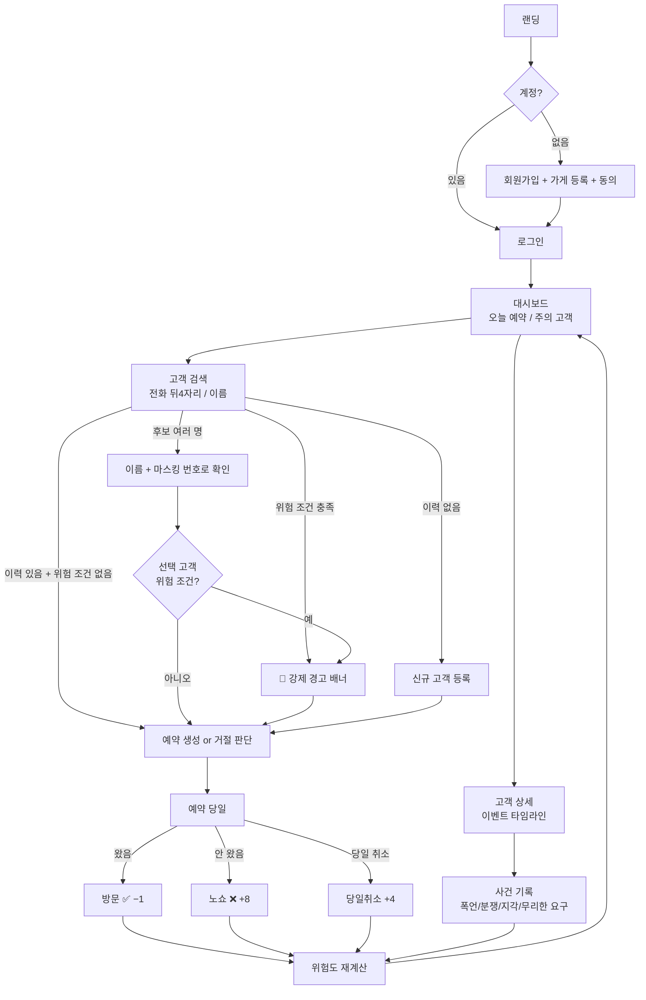

# ShowUp 유저 플로우

> 기준 원본: [plan.md](plan.md) §4(위험도)·§5(화면 흐름)·§6(IA). 수치·조건이 다르면 plan.md가 정답.

---

## 1. 핵심 순환 플로우 (시나리오 A)

사장님 관점의 반복 사이클. 기록이 쌓일수록 다음 검색의 판단 근거가 좋아진다.

```
┌─────────────┐     ┌─────────────────┐     ┌─────────────┐
│ 1. 고객 검색 │ ──▶ │ 2. 강제 경고 배너 │ ──▶ │ 3. 예약 생성 │
│ 뒤4자리·이름 │     │ 노쇼3+·폭언1+   │     │ 판단은 사장님 │
└─────────────┘     └─────────────────┘     └─────────────┘
      ▲                                            │
      │                                            ▼
┌─────────────┐     ┌─────────────────┐     ┌─────────────┐
│ 6. 등급·경고 │ ◀── │ 5. 위험도 재계산 │ ◀── │ 4. 이벤트 기록│
│ 대시보드 반영 │     │ risk.ts 단일로직 │     │ 방문·노쇼·사건│
└─────────────┘     └─────────────────┘     └─────────────┘
```

| 단계 | 행동 | 화면 | 비고 |
|------|------|------|------|
| 1 | 전화 뒤 4자리/이름 검색 | `/customers` | 300ms debounce. 결과는 항상 **후보 목록** — 단일 자동 매칭 금지, 이름+마스킹 번호 확인 후 선택 |
| 2 | 경고 배너 자동 표시 | `/customers`, `/reservations/new` | `noShowCount >= 3 || incidentCounts.abuse >= 1` 충족 시 강제 표시 |
| 3 | 예약 생성 or 거절/예약금 판단 | `/reservations/new` | 자동 차단 아님 — 최종 판단은 사장님 |
| 4 | 예약 당일 상태 원터치 + 사건 기록 | `/reservations`, `/customers/:id` | 방문 −1 / 노쇼 +8 / 당일취소 +4. 사건은 카테고리 선택 + 사실 메모 |
| 5 | riskStats 재계산 | (백그라운드) | 원칙 Cloud Function, MVP 대안은 `risk.ts` 클라이언트 갱신 — 로직은 한 곳만 |
| 6 | 등급·주의 고객 목록 갱신 | `/dashboard` | 다음 검색(1단계)에 반영 → 순환 |

---

## 2. 전체 화면 흐름



---

## 3. 분기 조건

> 점수·등급·경고 배너 조건은 `plan.md` §4가 정답. 여기는 플로우 관점에서만 정리.

| 조건 | 결과 |
|------|------|
| 위험도 등급 (안심/주의/위험) | `plan.md` §4.2 참조 |
| 경고 배너 발동 | `plan.md` §4.3 참조 |
| 검색 결과 후보 2명 이상 | 자동 선택 없음 — 목록에서 수동 선택 |
| 검색 결과 0명 | 신규 고객 등록 유도 |

---

## 4. 화면 ↔ 플로우 매핑 (MVP)

| 라우트 | 플로우 단계 | 핵심 컴포넌트 |
|--------|------------|--------------|
| `/login`, `/register` | 진입 | 동의 체크박스(필수) |
| `/dashboard` | 6 | 요약 카드, 주의 고객 Top 5 |
| `/customers` | 1, 2 | CustomerSearch, RiskAlertBanner, CustomerCard |
| `/customers/:id` | 4 | CustomerTimeline, IncidentFormModal, RiskBadge |
| `/reservations` | 4 | ReservationStatusActions (방문/노쇼/취소 원터치, 44px+) |
| `/reservations/new` | 2, 3 | RiskAlertBanner |
| `/privacy`, `/terms` | — | 정적 문서 (보안 문안) |

`/stats`(Phase 1.5), `/me`(Phase 2)는 MVP 제외.

---

## 5. 시나리오 B — 고객 본인 (Phase 2, MVP 제외)

1. 본인 전화번호 인증 → 자기 이력 조회 (열람권, 개인정보보호법 제35조)
2. 허위 또는 부정확한 기록이 있다고 판단하면 정정·삭제 요청 또는 이의제기 접수
3. 사장님은 요청 내역을 확인하고 내부 기록을 수정하거나 유지 사유를 남긴다

> Phase 2는 고객용 서비스 확장이 아니라, 고객 권리 보장을 위한 최소 기능이다.

---

## 6. 확장 플로우 — 노쇼 정책 설정 (Phase 1.5)

사장님은 노쇼 N회 이상 고객에 대해 예약금 요청, 사전 확인, 예약 제한 권장 등의 정책을 설정할 수 있다.
단, 시스템이 자동 차단하지 않고 사장님 판단을 돕는 정책 안내로 제공한다.
