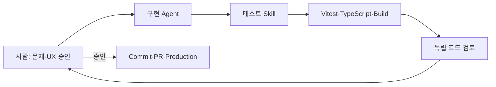

# Agent 협업 가이드

Later는 사람이 제품 판단과 외부 변경 권한을 갖고, Agent가 코드 분석·구현·검증·문서
동기화를 수행하는 방식으로 개발합니다.

## 역할

| 역할 | 책임 |
| --- | --- |
| 사람 | 사용자 문제, 우선순위, 완료 기준, 비밀 키, DB 변경과 배포 승인 |
| 구현 Agent | 관련 코드·스키마 조사, 작은 변경, 테스트, 실제 실패 진단, 문서 갱신 |
| `generate-tests` Skill | 성공·오류·fallback·회귀 경로의 집중 테스트 설계 |
| 코드 검증 Agent | 보안, 데이터 손실, 회귀와 누락 테스트를 읽기 전용으로 검토 |

## 작업 원칙

- 실제 코드와 실행 결과를 문서보다 우선합니다.
- 운영 DB와 실제 사용자 데이터를 자동 테스트에 사용하지 않습니다.
- 외부 URL과 AI 응답은 신뢰하지 않고 검증합니다.
- 플랫폼 원문을 확보하지 못했으면 분석 범위를 과장하지 않습니다.
- 기존 사용자 변경을 보존하고 관련 파일만 stage합니다.
- commit, push, PR, 배포와 운영 데이터 변경은 승인 범위 안에서만 수행합니다.
- 완료 보고에는 변경 파일, 검증 결과, 배포 여부와 남은 한계를 포함합니다.

## 현재 제품 검증 포인트

- URL Context와 메타데이터 결과를 구분했는가
- 요약이 소개문이 아니라 실제 결론·방법·주의점을 담는가
- Instagram 캡션 분석을 Reel 영상 분석으로 표현하지 않는가
- Gemini 오류 시 저장 fallback이 유지되는가
- 이미지 MIME·크기와 Storage 정리가 검증되는가
- 카테고리·아카이브 카드의 출처 아이콘과 이름이 일관적인가
- 인증·RLS 미구현 상태를 숨기지 않는가

## 제출 전 체크

- [ ] 관련 테스트와 전체 테스트 통과
- [ ] `npx tsc --noEmit`, `npm run build`, `git diff --check` 통과
- [ ] 비밀정보와 임시 파일 없음
- [ ] 운영 URL과 `/api/health` 확인
- [ ] 쇼케이스 JSON·대표 이미지·스크린샷 경로 확인
- [ ] 중앙 쇼케이스 PR 최신 커밋 반영 및 병합 상태 확인
