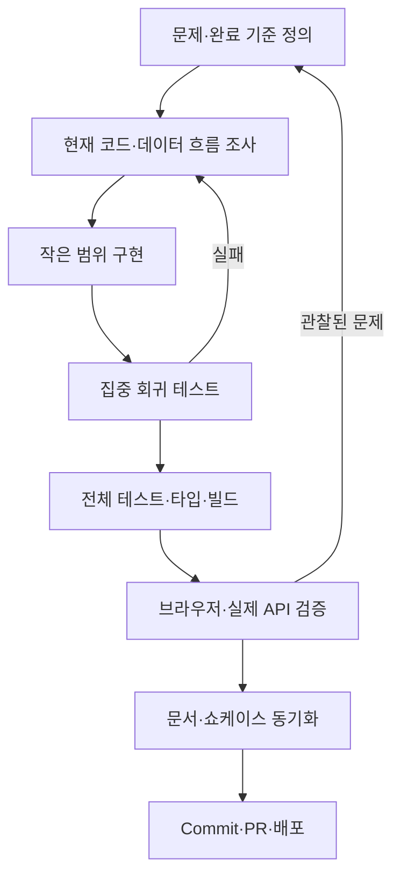

# AI 개발 워크플로

Later는 사람이 문제·UX·완료 기준을 결정하고 Codex가 조사, 구현, 테스트, 배포 준비를
돕는 반복 구조로 개발했습니다. AI가 생성한 코드나 요약을 그대로 완료로 간주하지 않고
실제 입력, 응답, 테스트와 배포 결과를 근거로 판단합니다.

## 반복 흐름



## 사례: 핵심 요약 개선

1. 카드 요약이 “무엇을 설명하는 콘텐츠”라는 소개문에 머무는 문제를 관찰했습니다.
2. 서버 입력을 추적해 Gemini가 메타데이터만 받는 경로를 확인했습니다.
3. URL Context를 추가하고, 결론·방법·주의점부터 쓰며 일반 소개문을 금지하도록
   Structured Output 지침을 강화했습니다.
4. URL에는 Context tool을 사용하고 일반 텍스트에는 사용하지 않는 테스트를 추가했습니다.
5. Instagram Reel을 다시 점검해 HTML에는 캡션만 있고 영상 URL은 없다는 사실을
   확인했습니다. 따라서 캡션 요약과 영상 분석을 구분해야 한다는 후속 백로그를 남겼습니다.

이 사례는 프롬프트만 수정하는 것으로 끝내지 않고 **모델에 전달된 근거가 무엇인지**를
확인해야 한다는 핵심 학습을 보여줍니다.

## 구현 기준

- 관련 화면, API, 타입, migration과 기존 테스트를 먼저 읽습니다.
- 외부 웹페이지와 AI 응답을 신뢰하지 않습니다.
- Gemini Structured Output 이후에도 허용 필드·카테고리·길이·한국어를 검증합니다.
- AI 장애가 저장 전체 장애가 되지 않도록 규칙 기반 fallback을 유지합니다.
- 이미지 파일은 DB 본문이 아니라 Storage에 저장합니다.
- 미구현 기능과 플랫폼 제한을 문서·쇼케이스에서 명확히 구분합니다.
- 삭제, 운영 DB 변경, commit, push와 production 배포는 승인 범위 안에서 수행합니다.

## 테스트 전략

```bash
npx vitest run path/to/changed.test.ts
npm test
npx tsc --noEmit
npm run build
git diff --check
```

분류 변경은 Gemini 성공·잘못된 출력·API 오류·규칙 fallback을 함께 검사합니다. UI 변경은
사용자가 볼 수 있는 텍스트와 상호작용을 React Testing Library로 검증합니다. Supabase,
Gemini와 네트워크는 기본 자동 테스트에서 mock 처리합니다.

현재 `npm run lint`는 ESLint 설정 질문을 표시하므로 자동 품질 게이트로 사용하지 않습니다.
설정 파일을 추가한 뒤 비대화형 명령으로 전환해야 합니다.

## Git·PR·배포

1. `git status -sb`, `git diff`, `git diff --check`로 변경 범위를 확인합니다.
2. 관련 파일만 명시적으로 stage하고 목적이 드러나는 커밋을 만듭니다.
3. 기존 기능 브랜치와 쇼케이스 PR head를 함께 최신화합니다.
4. 운영 반영 승인이 있으면 `main`과 Vercel Production을 갱신합니다.
5. Vercel `READY`, alias, build 결과와 운영 smoke test를 확인합니다.
6. 중앙 쇼케이스는 PR 병합 전까지 공개 페이지에 나타나지 않음을 구분해 보고합니다.

## 최종 체크리스트

- [ ] 구현 범위와 실제 사용자 가치가 일치한다.
- [ ] AI가 참고한 근거와 접근 제한을 설명할 수 있다.
- [ ] 성공·실패·fallback 테스트가 있다.
- [ ] 전체 테스트·타입·빌드가 통과한다.
- [ ] 비밀 값과 사용자 데이터가 출력·커밋되지 않았다.
- [ ] README, API, 아키텍처, 배포, 계획과 쇼케이스 문서가 최신이다.
- [ ] PR 최신 커밋과 운영 배포 여부를 각각 확인했다.
