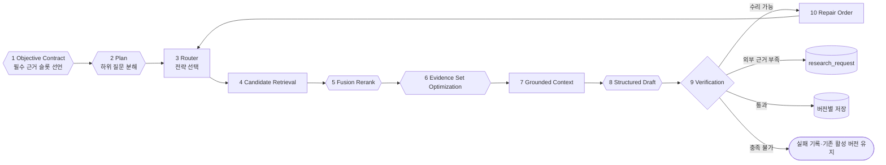
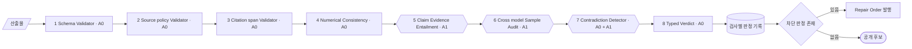

# CareerSignal 에이전트 설계

## 1. 문서 목적

이 문서는 여섯 도메인 에이전트의 입출력, 도구, 공통 실행 루프, 검증과 종료 정책을 정의한다. 이 문서는 에이전트 계약의 기준 문서다.

구성요소의 계층과 실행 순서는 [아키텍처](architecture.md), 저장 구조와 계보는 [지식·저장 구조](knowledge-schema.md), 분류체계와 지표는 [통계 모델](statistics-model.md), 자료의 허용 용도는 [데이터 전략](data-strategy.md)에서 다룬다.

## 2. 실행 컨텍스트

모든 에이전트는 [아키텍처](architecture.md) 5장의 실행 봉투를 입력으로 받는다. 봉투는 분석 버전, 데이터 버전, 분류체계 버전, 지식 버전, 직무, 범위, 기준일, 예산을 담는다.

직무 차이는 `job_role_id`와 직무별 분류체계로 표현한다. 코드와 프롬프트에 특정 직무명을 고정하지 않는다.

## 3. 도구

에이전트는 등록된 도구만 호출한다. 도구는 Pydantic 시그니처를 가지며 임의 SQL과 임의 URL 요청을 허용하지 않는다.

| 도구 | 책임 |
| --- | --- |
| `search_sql` | 범위별 공고·통계·산출물 조회 |
| `search_keyword` | 정확한 기술명·직무명·회사명 검색 |
| `search_vector` | 표현이 다른 유사 요구 검색 |
| `traverse_graph` | 요구·역량·근거·준비 항목의 다단계 관계 탐색 |
| `fetch_source` | 허용된 공개 원문과 메타데이터 수집 |
| `embed_chunks` | 청크 임베딩 생성 |
| `store_claims` | 주장과 근거 연결 저장 |
| `verify_claims` | 통합 검증 호출 |
| `request_research` | 조사 요청 발행 |

웹 검색과 외부 수집은 데이터 수집 에이전트만 수행한다. 다른 에이전트는 `request_research`로 조사 목표를 전달하고 갱신된 저장소를 다시 조회한다.

지표 집계와 계보 기록은 에이전트 도구가 아니다. 오케스트레이터가 파이프라인으로 스케줄링하며, 에이전트는 저장된 지표를 `search_sql`로 조회한다.

## 4. 검색 전략 선택

질문 유형에 따른 도구 선택은 규칙으로 고정한다.

| 질문 유형 | 도구 |
| --- | --- |
| 빈도·비율·표본 수 | `search_sql` |
| 정확한 기술명·회사명 | `search_keyword` |
| 표현이 다른 유사 요구 | `search_vector` |
| 요구에서 역량·증명·학습으로 이어지는 경로 | `traverse_graph` |
| 복합 근거 | 키워드와 벡터를 융합하고 그래프로 확장 |
| 새 외부 자료 | `request_research` |

에이전트의 판단은 도구 선택이 아니라 하위 질문 생성, 검색 반복, 근거 충분성 판정에 있다.

### 4.1 융합

키워드 검색과 벡터 검색은 서로 다른 실패를 한다. 키워드 검색은 표현이 다르면 놓치고, 벡터 검색은 희귀 고유명사에서 정확도가 떨어진다. 두 결과를 독립적으로 생성하고 순위 기반으로 융합한다.

```text
fusion_score(document) = Σ 1 / (k + rank_in_strategy)
```

점수 척도가 다른 검색기의 값을 직접 더하지 않고 순위만 사용한다. 두 검색기가 함께 상위로 올린 문서가 한쪽에서만 최상위인 문서보다 높은 점수를 받는다.

Postgres의 기본 텍스트 순위 함수는 문서 길이 정규화와 용어 포화를 다루는 랭킹 함수와 다르다. 키워드 랭킹 방식을 변경하면 `retrieval_policy_version`을 올린다.

### 4.2 검색 단계

| 단계 | 구성 | 가능 시점 |
| --- | --- | --- |
| 초기 검색 | 키워드, 벡터, 메타데이터 필터, 순위 융합 | 인덱스 구축 이후 |
| 확장 검색 | 초기 검색에 그래프 확장과 경로 조회를 더한다 | 지식 그래프 구축 이후 |

## 5. 공통 실행 루프



| 도형 | 의미 |
| --- | --- |
| 육각형 | 판단하거나 생성 모델을 쓰는 단계 |
| 사각형 | 결정적 단계 |
| 마름모 | 분기와 판정 |
| 원통 | 저장소 |
| 스타디움 | 종료 상태 |

| 단계 | 자율성 |
| --- | --- |
| Objective Contract | A0 정책 + A2 슬롯 작성 |
| Plan | A2 |
| Router | A0 |
| Candidate Retrieval | A0 |
| Fusion / Rerank | A0 융합, A1 모델 재정렬 |
| Evidence Set Optimization | A0 제약 최적화, A1 모델 평가 |
| Grounded Context | A0 |
| Structured Draft | A1 또는 A2 |
| Verification | A0 + A1 |
| Repair / Decide | A0 |

### 5.1 Objective Contract

검색 이전에 완료 조건을 선언한다. `ObjectiveContract`가 한 실행의 종료 조건을 정하는 값이며, 슬롯 하나는 `EvidenceSlot`이다.

```json
{
  "objective_id": "obj_intp_backend_cluster_fintech",
  "objective": "backend cluster 범위의 직무 공통 기대치와 추가 요구 해석",
  "required_evidence_slots": [
    { "slot": "overall_baseline", "support_type": "statistic_fact", "minimum": 1 },
    { "slot": "cluster_support", "support_type": "chunk", "minimum": 1,
      "minimum_independent_companies": 2, "allowed_tiers": ["A"] },
    { "slot": "official_context", "support_type": "wiki_revision", "minimum": 1,
      "allowed_tiers": ["B", "C"], "required": false }
  ],
  "forbidden_source_uses": [
    ["E", "interpretation_context"],
    ["D", "statistics"]
  ],
  "allowed_tools": ["statistics_facts", "chunk_search", "graph_paths"],
  "max_retrieval_rounds": 2,
  "max_repair_rounds": 2
}
```

`support_type`은 `analysis_claim_evidence.support_type`의 값이고, `allowed_tiers`는 자료 계층 부호다. `forbidden_source_uses`는 자료 계층과 허용 용도의 쌍이다. 계층 하나를 통째로 막지 않고 그 계층을 어떤 용도로 쓰는 것을 막는지 적는다. 계층 부호와 허용 용도의 정의는 [데이터 전략](data-strategy.md)에 있다.

필수 슬롯이 모두 채워지면 조사를 종료한다. 계약은 채워진 슬롯 수를 받아 미충족 필수 슬롯의 이름을 돌려주고, 그 목록이 비면 실행이 완료된다. 미충족 슬롯이 남으면 판정은 `insufficient_evidence`다. 선택 슬롯이 비어 있으면 주장은 성립하되 신뢰도가 낮아진다.

슬롯 구성은 범위에 따라 달라진다. 직무 전체는 직무 공통 기대치 통계만으로 성립하고, 기업군과 공고 범위는 그 위에 공고 근거를 더 요구한다. 내부 슬롯 이름 `overall_baseline`은 직무 공통 기대치 통계를 뜻한다. 기업군 일반화는 독립 회사 수의 최솟값을 함께 갖는다.

### 5.2 Plan

전역 실행 계획은 오케스트레이터의 실행 순서다. 별도의 계획 수립 에이전트를 두지 않는다.

에이전트 내부의 계획은 다음을 담당한다.

- 출력 스키마를 근거 슬롯으로 변환
- 하위 질문 생성과 의존 순서 결정
- 이미 확보한 근거 재사용
- 비어 있는 슬롯에 대해서만 검색

### 5.3 Evidence Set Optimization

개별 문서를 각각 점수화해 상위 항목을 넣는 대신 근거 묶음 전체를 평가한다.

| 방향 | 항목 |
| --- | --- |
| 최대화 | 필수 슬롯 충족, 자료 계층, 독립 회사·출처 다양성, 시간 적합성, 반례 포함, 그래프 경로 완전성 |
| 최소화 | 중복, 허용되지 않은 출처, 토큰 비용 |

상위 결과가 모두 같은 회사에서 나오면 기업군 일반화 주장의 근거로 사용할 수 없다. 개별 점수만으로는 이 조건을 판정하지 못한다.

선택 결과는 `evidence_sets`와 `evidence_set_members`에 기록한다.

### 5.4 근거 사용 기록

에이전트는 검색 결과를 인용했는지와 무관하게 반복마다 그 결과의 사용 목적을 `evidence_usages.usage_type`에 기록한다. 값의 목록과 계측에서의 쓰임은 [아키텍처](architecture.md) 14.2에 있다.

## 6. 에이전트 비교

| 에이전트 | 자율성 | 주 입력 | 주 출력 | 도구 | 필수 근거 슬롯 | 종료 조건 |
| --- | --- | --- | --- | --- | --- | --- |
| 데이터 수집 | A3 | 조사 요청, 출처 정책, 기존 해시 | `source_snapshots`, `source_observations`, `source_assessments` | `fetch_source` | 요청된 근거 유형 | 요청 슬롯 충족, 허용 출처 전수 조사, 탐색 경계 소진, 명시적 실패 |
| 지식 구축 | A2 | 역량, 차원 연결, 지표 우선순위, 깊이 프로파일, 필드별 근거 청크 | `knowledge_nodes`, `knowledge_edges`, `wiki_pages`, `wiki_revisions`, `wiki_evidence` | `search_sql`, `search_vector`, `traverse_graph` | Wiki 필수 필드별 근거 | 필수 필드 근거 충족 |
| 통계 분석 | A2 | 청크, 활성 분류체계, 평가 세트 | `requirement_mentions`, `requirement_candidates`, 승격 결정, `posting_requirement_assignments` | `search_sql`, `search_keyword`, `search_vector` | 후보별 독립 공고·회사 근거 | 승격 심사 완료, 할당 검증 통과 |
| 채용공고 해석 | A2 | `statistics_facts`, 공고 근거 청크, 그래프 경로, 회사 공식 자료 | `analysis_outputs(interpretation)`, `analysis_claims`, `analysis_claim_evidence`, `coverage_assertions` | `search_sql`, `search_keyword`, `search_vector`, `traverse_graph` | `overall_baseline`, `cluster_support`, `official_context`(선택) | 필수 슬롯 충족, 주장 근거 연결률 통과 |
| 합격 전략 | A2 | 해석 산출물, 지표, Wiki, 전략 자료 | `checklist_concepts`, `checklist_items`, `analysis_outputs(strategy)` | `search_sql`, `traverse_graph` | 요구 연결, 증명 방법 근거 | 항목 연결 완전성 통과 |
| 준비 로드맵 | A2 | 체크리스트 개념, 역량과 선수 관계, 깊이 프로파일 | `roadmap_items`, `roadmap_item_fills`, `study_tracks`, `analysis_outputs(roadmap)` | `search_sql`, `traverse_graph` | 선수 관계, 학습 자료 근거 | 순환 없음, 미충족 항목 없음 |

통계 분석 에이전트는 차원 발견과 할당까지 담당한다. 지표 집계는 A0 집계 파이프라인이 수행하며 에이전트가 수치를 저장하지 않는다. 발견과 승격 절차는 [통계 모델](statistics-model.md)에 있다.

각 에이전트는 저장소를 `Protocol`로만 안다. 실행 골격은 저장소 구현을 import하지 않고, 쓰기는 주 출력 열의 테이블로 한정된다. 체크리스트는 합격 전략이 소유하므로 준비 로드맵은 읽기만 한다.

종료 사유는 실행마다 하나로 접어 `agent_runs.stop_reason`에 기록한다. 판정 순서는 예산 소진, 명시적 실패, 탐색 경계 소진, 슬롯 충족, 신규 근거 없음이다. 예산이 끝나 대상을 남긴 실행과 검사에 걸린 항목이 있는 실행은 완결이 아니므로 앞의 둘이 먼저다.

## 7. 에이전트별 산출 규칙

### 7.1 데이터 수집

원문과 출처 평가를 분리해 저장한다. 스냅샷의 내용은 변경하지 않고, 접근 결과와 출처 평가는 별도로 기록한다. 접근할 수 없게 된 자료도 기존 분석의 계보를 위해 보존한다.

### 7.2 지식 구축

그래프 엣지는 온톨로지 버전에 등록된 유형과 허용 연결만 생성한다. 등록되지 않은 유형과 허용되지 않은 연결은 폐기하고 기록을 남긴다.

Wiki는 역량의 깊이 기준을 정의한다. 생성 조건과 필드별 허용 근거는 [지식·저장 구조](knowledge-schema.md) 8장에 있다.

### 7.3 통계 분석

원문 표현의 추출과 차원 후보 명명에 생성 모델을 사용한다. 빈도, 비율, 추세, 조합은 집계 파이프라인이 규칙으로 계산한다.

### 7.4 채용공고 해석

요구를 세 가지로 구분한다.

| 구분 | 의미 | 통계 반영 |
| --- | --- | --- |
| `explicit_requirement` | 공고에 명시된 요구 | 반영 |
| `inferred_requirement` | 공고 표현을 근거로 해석한 요구 | 미반영 |
| `company_context_signal` | 회사 공식 자료에 반복되나 공고에는 없는 맥락 | 미반영 |

`company_context_signal`은 화면에서 회사 특징으로 설명하며, 해당 공고의 명시 요구사항이 아님을 함께 표시한다. 포트폴리오 강조 순서와 면접 준비 후보에는 영향을 주고, 통계·직무 공통 기대치·필수 체크리스트에는 영향을 주지 않는다.

추가 요구 없음 주장은 `coverage_assertions`의 `coverage_complete`가 참일 때만 출력한다. 거짓이면 판단 근거 부족을 출력한다. 근거를 찾지 못한 것과 부재를 확인한 것을 구분한다.

### 7.5 합격 전략

체크리스트는 개념과 버전 인스턴스를 분리해 저장한다. 사용자 체크 상태는 개념 식별자에 연결한다.

### 7.6 준비 로드맵

학습 트랙의 깊이 기준은 Wiki의 깊이 등급 정의와 `capability_depth_profiles`의 기대 깊이를 함께 참조한다. 체크 상태에 따른 완료 표시와 순서 조정은 Express 조합기가 수행한다.

## 8. 신뢰도

신뢰도는 주장 유형별 정책으로 판정한다. 생성 모델의 자기 보고를 신뢰도로 사용하지 않는다.

| 주장 유형 | 판정 기준 |
| --- | --- |
| 개별 공고 명시 사실 | 기업 공식 공고의 직접 문장과 정확한 위치. 근거 하나로 충분하다 |
| 통계 수치 | 전수 집계, 분자·분모, 중복 제거 단위, 규칙 재계산 일치 |
| 기업군 일반화 | 독립 공고와 독립 회사 수, 기업 분포, 범위 충족도 |
| 추론 요구 | 공고 근거와 회사 공식·공공 표준 보강, 과잉 일반화 검사 |
| 회사 맥락 신호 | 회사 공식 자료의 반복과 요구사항 아님 표시 |
| 합격 전략 | 요구 연결과 허용된 전략 자료 근거 |
| 추가 요구 없음 | 닫힌 대상 집합의 전수 검사와 0건 확인 |

저장은 단일 등급이 아니라 구성값으로 한다.

```text
source_quality
evidence_directness
independent_support_count
scope_coverage
temporal_fitness
contradiction_status
verification_status
```

화면에 표시하는 등급은 이 구성값과 주장 유형 정책에서 파생한다.

## 9. 검증



| 도형 | 의미 |
| --- | --- |
| 평행사변형 | 검사 대상으로 들어오는 산출물 |
| 육각형 | 생성 모델을 쓰는 검사 |
| 사각형 | 규칙으로 판정하는 단계 |
| 마름모 | 분기와 판정 |
| 원통 | 저장소 |
| 스타디움 | 종료 상태 |

| 검사 | 내용 | 자율성 |
| --- | --- | --- |
| 1 Schema Validator | 타입, 필수 필드, 허용 값 | A0 |
| 2 Source policy Validator | 자료 계층과 허용 용도, 시간 적합성 | A0 |
| 3 Citation span Validator | 근거 위치가 원문과 일치 | A0 |
| 4 Numerical Consistency | 분모, 표본, 중복 제거, 재계산 일치 | A0 |
| 5 Claim Evidence Entailment | 근거가 주장을 지지하는지, 과잉 일반화 | A1 |
| 6 Cross model Sample Audit | 다른 모델 계열의 표본 재판정 | A1 |
| 7 Contradiction Detector | 상충 근거와 부재 확인 | A0 + A1 |
| 8 Typed Verdict | 판정 집계와 상태 전이 | A0 |

검사 5·6·7은 생성 모델을 판정자로 받는다. 검사 7은 상충 근거를 규칙으로 보고 부재 확인만 판정자에 맡기므로 A0과 A1이 함께 있다. 검사 6은 전건이 아니라 위험 기반 표본에 적용한다.

검사마다 적용 대상 타입이 다르다.

| 검사 | 대상 타입 |
| --- | --- |
| 1 Schema | `analysis_claim` |
| 2 Source policy | `analysis_claim`, `wiki_revision` |
| 3 Citation span | `analysis_claim`, `requirement_mention` |
| 4 Numerical | `statistic_fact`, `statistics_aggregation` |
| 5 Entailment | `analysis_claim` |
| 6 Cross model | `analysis_claim` |
| 7 Contradiction | `analysis_claim` |

대상 타입이 아닌 산출물에는 검사가 `skip`과 `CHECK_NOT_APPLICABLE`로 기록된다. 검사 6은 대상 타입이라도 9.1의 위험 조건에 걸리지 않으면 같은 값으로 기록한다. 검사 5는 근거 연결이 없으면 함의를 따질 것이 없어 같은 값으로 기록한다. 어떤 검사가 적용되는지는 산출물의 성질만 보는 순수 함수가 실행 이전에 답한다. 계층화 판정을 검사 밖에 두므로 검사를 돌리지 않고도 그 판정을 검증할 수 있다.

검사 1은 데이터베이스가 강제하는 컬럼 제약을 다시 확인하지 않는다. 컬럼 타입, `NOT NULL`, `CHECK`는 저장 시점에 이미 막히므로, 이 검사는 데이터베이스가 볼 수 없는 `jsonb` 필드의 내부 구조를 대상으로 한다. 구조의 정의는 각 필드의 기준 문서를 재사용하고 이 검사가 다시 선언하지 않는다. 선언되지 않은 키는 거부한다.

검사 3의 대상은 두 가지이며 확인 방법이 다르다.

| 대상 | 확인 |
| --- | --- |
| `requirement_mentions` | `evidence_span_*`이 가리키는 `source_chunks.text` 구간이 `raw_expression`과 같다. 오프셋은 문자 단위다 |
| `analysis_claim_evidence` | `support_id`가 `support_type`이 가리키는 표에서 해소된다 |

후자는 `support_type`에 따라 대상 표가 갈리는 다형 참조라 외래키로 강제할 수 없다. 근거 연결이 없는 주장은 이 검사의 대상이 아니며 필수 슬롯 판정이 다룬다.

검사 2의 대상도 두 가지이며 근거의 용도를 정하는 값이 다르다.

| 대상 | 용도를 정하는 값 |
| --- | --- |
| `analysis_claim` | `claim_type` |
| `wiki_revision` | `wiki_evidence.field_name` |

`claim_type`이 `statistic`이면 `statistics`, `strategy`면 `strategy`, 나머지는 `interpretation_context`를 요구한다. Wiki 필드와 `wiki_*` 용도는 [데이터 전략](data-strategy.md) 3.1에 따라 일대일로 대응한다.

평가가 없는 스냅샷은 계층을 알 수 없으므로 통과시키지 않는다. 스냅샷에 평가가 여러 버전이면 최신 평가를 적용한다.

검사 2는 `relation`이 `supports`인 근거만 본다. 정책은 주장의 근거로 쓰는 것을 제한하며 반례 확보를 막지 않는다. 상충 근거는 검사 7이 다룬다.

시간 적합성은 근거 스냅샷의 수집 시각과 실행 봉투의 `as_of_date`를 비교한다. 기준일 이후에 수집한 자료를 근거로 쓰면 같은 봉투로 재실행해도 같은 자료 범위를 얻지 못한다.

### 9.1 위험 기반 표본

| 조건 | 교차 판정 |
| --- | --- |
| 특정 회사에서 직무 전체로 일반화한 주장 | 적용 |
| 외부 전문가 자료를 근거로 사용한 전략 | 적용 |
| 상충 근거가 존재하는 주장 | 적용 |
| 신뢰도 경계에 있는 주장 | 적용 |
| 추가 요구 없음 주장 | 적용 |
| 새 프롬프트·모델 버전의 첫 실행 | 적용 |

### 9.2 검사 결과 기록

판정은 단일 값이 아니라 검사별로 저장한다.

```json
{
  "check": "source_policy_validator",
  "target_type": "analysis_claim",
  "target_id": "claim_42",
  "verdict": "fail",
  "severity": "blocking",
  "reason_code": "POLICY_DISALLOWED_USE",
  "repair_action": "drop_claim"
}
```

`judge_model`과 `detail`을 함께 담는다. 생성 모델이 판정한 검사는 어느 모델이 판정했는지가 남고, 실패는 어긋난 값이 `detail`에 남는다.

검사별 `verdict`는 세 값을 갖는다.

| `verdict` | 의미 |
| --- | --- |
| `pass` | 검사를 실행하고 통과했다 |
| `fail` | 검사를 실행하고 위반을 찾았다 |
| `skip` | 검사를 실행하지 않았다 |

`skip`은 실행하지 않은 사실을 남겨 누락된 검사와 적용 대상이 아닌 검사를 구분한다. 사유는 `reason_code`가 구분하며 9.3에 정의한다.

경고 수준은 `verdict`가 아니라 `severity`가 담는다. `severity`가 `blocking`인 `fail`만 공개를 차단하고, `warning`인 `fail`은 판정을 `verified_with_warning`으로 만든다.

### 9.3 검사 실행

검사는 선언된 순서대로 전부 실행하고, 결과를 모두 모은 뒤 판정한다. 차단 판정이 나와도 남은 검사를 건너뛰지 않는다. 한 번의 실행이 산출물의 결함 전체를 드러내야 수리 지시를 한 번에 만들 수 있다.

검사 구현은 자기 판정만 반환하고 대상 식별자를 쓰지 않는다. 실행기가 실행 문맥의 식별자로 검사 결과를 조립한다.

검사 8은 앞선 일곱 검사의 결과를 입력으로 받는 집계 단계이며, 실행기의 실행 대상이 아니다.

판정을 얻지 못한 세 경우를 구분해 기록한다.

| 상황 | `verdict` | `reason_code` | `severity` |
| --- | --- | --- | --- |
| 검사에 구현이 없다 | `skip` | `CHECK_NOT_REGISTERED` | `blocking` |
| 검사의 적용 대상이 아니다 | `skip` | `CHECK_NOT_APPLICABLE` | `info` |
| 검사가 예외로 끝났다 | `fail` | `CHECK_ERROR` | `blocking` |

`CHECK_ERROR`는 `repair_action`을 갖지 않는다. 검사기의 결함은 에이전트가 수리할 대상이 아니다.

검사 5·6·7은 판정자를 주입하지 않아도 등록된다. 판정자가 없으면 `skip`과 `CHECK_NOT_APPLICABLE`이 나오며 이것이 정식 동작이다. 이 값이라야 구현이 없는 상태(`CHECK_NOT_REGISTERED`)와 구분되어, 생성 모델을 부르지 않고도 검사 1~4의 결과만으로 판정에 이른다. 판정자를 주면 조회도 함께 준다. 한쪽만 주면 무엇을 재판정했는지 알 수 없는 판정이 남는다.

검사 2·3·4는 조회가 없으면 등록하지 않는다. 이 셋은 조회 없이 아무것도 판정할 수 없으므로, 등록해 두면 무엇을 검사했는지 모르는 통과가 생긴다. 등록되지 않은 사실은 실행기가 기록한다.

실행 결과는 검사별 판정과 함께 선언된 검사가 모두 실행되었는지를 보고한다. 실행되지 않은 검사가 남아 있으면 검증이 끝난 것이 아니다.

### 9.4 판정 유형

| 판정 | 의미 |
| --- | --- |
| `verified` | 전 검사 통과 |
| `verified_with_warning` | 차단 없는 경고가 존재 |
| `insufficient_evidence` | 필수 슬롯 미충족 |
| `contradicted` | 상충 근거가 해소되지 않음 |
| `policy_violation` | 자료 계층과 허용 용도 위반 |
| `schema_invalid` | 스키마 검사 실패 |
| `needs_research` | 외부 자료 확보가 필요 |

`needs_research` 판정은 통합 검증이 `research_requests`에 요청을 발행한다. 에이전트의 `request_research`와 같은 테이블을 쓰고 오케스트레이터가 상태를 갱신한다.

공개 여부는 [아키텍처](architecture.md) 8장의 공개 정책을 따른다.

#### 검사와 판정의 대응

차단 판정이 난 검사를 판정 유형으로 옮긴다. 대응이 없는 검사가 있으면 그 검사의 실패가 `verified`로 새어 나간다.

| 검사 | 판정 | 근거 |
| --- | --- | --- |
| 1 Schema | `schema_invalid` | |
| 2 Source policy | `policy_violation` | |
| 7 Contradiction | `contradicted` | |
| 4 Numerical | `contradicted` | 재계산 값이 다르다는 것은 어긋나는 값이 존재한다는 뜻이다 |
| 6 Cross model | `contradicted` | 다른 모델 계열의 판정이 어긋난다 |
| 3 Citation span | `insufficient_evidence` | 인용 위치가 원문과 다르면 주장을 받치는 것이 없다 |
| 5 Entailment | `insufficient_evidence` | 근거가 주장을 지지하지 않는다 |

수리 동작이 `request_research`인 실패는 검사와 무관하게 `needs_research`로 판정한다.

#### 우선순위

차단 판정이 여럿이면 문제가 근본적인 순서로 하나를 고른다.

```text
schema_invalid > policy_violation > contradicted > needs_research > insufficient_evidence
```

구조가 깨진 산출물에는 근거의 함의를 따질 수 없으므로 `schema_invalid`가 앞이다. `needs_research`가 `insufficient_evidence`보다 앞인 이유는 후속 동작이 다르기 때문이다. `needs_research`는 조사 요청을 발행하고 `insufficient_evidence`는 비공개로 끝난다. 순서를 바꾸면 외부 자료로 해결할 수 있는 실패가 요청 없이 묻힌다.

차단 판정이 없고 경고만 있으면 `verified_with_warning`, 둘 다 없으면 `verified`다.

#### 판정하지 않는 경우

선언된 검사가 모두 실행되지 않았으면 판정하지 않는다. 일곱 판정은 검증이 끝난 산출물의 결과를 나타내는 값이므로, 끝나지 않은 것에 이름을 붙이지 않는다.

판정이 없는 산출물은 공개하지 않는다. 분석 버전은 `validating`에서 `failed`로 간다. 이 경로는 배포에서 검사 하나가 등록되지 않는 상황을 `verified`로 통과시키지 않기 위해 있다.

### 9.5 통합 검증

통합 Verifier는 분석 버전의 모든 필수 산출물에 대한 검사 결과를 집계하고 활성화 가능 여부를 반환한다. 오케스트레이터가 모든 단계 뒤에 호출한다.

산출물 하나라도 공개할 수 없으면 분석 버전 전체가 `failed`다. 한 화면만 새 버전인 상태를 허용하지 않기 때문이다. 검사한 산출물이 하나도 없어도 `failed`다. 검증하지 않은 버전을 수용 평가로 넘기지 않는다.

여기서 말하는 활성화 가능은 `gated` 도달을 뜻한다. `gated`에서 `active`로 가려면 수용 평가가 남으므로 통합 Verifier는 활성화를 수행하지 않고 그 전제가 성립하는지만 돌려준다. 상태 전이는 [아키텍처](architecture.md) 8장을 따른다.

## 10. 수리

검증 실패는 고정 스키마의 수리 지시로 표현한다.

```json
{
  "target_claim_id": "claim_42",
  "failed_check": "claim_evidence_entailment",
  "reason": "공고 근거는 존재하나 회사 공식 보강 근거가 없음",
  "action": "request_research",
  "missing_evidence": {
    "source_tier": "B",
    "company_id": "company_a",
    "topic": "transaction_integrity"
  },
  "requery_hint": null,
  "round": 1
}
```

| `action` | 처리 |
| --- | --- |
| `requery` | 제시된 질의로 재검색 |
| `add_counterevidence` | 반례 근거 확보 |
| `swap_evidence` | 근거 교체 |
| `drop_claim` | 주장 폐기 |
| `narrow_scope` | 범위 축소 |
| `lower_confidence` | 신뢰도 하향 |
| `recompute_stat` | 수치 재계산 |
| `fix_identifier` | 식별자 정정 |
| `request_research` | 외부 근거 확보 요청 발행 |

`lower_confidence`는 근거가 약한 조언으로 표현할 수 있는 주장에만 적용한다. 통계 오류와 근거 없는 기업 요구사항은 낮은 신뢰도로 유지하지 않고 폐기한다.

`request_research`는 `missing_evidence`에 필요한 자료 계층·회사·주제를 담는다. 저장소 안에서 해결할 수 없는 실패만 이 동작을 갖는다.

수리 반복은 봉투의 `max_repair_rounds`로 제한한다.

## 11. 종료

### 11.1 조사 종료

| 대상 | 조건 |
| --- | --- |
| 개별 조사 요청 | 요청 슬롯 충족, 허용 출처 전수 조사, 신규 근거 없이 탐색 경계 소진, 명시적 실패 |
| 정기 수집 실행 | 출처 경계 검사 완료, 변경 감지 완료, 중복·오류 기록 완료 |
| 에이전트 조사 | 필수 슬롯 충족, 주장 근거 연결률 통과, 추가 검색이 미해결 슬롯을 줄이지 못함 |
| 수리 | 검증 통과, 동일 실패 검사 반복, 수리 한도 소진 |

### 11.2 표본 수렴

공고 추가에 따른 신규 차원 후보의 증가량은 `saturation_observations`에 기록한다. 이 기록은 데이터셋 충분성의 진단 자료이며 개별 실행의 단독 종료 사유가 아니다.

### 11.3 종료 사유 기록

`agent_runs.stop_reason`에 다음을 기록한다.

```text
slots_filled
no_new_evidence
frontier_exhausted
budget_exhausted
repair_limit
no_progress
explicit_failure
```

## 12. 지식 그래프 사용 범위

| 단계 | 사용 | 목적 |
| --- | --- | --- |
| 자료 수집 | 미사용 | |
| 지식 구축 | 생성 | 사전 semantic 관계 |
| 통계 집계 | 미사용 | 집계는 관계형 조회로 수행 |
| 채용공고 해석 | 탐색 | 공고에서 요구·역량·표준으로 이어지는 연결 |
| 합격 전략 | 탐색 | 요구에서 역량·선수 역량으로 이어지는 연결 |
| 준비 로드맵 | 탐색 | 역량에서 선수 역량으로 이어지는 연결 |
| 계보 기록 | 생성 | Provenance 엣지와 사후 semantic 엣지 |
| 화면 조회 | 근거 경로만 | 저장된 분석 결과를 직접 조회하고 경로는 캐시에서 읽는다 |
| 체크 상태 조합 | 미사용 | 규칙 기반 계산 |

에이전트는 자신이 생성할 노드로 이어지는 엣지를 탐색 입력으로 받지 않는다. 합격 전략은 `ProofArtifact`를, 준비 로드맵은 `LearningResource`와 `Project`를 만드는 주체이므로 `PROVEN_BY`, `USED_IN_CHANNEL`, `TEACHES`는 이들의 입력이 아니다. 전략이 만든 체크리스트를 로드맵이 참조할 때는 `checklist_items`를 관계형으로 조회한다.

각 검색 표현은 서로 다른 검색·검증 책임을 가지며, 실제 기여도는 비교 평가로 측정한다.

## 13. 모델

핵심 생성 모델은 OpenAI API를 사용한다. 모델은 에이전트 이름이 아니라 작업의 난이도와 평가 결과에 따라 배치한다.

| 작업 | 기본 | 상향 조건 |
| --- | --- | --- |
| 규칙으로 처리 가능한 작업 | 생성 모델 미사용 | 없음 |
| 분류·메타데이터 보완·단순 정형 추출 | 경량 모델 | 구조화 정확도 미달 시 중간 모델 |
| 요구 추출·차원 명명·Wiki·해석·전략·로드맵 | 중간 모델 | 근거 연결과 재현율 미달 시 상위 모델 |
| 반복 실패 산출물과 평가 표본 | 상위 모델 | 없음 |
| 교차 표본 감사 | NVIDIA Build API | 없음 |
| 공개 영상 분석 | Gemini API | 없음 |

모델 식별자는 환경변수로 관리한다. 동일 작업은 개발·평가·배치 실행에서 같은 모델과 프롬프트 버전을 사용한다. 모델 변경은 평가 세트 비교와 새 분석 버전을 거쳐 반영한다.

모든 산출물은 모델, 프롬프트, 검색 정책, 지표 정책, 데이터 버전, 분류체계 버전을 기록한다.

### 13.1 모델 어댑터

생성 모델을 부르는 자리는 세 벌로 나눈다.

| 벌 | 책임 |
| --- | --- |
| `Protocol` | 그 자리가 받는 입력과 돌려주는 값의 모양 |
| `OpenAI*` | 제공자 API를 부르는 구현 |
| `Stub*` | 같은 모양을 규칙으로 채우는 대역 |

실행 골격은 `Protocol`만 안다. 제공자 라이브러리를 import하지 않으므로 어느 벌을 넣는지가 골격 밖의 결정이다.

| 자리 | `Protocol` | 위치 |
| --- | --- | --- |
| 요구 표현 추출 | `MentionExtractor` | `agents/statistics/extractor.py` |
| 차원 배정 | `DimensionAssigner` | `agents/statistics/assigner.py` |
| 관계 판정 | `RelationJudge` | `agents/statistics/judge.py` |
| Wiki 필드 작성 | `WikiWriter` | `agents/knowledge/` |
| 추가 요구 서술 | `DeviationInterpreter` | `agents/interpretation/` |
| 체크리스트 문구 | `StrategyWriter` | `agents/strategy/` |
| 단계 서술 | `StepNarrator` | `agents/roadmap/` |
| 청크 임베딩 | `EmbeddingClient` | `providers/embeddings.py` |

이 구조가 생성 모델 호출 없이 검사를 돌게 한다. 대역을 넣으면 순서·기간·깊이·근거 연결처럼 규칙이 정하는 값은 그대로 나오고 문장만 고정 문구가 된다. 검증의 판정자 자리도 같은 규약을 쓰며, 판정자를 비우면 9.3의 `CHECK_NOT_APPLICABLE`이 된다.

## 14. 관련 문서

- [아키텍처](architecture.md)
- [지식·저장 구조](knowledge-schema.md)
- [통계 모델](statistics-model.md)
- [데이터 전략](data-strategy.md)
- [개발 백로그](backlog.md)
- [검증 체크리스트](checklist.md)
