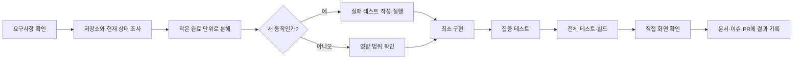

# 지금리뷰 AI Agent Workflow

## 목적

AI와 함께 기능을 만들 때 요구사항, 구현, 검증, 기록이 빠지지 않도록 같은 순서로 작업한다.

## 작업 순서

## 사용하는 Skill과 Agent

| 구분 | 사용 시점 | 역할 |
|---|---|---|
| `trusted-place-design` Skill | 화면이나 CSS를 변경할 때 | 지도 중심 모바일 UI와 디자인 시스템 확인 |
| `code-verification` Skill | 코드 변경을 완료할 때 | 테스트, 빌드, 보안, 완료 범위 검증 |
| 기본 개발 Agent | 기능 구현과 오류 수정 | 저장소 조사, 코드 수정, 검증 결과 정리 |

현재 별도의 하위 Agent를 상시 사용하지 않는다. 독립 검증이 필요한 규모가 되면 코드 리뷰 Agent를 추가하고 역할을 이 문서에 기록한다.

## 작은 작업의 완료 기준

- 사용자에게 보이는 동작이 한 문장으로 설명된다.
- 화면·서버·DB 중 영향을 받는 범위가 정리된다.
- 새 동작은 가능한 경우 실패 테스트부터 작성한다.
- 관련 테스트와 프로덕션 빌드가 통과한다.
- 실제 구현과 예정 기능을 문서에서 구분한다.
- API 키와 Secret Key가 커밋되지 않는다.

## PR에 남길 내용

- 연결된 이슈와 완료 조건
- 변경한 사용자 흐름
- 실패 테스트와 통과 테스트 기록
- 실행한 검증 명령
- 화면 캡처 또는 직접 확인 방법
- 아직 구현하지 않은 범위

