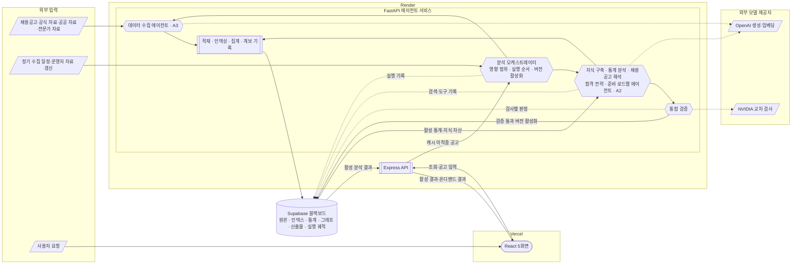
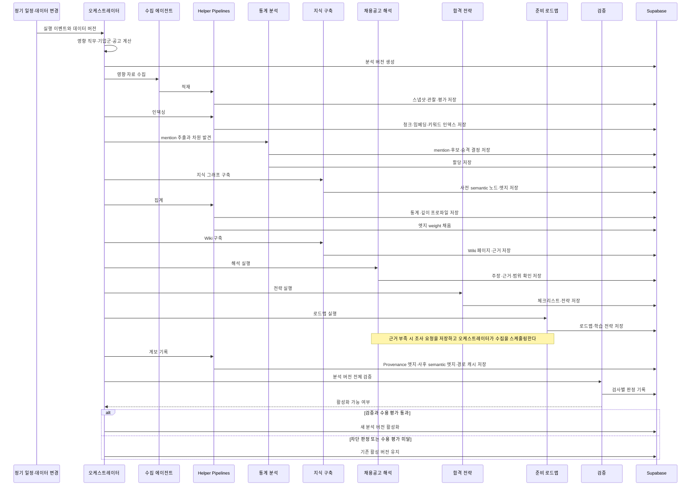
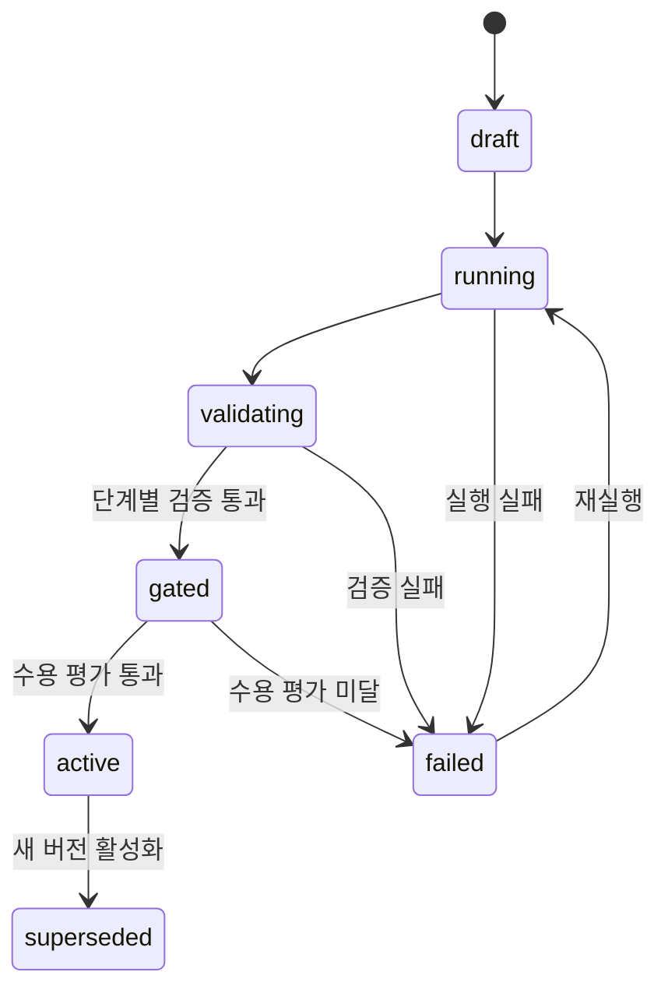
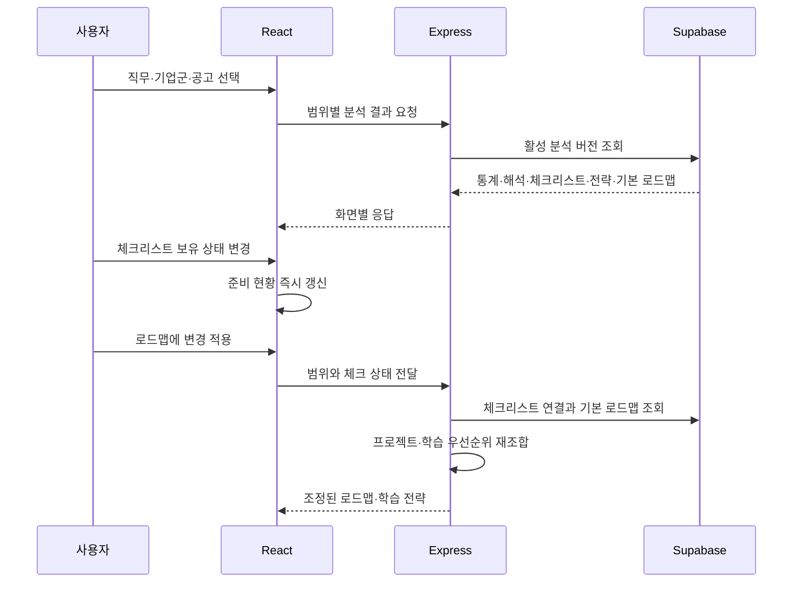
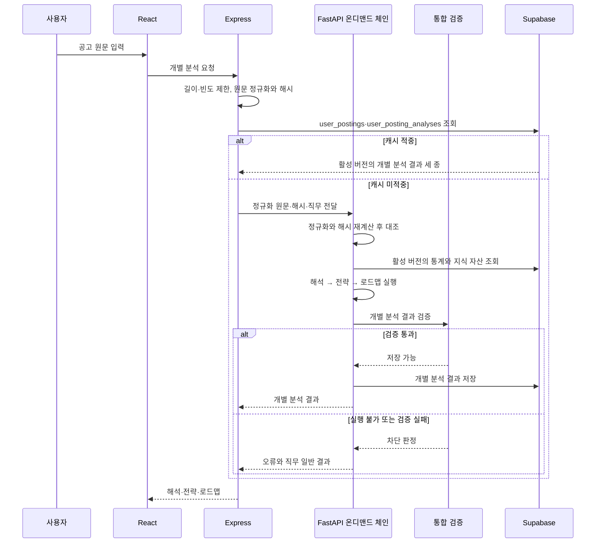

# CareerSignal 아키텍처

## 1. 문서 목적

이 문서는 CareerSignal의 실행 구조, 구성요소의 경계와 책임, 분석 버전의 생성과 활성화를 정의한다. 이 문서는 실행 구조의 기준 문서이며, 다른 문서는 구조를 다시 설명하지 않고 이 문서를 참조한다.

제품 목적과 사용자 흐름은 [기획서](plan.md), 데이터 계층과 저장 구조는 [지식·저장 구조](knowledge-schema.md), 에이전트의 내부 루프와 검증은 [에이전트 설계](agent-design.md), 분류체계와 지표는 [통계 모델](statistics-model.md), 자료 정책은 [데이터 전략](data-strategy.md), 진행 상태는 [개발 백로그](backlog.md)에서 관리한다.

### 1.1 기준 다이어그램

| 관점 | 위치 |
| --- | --- |
| 전체 시스템 구조 | 이 문서 3장 |
| 분석 실행 순서 | 이 문서 7장 |
| 분석 버전 생성과 활성화 | 이 문서 8장 |
| 사용자 요청 흐름 | 이 문서 9장 |
| 사용자 공고 직접 입력 | 이 문서 11장 |
| 데이터 계층과 계보 | [지식·저장 구조](knowledge-schema.md) 2장 |
| 분류체계 발견과 승격 | [통계 모델](statistics-model.md) 3장 |
| 에이전트 공통 루프 | [에이전트 설계](agent-design.md) 5장 |
| 검증 흐름 | [에이전트 설계](agent-design.md) 9장 |

## 2. 시스템 범위

CareerSignal은 채용공고와 근거 자료를 직무 단위로 분석해 통계, 채용공고 해석, 합격 전략, 준비 로드맵을 생성하는 배치형 리서치 에이전트 서비스다.

설계의 기준 규모는 여러 직무의 대량 실데이터다. 백엔드 직무의 소량 자료 구간은 같은 코드 경로를 검증하는 단계이며 별도의 구조를 두지 않는다.

분석 범위는 세 단계다.

| 범위 | 식별자 | 의미 |
| --- | --- | --- |
| 직무 전체 | `job_role_id` | 동일 직무 공고 전체의 공통 요구와 통계 |
| 기업군 | `company_cluster_id` | 동일 직무 안에서 기업군이 보이는 추가 요구 |
| 개별 공고 | `posting_id` | 특정 공고의 요구사항과 회사 맥락 |

정적 프로토타입은 `prototype/`, React 화면은 `product/`, Express API는 `server/`, Python·FastAPI 에이전트 서비스는 `agent/`, 저장소는 Supabase(Postgres + pgvector)가 담당한다.

### 2.1 자율성 등급

구성요소의 판단 범위를 네 등급으로 구분한다.

| 등급 | 정의 | 해당 구성요소 |
| --- | --- | --- |
| A0 | 결정적. 같은 입력에 같은 출력을 낸다 | 오케스트레이터, 집계 파이프라인, 계보 기록 파이프라인, Express 조합기, 규칙 검증 |
| A1 | 고정 순서의 파이프라인 안에서 생성 모델을 사용한다 | 근거 함의 검증, 교차 모델 감사, 모델 재정렬 |
| A2 | 검색 대상과 도구를 선택하고 근거의 충분성을 판단하며 반복한다 | 지식 구축, 통계 분석의 차원 발견, 해석, 전략, 로드맵 |
| A3 | 목표만 받고 출처 발견까지 수행한다 | 데이터 수집 |

수치를 생성하는 경로에는 생성 모델을 두지 않는다. 생성 모델은 원문 추출, 차원 후보 명명, 해석과 전략의 서술, 근거 함의 판정에 사용한다.

### 2.2 구성요소 분류

구성요소를 네 계층으로 나눈다.

| 계층 | 구성요소 | 판별 기준 |
| --- | --- | --- |
| Control Plane | 분석 오케스트레이터 | 실행 계획에 따라 에이전트를 스케줄링한다 |
| Domain Agents | 데이터 수집, 지식 구축, 통계 분석, 채용공고 해석, 합격 전략, 준비 로드맵 | 불확실성 속에서 검색과 충분성을 판단한다 |
| Helper Pipelines | 적재, 인덱싱, 집계, 계보 기록, 서빙 | 결정적 처리를 수행해 결과를 재계산할 수 있다 |
| Verification | 통합 검증 | 규칙 검사와 모델 판정을 결합해 공개·수리·차단을 판정한다 |

세 가지 규칙이 계층의 경계를 정의한다.

1. 도메인 에이전트는 다른 도메인 에이전트를 직접 호출하지 않는다.
2. 결정적 helper pipeline은 에이전트를 자율적으로 시작하지 않는다.
3. Control Plane의 오케스트레이터만 실행 계획에 따라 에이전트를 스케줄링한다.

## 3. 전체 시스템 구성



도형은 구성요소의 성격을 나타낸다.

| 도형 | 의미 |
| --- | --- |
| 평행사변형 | 외부 자료와 입력 이벤트 |
| 육각형 | 판단하는 구성요소. 오케스트레이터·도메인 에이전트·통합 검증 |
| 서브루틴 | 결정적 helper 파이프라인 |
| 원통 | 저장소의 논리 영역 |
| 스타디움 | 사용자 접점 |

## 4. 구성요소와 책임

| 구성요소 | 책임 | 자율성 | 실행 시점 | 위치 |
| --- | --- | --- | --- | --- |
| React UI | 범위 선택, 분석 결과와 체크 상태 표시 | 미사용 | 사용자 요청 | `product/` |
| Express API | 활성 결과 조회, 응답 조립, 체크 상태 반영, 오류 처리 | A0 | 사용자 요청 | `server/` |
| 준비 현황·로드맵 조합기 | 체크 상태에 따른 집계와 순서 재조합 | A0 | 사용자 요청 | `server/` |
| 사용자 공고 입력 처리 | 길이·빈도 제한, 원문 정규화와 해시, `user_postings`·`user_posting_analyses` 캐시 조회 | A0 | 사용자 요청 | `server/` |
| 분석 오케스트레이터 | 영향 범위 계산, 실행 순서 제어, 조사 요청 정책 검사, 버전 활성화 | A0 | 데이터 변경 | `agent/` |
| 데이터 수집 에이전트 | 자료 발견·수집·평가, 원본과 출처 평가 저장 | A3 | 데이터 변경, 조사 요청 | `agent/` |
| 지식 구축 에이전트 | 지식 그래프와 Wiki 구축 | A2 | 데이터 변경 | `agent/` |
| 통계 분석 에이전트 | mention 추출, 차원 발견과 승격, 할당 | A2 | 데이터 변경 | `agent/` |
| 채용공고 해석 에이전트 | 직무 공통 기대치, 기업군·공고 추가 요구, 회사 특징 | A2 | 데이터 변경 | `agent/` |
| 합격 전략 에이전트 | 체크리스트와 포트폴리오·자소서·면접 전략 | A2 | 데이터 변경 | `agent/` |
| 준비 로드맵 에이전트 | 기본 프로젝트 로드맵, 학습 전략, 선수 관계 | A2 | 데이터 변경 | `agent/` |
| 적재 파이프라인 | 해시, 중복 판정, 스냅샷·관찰·평가 기록 | A0 | 수집 직후 | `agent/` |
| 인덱싱 파이프라인 | 청크 분할, 문맥 부착, 임베딩, 키워드 인덱스 | A0 | 적재 직후 | `agent/` |
| 집계 파이프라인 | 지표 실행, 표본 판정, 불확실성 계산, 깊이 프로파일 산출 | A0 | 할당 직후 | `agent/` |
| 계보 기록 파이프라인 | Provenance 엣지와 사후 semantic 엣지 기록, 경로 캐시 갱신 | A0 | 각 산출물 저장 직후 | `agent/` |
| 통합 검증 | 규칙·의미 검증, 공개·수리·차단 판정 | A0 + A1 | 각 산출물 직후 | `agent/` |
| 서빙 파이프라인 | 활성 분석 버전 조회, 저장된 payload 반환, 범위 폴백 | A0 | 사용자 요청 | `agent/`, `server/` |

## 5. 블랙보드와 실행 봉투

에이전트는 산출물을 서로 전달하지 않는다. 공유 상태는 Supabase에 두고, 각 실행은 범위와 버전을 지정하는 봉투만 받는다.

```json
{
  "agent_run_id": "run_...",
  "analysis_version": "an_...",
  "dataset_version": "ds_...",
  "taxonomy_version": "tx_...",
  "knowledge_version": "kn_...",
  "job_role_id": "backend",
  "scope_level": "cluster",
  "scope_id": "fintech",
  "upstream_output_ids": ["out_stats_..."],
  "as_of_date": "2026-07-27",
  "budget": {
    "max_retrieval_rounds": 2,
    "max_repair_rounds": 2,
    "max_tokens": 120000
  }
}
```

`as_of_date`는 시간 필터의 기준이다. 같은 봉투로 재실행하면 같은 자료 범위를 조회한다.

### 5.1 조사 요청 흐름

근거가 부족한 에이전트는 수집 에이전트를 직접 호출하지 않는다.

```text
분석 에이전트가 자료 부족을 확인
→ research_requests에 요청 저장
→ 오케스트레이터가 출처 정책과 우선순위를 검사
→ 수집 에이전트를 새 실행으로 스케줄링
→ 수집과 지식 구축 완료
→ 영향받은 분석만 재실행
```

## 6. 시간 정책

### 6.1 시간 필드

| 대상 | 필드 |
| --- | --- |
| 원본 스냅샷 | `published_at`, `fetched_at` |
| 원본 관찰 | `observed_at`, `fetch_status` |
| 공고 버전 | `posted_at`, `closed_at` |
| 그래프 엣지 | `valid_from`, `valid_to` |
| 통계 | `period_id`와 기간 경계 |
| 실행 | 봉투의 `as_of_date` |

알 수 없는 유효 기간을 게시일로 추정해 채우지 않는다.

### 6.2 검색 필터 순서

```text
분석 버전 → 직무 → 범위 → 자료 계층 → 허용 용도 → 시간창 → 랭킹
```

시간창은 랭킹 직전에 적용한다. 기준 기간을 벗어난 자료는 의미가 유사해도 결과에 포함하지 않는다.

## 7. 분석 실행 순서



이 순서는 채용공고 변경으로 모든 단계가 필요한 실행을 나타낸다. 오케스트레이터는 변경 유형에 따라 영향이 없는 단계를 생략한다.

### 7.1 데이터 변경별 재실행 범위

| 변경 데이터 | 수집·인덱싱 | mention·차원 | 통계 | 그래프·Wiki | 해석 | 전략 | 로드맵 |
| --- | --- | --- | --- | --- | --- | --- | --- |
| 신규·수정·삭제 채용공고 | 실행 | 해당 직무 | 해당 직무·기업군·기간 | 영향 범위 | 영향 범위 | 영향 범위 | 영향 범위 |
| 공고의 직무 분류 변경 | 실행 | 두 직무 | 두 직무 | 두 직무 | 두 직무 | 두 직무 | 두 직무 |
| 공고의 기업군 분류 변경 | 실행 | 미실행 | 직무 전체와 이전·새 기업군 | 기업군 엣지만 | 동일 범위 | 동일 범위 | 동일 범위 |
| 분류체계 버전 발행 | 미실행 | 전량 재할당 | 해당 직무 전체 | 해당 직무 전체 | 영향 범위 | 영향 범위 | 영향 범위 |
| 온톨로지 버전 발행 | 미실행 | 미실행 | 미실행 | 해당 직무 전체 | 영향 범위 | 영향 범위 | 영향 범위 |
| 회사 공식 자료 | 실행 | 미실행 | 미실행 | Wiki 연결 범위 | 연결된 범위 | 영향 범위 | 영향 범위 |
| 공공·직무 표준 | 실행 | 표준 연결 갱신 | 영향 직무 | 영향 직무 | 영향 직무 | 영향 직무 | 영향 직무 |
| 외부 전략 자료 | 실행 | 미실행 | 미실행 | Wiki 연결 범위 | 미실행 | 연결된 범위 | 연결된 범위 |
| 지표 정책 버전 | 미실행 | 미실행 | 해당 직무 전체 | 엣지 `weight`와 깊이 기준 | 영향 범위 | 영향 범위 | 영향 범위 |
| 사용자 체크 상태 | 미실행 | 미실행 | 미실행 | 미실행 | 미실행 | 미실행 | Express에서 재조합 |

분류체계 버전이 바뀌면 `taxonomy_version`을 가진 `REQUIRES`와 `REQUIRES_CAPABILITY` 엣지가 무효가 되므로 그래프를 함께 재구축한다. 계보 기록은 별도의 트리거를 갖지 않고 재실행된 산출물이 저장될 때 따라 실행한다.

## 8. 분석 버전 생명주기



| 상태 | 의미 |
| --- | --- |
| `draft` | 데이터 변경과 영향 범위가 등록된 버전 |
| `running` | 산출물을 생성하는 버전 |
| `validating` | 단계별 검증을 수행하는 버전 |
| `gated` | 검증을 통과하고 수용 평가를 기다리는 버전 |
| `active` | 사용자 조회에 제공되는 버전 |
| `failed` | 실행·검증·수용 평가에 실패해 공개되지 않는 버전 |
| `superseded` | 새 활성 버전으로 교체된 버전 |

수용 평가는 활성화 이전 단계다. 평가 세트 채점 결과가 기준을 충족하지 않으면 활성화하지 않는다. 기준은 [검증 체크리스트](checklist.md)에서 관리한다.

활성 버전 전환은 직무 단위로 원자적으로 수행한다. 한 화면만 새 버전이고 다른 화면은 이전 버전인 상태를 허용하지 않는다.

### 8.1 공개 정책

산출물의 검증 판정에 따라 공개 여부를 결정한다.

| 판정 | 공개 |
| --- | --- |
| `verified` | 공개 후보 |
| `verified_with_warning` | 공개 후보. 경고를 함께 표시한다 |
| `insufficient_evidence` | 비공개. 기존 활성 버전을 유지한다 |
| `contradicted` | 비공개. 기존 활성 버전을 유지한다 |
| `policy_violation` | 비공개. 해당 주장을 폐기한다 |
| `schema_invalid` | 비공개 |
| `needs_research` | 비공개. 조사 요청을 발행한다 |

실행 한도에 도달해 조사를 마치지 못한 결과는 활성 버전에 포함하지 않는다.

판정의 정의는 [에이전트 설계](agent-design.md)를 따른다.

## 9. 사용자 요청 흐름



화면 조회는 에이전트를 호출하지 않는다. 조회는 두 걸음이다.

1. `active_analysis_versions`에서 직무의 활성 분석 버전을 찾는다.
2. `analysis_outputs`를 `(analysis_version, scope_level, scope_id, output_type)`으로 읽고 `payload`를 그대로 반환한다.

`analysis_outputs` 한 행이 화면 한 벌이며 조회 계층은 payload를 만들지 않는다. 직무별 라벨은 payload 안에 있다.

공고 범위의 `strategy`와 `roadmap`은 저장하지 않으므로, 그 공고가 속한 기업군, 다시 직무 전체 순으로 한 칸씩 넓히고 payload의 `scope`를 실제로 읽은 범위로 바꾼다. 활성 버전에 요청한 산출물이 없으면 빈 값 대신 `NO_ACTIVE_ANALYSIS` 오류를 낸다. 결정 근거는 [ADR 0013](adr/0013-serving-stored-analysis-outputs.md)에 있다.

### 9.1 체크 상태 영향 범위

| 화면 결과 | 범위 변경 | 체크 변경 |
| --- | --- | --- |
| 준비 현황 카드 | 범위에 맞게 변경 | 즉시 변경 |
| 체크리스트 내용 | 범위에 맞게 변경 | 내용 유지, 보유 상태만 변경 |
| 포트폴리오·자소서·면접 전략 | 범위에 맞게 변경 | 변경 없음 |
| 프로젝트 로드맵·학습 전략 | 범위에 맞게 변경 | 적용 동작으로 재조합 |

체크 상태는 `(job_role_id, scope_level, scope_id, checklist_concept_id)` 단위로 구분한다. 개념 식별자에 연결하므로 분석 버전이 바뀌어 문구가 달라져도 체크가 유지된다.

비로그인 구간에서 체크 상태는 브라우저에 저장하고 서버는 저장하지 않는다. 로드맵 조합을 요청할 때 클라이언트가 체크 맵을 요청 본문의 `checks`에 실어 보낸다. 키는 `checklist_concept_id`이고 값은 보유 여부다. 로그인과 사용자별 영구 저장은 같은 키 구조를 사용자별 저장소에 적용한다.

## 10. API와 데이터 계약

브라우저는 Express만 호출한다. Express는 활성 분석 버전을 저장소에서 직접 조회하고, 요구 추출과 사용자 공고 개별 분석에서만 FastAPI를 내부 HTTP로 호출한다.

### 10.1 공통 분석 식별자

```text
job_role_id
scope_level: overall | cluster | posting
scope_id
entry_segment: entry_junior | experienced | unspecified
dataset_version
taxonomy_version
knowledge_version
analysis_version
model_version
prompt_version
retrieval_policy_version
metric_policy_version
verification_status
generated_at
```

### 10.2 화면 API

| 메서드·경로 | 책임 |
| --- | --- |
| GET `/api/health` | 상태 확인 |
| GET `/api/jobs` | 직무 목록과 직무별 활성 분석 버전 보유 여부 |
| GET `/api/stats?job=` | 활성 버전의 직무 전체 `statistics` payload |
| GET `/api/postings?job=` | 개별 해석이 있는 공고 목록과 각 공고의 기업군 |
| POST `/api/reverse` | 범위별 `interpretation` payload |
| POST `/api/conditions` | 범위별 `strategy` payload |
| POST `/api/roadmap` | 범위별 `roadmap` payload. 체크 맵이 있으면 순서와 우선순위를 재조합한다 |
| POST `/api/postings/analyze` | 사용자 공고 한 건의 개별 분석. 흐름은 11장 |
| POST `/api/extract` | 원문의 요구 표현 추출. FastAPI로 중계한다 |

POST 본문의 범위는 `job`과 `scope`(`level`·`cluster_tag`·`posting_id`)다. 오류는 `error.code`와 `error.message`로 낸다. 경로별 FastAPI 의존과 배포 설정은 `server/README.md`가 소유한다.

### 10.3 에이전트 API

| 메서드·경로 | 책임 |
| --- | --- |
| GET `/health` | 상태 확인 |
| POST `/reverse` | 활성 버전의 `interpretation` payload |
| POST `/conditions` | 활성 버전의 `strategy` payload |
| POST `/roadmap` | 저장된 `roadmap` payload에 체크 상태를 적용한 순서 |
| POST `/extract` | 원문의 요구 표현 추출 |
| POST `/postings/analyze` | 사용자 공고 한 건의 개별 분석 |

Express가 부르는 것은 `/extract`와 `/postings/analyze` 둘이다. 브라우저는 이 주소를 부르지 않는다.

수직 슬라이스의 JSON 키는 화면 계약으로 유지하고, 범위 식별자와 버전 메타데이터를 추가한다. 에이전트는 이전 HTTP 응답 전체를 전달받지 않고 공통 식별자로 저장소를 조회한다.

## 11. 사용자 공고 직접 입력

사용자가 입력한 공고는 통계와 직무 공통 기대치에 포함하지 않는다.

Express는 입력 길이와 요청 빈도를 제한하고 원문을 정규화한다. 정규화는 개인정보 패턴 제거를 포함하며, 규칙 본문은 [데모 시드 계약](../agent/data/demo_seed/CONTRACT.md) 6.2가 소유한다. Express와 FastAPI가 같은 규칙을 쓰므로 같은 원문이 양쪽에서 같은 SHA-256을 낸다.

캐시 조회는 Express가 저장소에서 직접 수행한다. 정규화한 원문의 해시로 `user_postings`를 찾고, 그 공고의 `user_posting_analyses` 가운데 활성 분석 버전과 맞는 세 종을 고른다. 세 종이 갖춰지면 그것을 반환하고, 갖춰지지 않으면 FastAPI의 온디맨드 분석을 호출한다.

FastAPI는 받은 정규화 결과를 다시 계산해 요청의 해시와 대조한다. 해시는 캐시의 열쇠이므로 요청이 보낸 값을 그대로 열쇠로 쓰지 않는다.



온디맨드 체인을 열 수 없으면 그 직무의 활성 버전 직무 전체 결과를 함께 실어 보낸다. 화면은 개별 해석이 아니라 직무 일반 결과를 보고 있음을 표시한다.

## 12. 저장소

저장소는 Supabase(Postgres + pgvector) 하나를 사용한다. 데이터 계층, 테이블 구조, 지식 그래프, Wiki, 계보의 정의는 [지식·저장 구조](knowledge-schema.md)에 있다.

데이터베이스 스키마의 기준은 `agent/migrations/`다.

## 13. 접근 권한

구성요소별 읽기·쓰기 범위와 강제 수단은 [권한 매트릭스](permission-matrix.md)에 있다.

## 14. 검증과 계측

### 14.1 검증 층

1. 규칙 검증: 스키마, 수치, 분모, 근거 존재, 식별자 연결, 선수 관계 순환을 검사한다.
2. 의미 검증: 주장과 근거의 함의, 과잉 일반화를 생성 모델로 판정한다.
3. 교차 확인: 다른 모델 계열로 표본을 재판정한다.
4. 사람 점검: 평가 세트와 베타 결과를 표본 검토한다.

교차 확인은 같은 계열 모델의 자기 선호와 오류 상관을 줄인다. 다른 회사의 모델이라는 이유만으로 판정을 정답으로 취급하지 않는다. 최종 기준은 사람이 확정한 평가 세트다.

검사 목록과 판정 형식은 [에이전트 설계](agent-design.md)를 따른다.

### 14.2 계측 지표

| 지표 | 정의 |
| --- | --- |
| `citation_utilization` | 검색 결과 중 `unused` 외의 사용 목적이 기록된 비율 |
| `citation_precision` | 인용한 근거가 주장을 지지하는 비율 |
| `claim_coverage` | 허용된 근거가 연결된 주장의 비율 |
| `marginal_utility` | 특정 근거나 검색 전략을 제거했을 때의 결과 변화 |

검색 실행과 질의, 그리고 검색이 만난 후보 전부를 `retrieval_runs`·`retrieval_queries`·`retrieval_candidates`에 기록한다. 고른 근거 묶음은 `evidence_sets`·`evidence_set_members`에, 근거의 사용 목적은 `evidence_usages`에 기록한다. 이 순서가 외래키의 순서다.

앞의 세 지표는 이 테이블들의 조인으로 계산한다. 세는 단위는 지표마다 다르다. `citation_utilization`은 후보 단위, `citation_precision`은 `(후보, 주장)` 쌍 단위, `claim_coverage`는 주장 단위다. `claim_coverage`의 허용 판정은 근거의 자료 계층과 용도로 하며, 근거 집합을 고를 때 쓴 계층 표를 그대로 쓴다.

지표는 비율과 함께 분모를 보고한다. 비율만 남기면 표본이 작아 흔들린 값을 알아볼 수 없다. 분모가 0이면 값을 비운다. 0으로 두면 아직 재지 않은 것과 재었더니 0인 것을 구분할 수 없다.

`marginal_utility`는 평가 세트 표본에서 제거 실험으로 측정한다. 근거 하나를 뺀 실행을 다시 돌려야 결과 변화가 나오므로 계측 테이블의 조인으로는 계산하지 않는다.

검색 결과는 최종 인용 외에도 반례 검사, 용어 정규화, 다음 검색 계획, 부재 확인에 기여한다. 인용 여부만으로 검색의 가치를 판정하지 않는다. `unused`도 기록한다. 쓰지 않았다는 사실이 없으면 검색이 만났으나 쓰이지 않은 후보와 아직 판정하지 않은 후보를 구분할 수 없다.

### 14.3 실행 기록

각 실행은 입력 데이터 버전, 분류체계 버전, 모델·프롬프트·검색 정책·지표 정책 버전, 도구 호출, 검색 출처, 토큰과 비용, 재시도, 종료 사유, 검증 결과를 기록한다.

## 15. 배포

| 구성요소 | 실행 위치 | 정의 |
| --- | --- | --- |
| React 화면 | Vercel | `product/`를 Root Directory로 쓰는 Vercel 프로젝트 |
| Express API | Render | `server/render.yaml`의 `careersignal-server` |
| FastAPI 에이전트 서비스 | Render | `server/render.yaml`의 `careersignal-agent` |
| 저장소 | Supabase | Postgres + pgvector |

Blueprint 하나가 Express와 FastAPI 두 서비스를 정의한다. 브라우저가 부르는 주소는 Express뿐이며, FastAPI는 요구 추출과 사용자 공고 온디맨드 분석 경로에서 Express가 내부 HTTP로 호출한다.

키는 서비스별로 분리한다. Express는 저장소 접속과 에이전트 주소를, FastAPI는 저장소 접속과 생성 모델 키를 갖는다. Express는 생성 모델 키를 보유하지 않는다.

배포 설정의 기준 문서는 `server/README.md`와 `product/README.md`다.

## 16. 관련 문서

- [기획서](plan.md)
- [지식·저장 구조](knowledge-schema.md)
- [에이전트 설계](agent-design.md)
- [통계 모델](statistics-model.md)
- [데이터 전략](data-strategy.md)
- [디자인 컨셉](design-concept.md)
- [개발 백로그](backlog.md)
- [검증 체크리스트](checklist.md)
