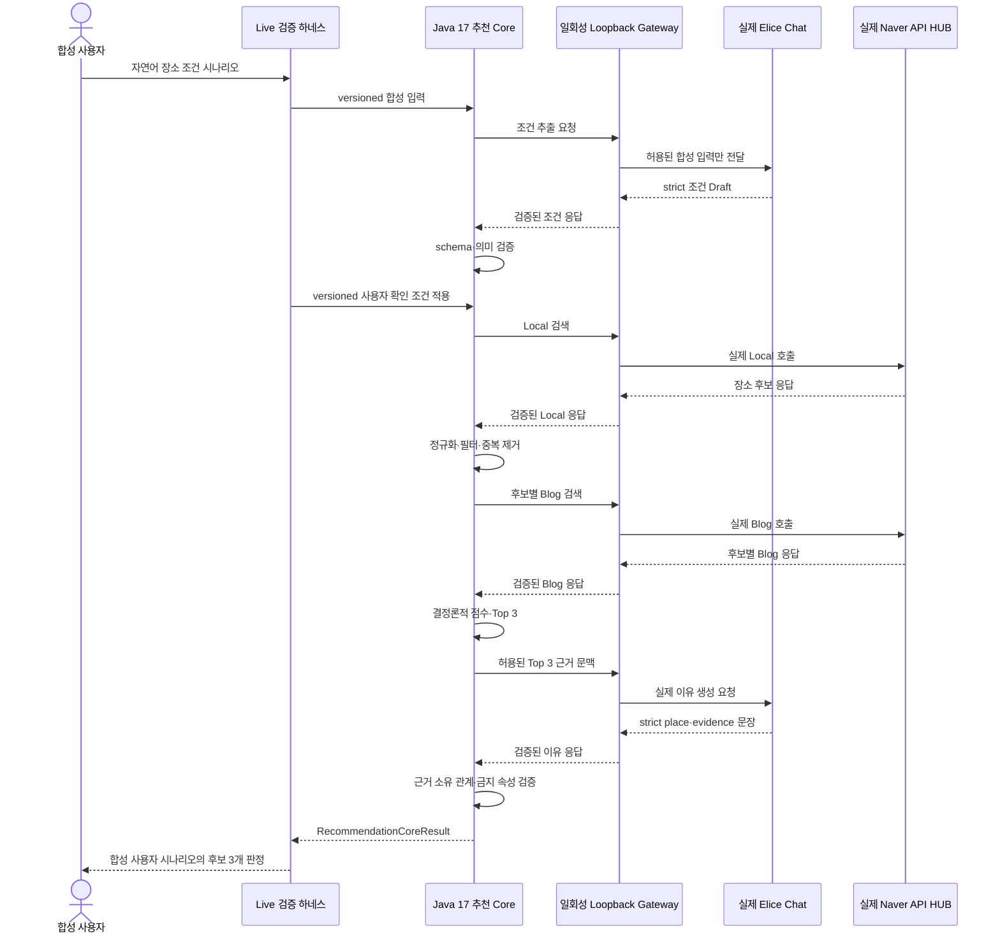

# CASE-0002 실제 Naver→Elice 추천 핵심 워크플로 사용자 여정 검증

## 결론과 검증 범위

고정 합성 사용자 조건 세 건을 사용해 실제 Elice 조건 추출, 실제 Naver Local·Blog
검색, 서버의 정규화·필터·중복 제거·결정론적 점수·Top 3, 실제 Elice 근거 이유 생성,
서버의 최종 근거 검증을 하나의 동기식 추천 core로 끝까지 연결했다. 세 시나리오는
동일한 최종 코드 SHA `e789af65e94441aa38a018a2931c3705f7125112`에서 각각 독립적으로
실행했고 모두 strict success였다.

이 결과가 증명하는 것은 실제 Provider가 연결된 **추천 핵심 엔진**이 검증한 세 합성
시나리오에서 작동했다는 사실이다. 브라우저에서 실제 사용자가 입력한 서비스 E2E를
뜻하지는 않는다. 사용자 확인은 versioned fixture로 모사했으며 공개 HTTP API, DB,
비동기 Job·Worker, SSE, 프런트엔드와 배포 runtime은 아직 이 경로에 연결되지 않았다.

| 실제로 검증한 범위 | 이번 결과가 아직 증명하지 않는 범위 |
| --- | --- |
| 실제 Elice 조건 Draft 추출과 의미 검증 | 실제 사용자 입력과 브라우저 UI |
| 실제 Naver Local·Blog 검색과 후보 처리 | Controller, Draft·Job DB 영속화 |
| 서버의 결정론적 점수와 Top 3 | Outbox, Redis Worker, SSE 재연결 |
| 실제 Naver 파생 근거의 Elice 전달 | 공유방·투표·최종 확정 |
| Elice 출력의 place·evidence 사후 검증 | 클라우드 배포·운영 가용성·SLA |
| 비밀 격리, 무재시도, 종료 정리 | 풍부한 자연어 추천 이유의 품질 |

## 해결하려던 사용자 문제

Mock 전체 흐름은 입력부터 추천 결과까지 application 로직을 검증하지만 실제 Naver와
Elice의 응답 차이를 발견하지 못한다. 반대로 Provider별 Local Live는 인증과 schema만
확인하기 때문에 실제 Naver 검색 결과가 추천 후보가 되고 그 근거가 Elice 이유 생성에
연결되는지는 증명하지 못한다. Split Live도 의도적으로 Naver 응답을 Elice에 전달하지
않는다.

따라서 검증 질문을 다음처럼 정의했다.

> 사용자가 장소 조건을 자연어로 입력했다고 가정할 때, 실제 Elice가 조건을 안전하게
> 구조화하고 사용자가 확인한 조건만으로 실제 Naver 후보를 찾은 뒤, 서버가 정한 Top 3의
> 실제 근거만 Elice에 전달해 검증 가능한 추천 결과를 만들 수 있는가?

성공 판정은 단순히 조건 추출·Local·Blog·이유 생성의 네 Provider 단계가 2xx였는지가
아니다. 사용자 입력의 의미 보존, 명시적 확인 경계, 후보 필수 조건, 점수·순위 결정 주체,
근거 provenance, fallback과 degraded 부재, 비밀 비노출과 cleanup까지 모두 충족해야
한다.

## 테스트 구조와 신뢰 경계

원본 Naver·Elice 자격은 invocation마다 새로 시작하는 Gateway 프로세스만 보유했다.
Java 테스트 프로세스에는 loopback 주소와 역할별 일회성 로컬 자격만 전달했다. Naver
응답은 메모리에서 정규화했으며 원문 응답 전체를 파일, JUnit artifact 또는 문서에
저장하지 않았다.

Elice 이유 생성에는 확정 조건과 Top 3의 허용된 최소 문맥만 전달했다. 장소 UUID·이름·
category, 정규화된 Local 근거, Blog 근거 ID·제목·요약은 허용했지만 Provider 자격,
원문 응답 전체, source URL, 좌표, CandidateKey, 점수·순위, 사용자 식별자는 제외했다.
Gateway는 전달할 장소와 근거가 앞선 실제 Naver 응답에서 파생됐는지 Elice 호출 전에
검사했다.

## 공통 사용자 여정과 단계별 판정

세 시나리오는 같은 제품 흐름을 통과하고 입력 조건의 완전성만 달리했다. 다음 표의
각 통과 기준을 만족한 경우에만 다음 단계로 진행했다.

| 단계 | 유저 관점 | 시스템 처리 | 통과 기준 | 실제 결과 |
| --- | --- | --- | --- | --- |
| 1. 입력 | 원하는 장소 조건을 자연어로 제시 | 허용된 versioned 합성 입력을 actual Elice 조건 추출에 전달 | 실제 사용자·개인정보가 없고 fixture hash가 승인값과 일치 | 세 fixture 모두 승인된 입력으로 시작 |
| 2. 조건 초안 | 서비스가 이해한 조건을 확인할 준비 | Elice가 `placepick.condition-extraction.v1` strict JSON을 반환 | 2xx, schema 유효, 추가 필드 없음 | 세 시나리오 모두 통과 |
| 3. 의미 검증 | 입력한 뜻이 바뀌지 않았는지 확인 | 위치·유형·인원·예산·선호·제외·warning을 닫힌 기준으로 대조 | 누락값 임의 추정, 다른 위치·유형, 조건 손실이 없음 | 세 시나리오 모두 통과 |
| 4. 사용자 확인 | 추출 초안을 검토·수정한 뒤 추천 시작 | 실제 UI 대신 versioned 확정 fixture를 명시적으로 적용 | Draft를 자동 확정하지 않고 정본 조건만 core에 전달 | `applied=true`, `semanticMatch=true` |
| 5. 장소 검색 | 조건에 맞는 실제 후보 탐색 | 서버가 확정 조건으로 query를 만들고 Naver Local을 실제 호출 | 2xx·schema, 위치·유형 필수 조건을 만족하는 후보 3개 이상 | 세 시나리오 모두 통과 |
| 6. 후보 정제 | 중복·부적합 후보가 결과에 섞이지 않음 | HTML·NFKC·공백 정리, 주소·category·제외 조건, URL, 중복을 검사 | 유효 source가 있고 필수 조건을 만족한 고유 후보만 유지 | 세 시나리오 모두 통과 |
| 7. 완화 판단 | 후보가 부족할 때만 낮은 우선순위 선호를 한 번 완화 | 유효 후보 수를 검사하고 필요 시 lowest priority preference 하나만 제거 | 위치·유형은 유지하고 Local 추가 호출은 최대 1회 | 실제 캠페인은 완화 대표성을 주장하지 않음; 해당 분기는 Mock 전체 흐름에서 검증 |
| 8. 근거 수집 | 후보를 설명할 실제 근거 확보 | 예비 후보별 Naver Blog를 실제 호출하고 후보 이름과 근거를 연결 | Blog 호출 성공, 연결 근거 1개 이상, 후보 간 근거 교차 없음 | 세 시나리오 모두 실제 Blog 근거로 통과 |
| 9. 점수·Top 3 | 조건과 근거가 나은 후보 3개를 받음 | 서버가 위치 30, 유형 25, 선호 최대 15, Blog 최대 10으로 계산 | 정확히 3개, 점수 0~80, 정렬 계약 유지 | 세 시나리오 모두 Top 3 확정 |
| 10. 이유 생성 | 각 후보를 추천한 근거를 확인 | 서버가 Top 3와 허용된 근거만 actual Elice에 batch 전달 | 출력 place ID 집합이 Top 3와 같고 각 문장이 같은 후보 근거 하나만 인용 | 세 시나리오 모두 통과 |
| 11. 서버 사후 검증 | LLM이 순위나 사실을 임의로 바꾸지 않음 | place·evidence 소유 관계, 문장 유형, 금지 속성과 추가 필드를 재검사 | 가격·영업·도보·출구 등 입력에 없는 주장 0건, fallback 없음 | `reasonFallback=false` |
| 12. 완료·정리 | 정상 결과를 받고 실행 자격이 남지 않음 | safe summary를 검증하고 Gateway·port·일회성 자격·임시 파일 제거 | `linked=true`, `degraded=false`, `cleanup=true`, retry·redirect 0회 | 세 invocation 모두 strict success |

현재 이유 문장은 `LOCAL`과 `BLOG` 근거 유형별로 허용된 두 개의 보수적 문장 중 하나를
선택하는 구조다. 이는 Elice가 실제 Naver 파생 근거와 올바르게 연결되는지 검증하지만,
자유롭고 풍부한 추천 카피의 품질을 입증하지는 않는다. 점수와 순위는 Elice가 아니라
서버가 먼저 확정했으며 Elice 출력이 이를 변경할 수 없다. Embedding 호출은 0회였고
검색·중복 제거·점수 계산에도 사용하지 않았다.

## 시나리오 1: 조건이 모두 있는 카페 탐색

### 사용자 의도

사용자는 서울에서 2명이 방문할 카페를 찾는다. 1인당 예산 상한은 2만 원이고 조용한
환경을 선호하며 흡연 장소는 제외한다. versioned 합성 입력은 재현 가능한 계약으로
source에 보존했다. Provider에 전송된 전체 HTTP request body와 실제 response body는
로그·JUnit artifact·문서에 보존하지 않았다.

### 과정과 관찰

1. 실제 Elice는 위치, `CAFE`, 인원 2명, 예산 상한, 조용함 선호와 흡연 제외를 Draft
   범주로 추출했다.
2. 서버는 각 필드를 닫힌 의미 집합으로 검증했다. 추출 결과를 바로 검색에 사용하지 않고
   사용자가 확인했다고 정의한 versioned 조건에서 위치를 `서울`, 선호 우선순위를 10으로
   확정했다.
3. 확정 조건으로 실제 Naver Local 후보를 받고 위치·카페 category·흡연 제외·source와
   중복을 검사했다.
4. 예비 후보에 실제 Naver Blog 근거를 연결한 뒤 서버가 결정론적 점수와 Top 3를 먼저
   확정했다. 구조화된 가격 근거가 없으므로 예산을 맞는다고 추론해 점수를 주지 않았다.
5. Elice에는 Top 3의 허용된 파생 근거만 전달했다. 반환된 세 장소의 ID 집합, 각 문장이
   인용한 evidence 소유 관계와 금지 속성 부재를 서버가 다시 검증했다.

### 결과와 판정

application 논리 호출 수는 7회였다. 조건 추출, 실제 Local·Blog, 이유 생성과 서버
사후 검증을 모두 완료했고 `linked=true`, `degraded=false`, `reasonFallback=false`,
`cleanup=true`였다. 따라서 “조건이 모두 채워진 사용자 입력”의 실제 연결 경로는
strict success로 판정했다.

## 시나리오 2: 선택 조건을 입력하지 않은 음식점 탐색

### 사용자 의도

사용자는 서울 음식점을 찾지만 인원, 예산, 선호와 제외 조건은 입력하지 않는다. 핵심
검증 목적은 LLM이나 서버가 비어 있는 값을 그럴듯하게 추정하지 않는지 확인하는 것이다.

### 과정과 관찰

1. 실제 Elice 조건 Draft에서 위치와 `RESTAURANT`만 존재하고 인원·예산은 nullable로
   유지되는지 검사했다.
2. 누락된 인원에는 `PARTY_SIZE_NOT_PROVIDED`, 예산에는 `BUDGET_NOT_PROVIDED` warning이
   대응해야 다음 단계로 진행했다. 입력하지 않은 선호나 제외 조건의 생성도 허용하지 않았다.
3. 실제 실행에서 관찰된 exact 영문 동치 `Seoul`은 사용자 확인 전 Draft에서만 닫힌
   alias로 인정했다. 부분 일치나 추가 단어를 허용하지 않았고, 확인 fixture에서는 정본
   `서울`을 적용했다.
4. 이 확정 조건으로 실제 Naver Local·Blog를 처리하고 서버가 Top 3를 결정했다. 가격
   정보가 없다는 사실은 유지하며 음식점의 예산 적합도를 추정하지 않았다.
5. 실제 Elice 이유와 서버의 place·evidence 사후 검증을 완료했다.

### 결과와 판정

application 논리 호출 수는 6회였다. `linked=true`, `degraded=false`,
`reasonFallback=false`, `cleanup=true`였고, 누락 정보를 만들어내지 않은 채 후보 3개까지
완료했다. 따라서 “사용자가 선택 조건을 생략한 흐름”도 strict success로 판정했다.

## 시나리오 3: nullable과 선호·제외가 함께 있는 디저트 카페 탐색

### 사용자 의도

사용자는 서울의 디저트 카페를 원하고 흡연 장소는 제외한다. 인원과 예산은 입력하지
않는다. 이 시나리오는 누락 필드와 명시 필드를 동시에 정확히 분리하는지 확인한다.

### 과정과 관찰

1. 실제 Elice Draft에서 위치·`CAFE`·디저트 선호·흡연 제외는 유지하고 인원·예산은
   nullable과 대응 warning으로 남기는지 검증했다.
2. 사용자 확인 fixture는 위치를 `서울`, 디저트 선호 우선순위를 10으로 확정하되 누락된
   인원·예산을 채우지 않았다.
3. 실제 Naver Local은 1회 호출됐고 유효 후보 3개 이상을 반환했다. 제품 core는 정규화·
   필터·중복 제거를 수행했고 이 실행에서는 `relaxed=false`였다.
4. 실제 Naver Blog는 후보별 3회 호출돼 9개 item을 처리했고, 서버는 Blog 근거를 후보에
   연결한 뒤 Top 3를 확정했다. 보존된 safe report에서 세 후보의 점수는 모두 80이었다.
5. 실제 Elice는 연결된 근거를 사용한 이유 batch를 반환했다. 서버는 Blog evidence 9개의
   소유 관계와 세 place ID 집합을 검증했고 fallback 없이 완료했다.

### 결과와 판정

application 논리 호출 수는 조건 추출 1, Local 1, Blog 3, 이유 생성 1의 총 6회였다.
JUnit safe report는 `linked=true`, `degraded=false`, `reasonFallback=false`,
`callCount=6`을 기록했다. launcher의 종료 guard가 Gateway·port·일회성 자격·임시 파일
제거 뒤 별도로 `cleanup=true`를 확인했고 HTTP retry·redirect는 0회였다. 이는
“nullable과 선호·제외가 함께 있는 흐름”의 strict success다.

시나리오 3의 item·evidence·점수는 로컬에 남은 safe JUnit report에서 확인 가능한
비식별 수치다. 시나리오 1·2의 세부 stage 수치는 최종 추적 문서에 보존하지 않았으므로
총 논리 호출 수와 strict 판정 외 수치를 추정해 추가하지 않았다.

## 세 시나리오 결과 비교

| 시나리오 | 사용자 조건의 차이 | 논리 호출 | 최종 후보 | Linked | Blog 저하 | 이유 fallback | 정리 | 판정 |
| --- | --- | ---: | ---: | --- | --- | --- | --- | --- |
| 완전 조건 카페 | 인원·예산·선호·제외 모두 입력 | 7 | 3 | `true` | 없음 | 없음 | 완료 | strict success |
| nullable 음식점 | 인원·예산·선호·제외 미입력 | 6 | 3 | `true` | 없음 | 없음 | 완료 | strict success |
| nullable 디저트 카페 | 인원·예산 미입력, 선호·제외 입력 | 6 | 3 | `true` | 없음 | 없음 | 완료 | strict success |

`7/6/6`은 application이 허용한 Provider 논리 호출 수다. 처리량, 성공률, SLA 또는
Provider 내부 wire retry 수치가 아니다. 세 invocation은 같은 호출을 자동 재시도한 것이
아니며 각각 새 Gateway·port·일회성 자격과 독립 호출 예산을 사용했다.

## 실패에서 실제 성공까지의 문제 해결

성공 결과만 남기지 않고 중간 실패를 원인과 함께 보존했다.

| 관찰 | 원인 가설과 검증 | 선택한 수정 | 실제 재검증 결과 |
| --- | --- | --- | --- |
| 조건 추출이 `PROVIDER_UNAVAILABLE`로만 보임 | Gateway·Java 사이에서 transport, schema, 의미 오류가 한 코드로 평탄화됨 | 원문 없이 transport·schema·semantic·cross-field safe code를 보존 | 잘못된 Draft는 downstream Naver 호출 전에 fail closed |
| Java 개별 계약은 성공하지만 Gateway outbound 실패 | workerd 로컬 fetch 경로와 실제 endpoint 조합에서 응답을 얻지 못함 | Gateway 보안 정책은 유지하고 로컬 실행 adapter만 Node 24로 교체 | 조건 추출부터 Naver·이유 생성까지 전체 경로 진입 |
| 이유 생성에서 Elice 400 | strict Structured Outputs 지원 부분집합이 배열의 `uniqueItems`를 수용하지 않음 | 정확히 1개 근거 계약은 `minItems=1`, `maxItems=1`과 서버 검증으로 유지하고 미지원 keyword만 제거 | 실제 이유 생성과 사후 provenance 검증 성공 |
| nullable 시나리오 위치가 exact `Seoul`로 반환 | 정본 한국어만 허용한 의미 검증이 정확한 번역 동치도 거부 | 관찰된 `Seoul`·`seoul`만 finite alias로 추가하고 fuzzy·부분 일치는 계속 거부 | 사용자 확인 정본 `서울`로 전체 흐름 성공 |

계약을 약화해 우연히 2xx를 만드는 방식은 사용하지 않았다. Provider가 지원하지 않은
keyword만 제거하면서 정확히 한 evidence라는 의미는 서버 post-validation으로 유지했고,
위치 표현도 관찰된 정확 동치만 제한적으로 허용했다.

## 결과의 의미와 남은 위험

이번 검증으로 다음 결론은 근거를 갖는다.

- 실제 Elice 조건 추출 결과를 schema뿐 아니라 사용자 입력 의미와 대조할 수 있다.
- Draft를 자동 확정하지 않고 명시적인 사용자 확인 경계 뒤에만 추천 core를 실행한다.
- 실제 Naver Local·Blog 결과를 제품 normalizer·filter·dedup·ranker가 처리한다.
- 서버가 점수와 Top 3를 먼저 결정하므로 LLM이 순위나 점수를 바꾸지 않는다.
- 실제 Naver에서 파생한 후보별 근거만 실제 Elice 이유 생성에 전달된다.
- Elice가 다른 후보의 근거를 인용하거나 허용되지 않은 속성을 만들면 서버가 거부한다.
- 실패 시 fallback이 안전하더라도 실제 Linked 성공으로 기록하지 않는 strict 기준이 작동한다.

실제 후보의 장소명·주소·링크를 이 Case Study에 표시하지 않은 이유는 결과가 없어서가
아니다. 원문 응답과 장소 식별 정보를 포트폴리오 artifact로 영구 보존하지 않는 데이터
최소화 정책 때문이다. 최종 결과의 의미는 “필수 조건을 통과한 세 후보, 서버가 고정한
순위, 후보별 실제 근거와 검증된 보수적 이유”로 제한한다. 구조화된 가격 근거가 없으므로
예산 점수는 0이고 가격 근거 부재 warning을 유지한다.

다음 내용은 별도 Task와 증거가 필요하다.

- 실제 사용자 입력과 Naver 데이터의 제품 runtime 처리를 허용할 약관·보안·개인정보 승인
- 익명 session, Draft 저장, 202 Job, transactional outbox, Redis Worker와 SSE
- Next.js에서의 조건 확인, 진행 상태, 결과 표시와 브라우저 E2E
- 실제 사용자 만족도와 추천 이유 품질 Eval
- 장애·시간대·검색 분포를 포함한 장기 가용성, 처리량과 성능 기준선
- Gateway와 애플리케이션의 승인된 cloud 배포 Live E2E

세 개의 닫힌 합성 시나리오가 각 한 번 성공한 결과만으로 실제 사용자 성공률이나
Provider SLA를 계산하지 않는다. 실제 Live에서 충분히 대표하지 못한 선호 완화, 후보
부족, Blog 장애와 이유 fallback은 Mock core 전체 테스트로 회귀 검증했지만 별도의 실제
장애 주입 결과로 주장하지 않는다.

## 개인 기여와 검증 책임

사람은 실제 Naver→Elice 전달 범위, Provider 실행 승인, 검증 SHA, 합격 기준과 Live 실행을
결정하고 safe summary와 PR diff를 확인했다. Provider 약관·비용·표시 의무와 실제 사용자
데이터 사용 여부도 사람의 승인 책임으로 남겼다.

AI에는 기존 계약 탐색, 테스트·Gateway 초안, 실패 분류 후보, 자동 회귀와 문서 구조화를
위임했다. 실제 Provider 2xx만으로 결과를 채택하지 않고, 코드는 strict schema, 사용자
의미, 후보 조건, 점수 순서와 place·evidence provenance를 검증했다. 사람은 승인 SHA와
diff, safe summary의 허용 형식, redaction과 cleanup 결과를 확인했다. 전체 LLM prompt,
내부 추론, 비밀값과 Provider 원문은 문서에 남기지 않았다.

## 재현 근거

- 작업과 실제 실행 이력:
  [WI-0042](../work-records/WI-0042-naver-elice-linked-live-workflow.md)
- 세 대표 시나리오의 가설과 결과:
  [EXP-0001](../experiments/EXP-0001-linked-live-representative-scenario-repeatability.md)
- 승인 SHA·호출 상한·실패 중단 절차:
  [RUN-0004](../runbooks/RUN-0004-recommendation-workflow-linked-live.md)
- 데이터·자격 신뢰 경계:
  [ADR-0013](../adr/ADR-0013-naver-elice-linked-live-boundary.md)
- 구현·검증 PR:
  [PR #53](https://github.com/gdh0730/hub/pull/53)

이 문서는 기존 실제 실행을 사용자 여정 관점으로 재구성한 포트폴리오 증거다. 문서
작성 과정에서는 Provider를 다시 호출하지 않았으며 기존 검증 SHA와 safe report에 없는
결과를 새로 추정하지 않았다.
