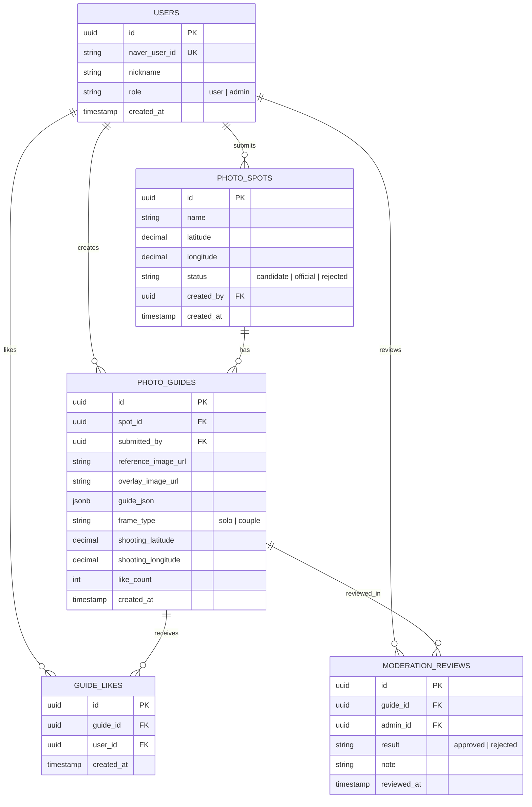

# Database Design

후보 제안, 좋아요, 관리자 검토를 지원하는 목표 DB 구조다. 2주차 수직 슬라이스에서는 `users`, `photo_spots`, `photo_guides`부터 생성하고, 좋아요와 검토 테이블은 이후 연결한다.



## Rules

- `guide_likes`에는 `(user_id, guide_id)` 유니크 제약을 둔다.
- 사용자는 후보만 제안할 수 있다. `official` 전환은 관리자 검토 결과로만 처리한다.
- `guide_json`에는 1인 또는 커플 프레임, YOLO 관절점, 선택적 인물 윤곽, 수평선, 배경 대표선의 비율 좌표를 함께 저장한다.
- 관절점만 별도 파일로 나누지 않는다. 승인된 `guide_json` 하나를 기준 데이터로 재사용하면, 촬영 비교 때 기준 사진을 다시 YOLO로 분석할 필요가 없다.
- 사진 원본과 생성 Overlay PNG는 Supabase Storage에 두고, DB에는 URL, `guide_json`, 모델·생성 시각 같은 메타데이터만 저장한다.
- 빠른 비교는 저장된 관절점과 촬영 사진의 YOLO 관절점만 비교한다. 배경선 정합은 필요할 때만 정확 모드로 추가한다.
- 접근 권한과 RLS 원칙은 [security.md](./security.md)를 따른다.

## Core Data Ownership

| 데이터 | 저장 위치 | 이유 |
| --- | --- | --- |
| 장소명, 좌표, 상태 | `photo_spots` | 지도 마커와 후보·공식 상태를 빠르게 조회한다. |
| 예시 사진, Overlay PNG | Supabase Storage | 큰 파일은 Storage에 두고 URL만 DB에 저장한다. |
| 프레임, YOLO 관절점, 윤곽, 배경선 | `photo_guides.guide_json` | 한 프레임의 비교 기준을 버전 단위로 함께 관리한다. |
| 좋아요, 관리자 검토 | `guide_likes`, `moderation_reviews` | 사용자 행동과 권한 검토 기록을 분리한다. |

## `guide_json` Contract

관절점 파일과 레이아웃 파일을 따로 저장하지 않는다. 한 촬영 프레임의 승인된 기준은 `guide_json` 하나가 소유한다.

```json
{
  "version": 4,
  "personFrames": [
    { "x": 0.28, "y": 0.24, "width": 0.18, "height": 0.58, "label": "Left person" },
    { "x": 0.54, "y": 0.22, "width": 0.18, "height": 0.6, "label": "Right person" }
  ],
  "personPoses": [
    {
      "label": "Left person",
      "keypoints": {
        "left_shoulder": [0.34, 0.4],
        "right_shoulder": [0.4, 0.4],
        "left_hip": [0.35, 0.56],
        "right_hip": [0.41, 0.56]
      },
      "missingKeypoints": []
    }
  ],
  "personOutlines": [],
  "backgroundLines": [
    { "id": "stairs-1", "start": [0.12, 0.7], "end": [0.84, 0.48] }
  ],
  "analysisMeta": {
    "engine": "YOLO + SAM2",
    "guideVersion": 4
  }
}
```

- `personFrames`: 카메라 Overlay와 기본 위치 안내
- `personPoses`: 빠른 YOLO 관절점 비교의 기준값
- `personOutlines`: 선택적 SAM2 실루엣. 점수보다 시각 가이드에 사용
- `backgroundLines`: 정확 모드에서만 쓰는 장소 대표선

## Storage Key Convention

```text
photo-guides/{spot_id}/{guide_id}/reference.jpg
photo-guides/{spot_id}/{guide_id}/overlay.png
photo-guides/{spot_id}/{guide_id}/guide.json
```

DB에는 `reference_image_url`, `overlay_image_url`, `guide_json`, `guide_version`, `analysis_engine`을 저장한다. `guide.json`을 Storage에도 보관할 수 있지만, 앱 조회와 빠른 비교에는 DB의 JSONB 값을 기준으로 사용한다.

## Fast Comparison Flow

```text
photo_guides.guide_json
        ↓
촬영 사진만 YOLO Pose 분석
        ↓
personPoses: 위치 · 몸통 크기 · 공통 관절점 모양 비교
        ↓
빠른 구도 점수
```

기준 사진을 다시 YOLO·SAM2로 분석하지 않으므로 빠르다. 배경 대표선까지 확인해야 할 때만 예시 사진과 SAM2·ORB 정합을 추가하는 정확 모드를 사용한다.
