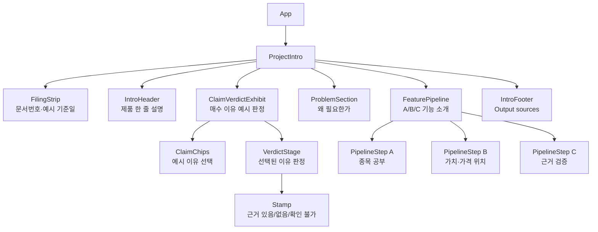

# 컴포넌트 트리 초안

현재 React 화면은 소개용 `ProjectIntro` 단일 페이지다. 아래는 지금 코드 기준 트리와, T08~T11에서 실제 제품 화면으로 나눌 때의 목표 트리다.

## 현재 구현 화면



## 목표 제품 화면 분리

```mermaid
flowchart TD
  App[App] --> AppShell[AppShell]

  AppShell --> TopNav[TopNav]
  AppShell --> SideNav[SideNav]
  AppShell --> MainRoutes[MainRoutes]
  AppShell --> Toasts[Toasts / ErrorBoundary]

  MainRoutes --> AuthPage[AuthPage<br/>로그인·회원가입]
  MainRoutes --> DashboardPage[DashboardPage<br/>최근 검증·복기]
  MainRoutes --> CompanyPage[CompanyPage<br/>종목 검색·회사 확정]
  MainRoutes --> StudyPage[StudyPage<br/>기능 A 종목 공부]
  MainRoutes --> ValuePage[ValuePage<br/>기능 B 가치 범위]
  MainRoutes --> ClaimPage[ClaimPage<br/>기능 C 근거 검증]
  MainRoutes --> ReviewPage[ReviewPage<br/>체크리스트·가설 추적]
  MainRoutes --> OrderPage[OrderPage<br/>기능 D 개인 주문]

  CompanyPage --> CompanySearchBox[CompanySearchBox]
  CompanyPage --> CompanyCandidateList[CompanyCandidateList<br/>동명·유사 후보]
  CompanyPage --> CompanyConfirmCard[CompanyConfirmCard<br/>사용자 확정]

  StudyPage --> DisclosureTimeline[DisclosureTimeline<br/>공시·정정 이력]
  StudyPage --> FinancialSummaryCards[FinancialSummaryCards]
  StudyPage --> SourceCitationList[SourceCitationList<br/>원문 링크]

  ValuePage --> ScenarioControls[ScenarioControls<br/>가정 입력]
  ValuePage --> ValuationRangeChart[ValuationRangeChart<br/>범위 표시]
  ValuePage --> PricePositionCard[PricePositionCard<br/>현재 가격 위치]
  ValuePage --> AssumptionTable[AssumptionTable<br/>민감도·비교군]

  ClaimPage --> ClaimInput[ClaimInput<br/>자연어 근거 입력]
  ClaimPage --> ClaimSummaryCards[ClaimSummaryCards<br/>모호하지 않은 Claim]
  ClaimPage --> AmbiguityQuestions[AmbiguityQuestions<br/>모호 항목만 질문]
  ClaimPage --> EvidencePlanPanel[EvidencePlanPanel<br/>필수 근거 계획]
  ClaimPage --> VerificationResultList[VerificationResultList<br/>5상태 판정]

  VerificationResultList --> VerdictBadge[VerdictBadge]
  VerificationResultList --> CalculationTrace[CalculationTrace<br/>계산식·rule version]
  VerificationResultList --> CitationViewer[CitationViewer<br/>원문 하이라이트]
  VerificationResultList --> CounterEvidencePanel[CounterEvidencePanel<br/>반증 근거]

  ReviewPage --> HypothesisSnapshotList[HypothesisSnapshotList]
  ReviewPage --> ReviewChecklist[ReviewChecklist]
  ReviewPage --> CitationOpenHistory[CitationOpenHistory<br/>인용 열람 기록]

  OrderPage --> OrderGuardNotice[OrderGuardNotice<br/>분석-주문 분리 안내]
  OrderPage --> ManualOrderForm[ManualOrderForm<br/>사용자 직접 가격·수량 입력]
  OrderPage --> TwoStepConfirm[TwoStepConfirm]
  OrderPage --> PaperOrderStatus[PaperOrderStatus]
```



## 우선 쪼갤 파일 단위

T08~T11에서 실제 UI를 만들 때는 다음 순서로 나누면 된다.

```text
src/
  App.jsx
  app/
    AppShell.jsx
    routes.jsx
  components/
    common/
      VerdictBadge.jsx
      SourceCitationList.jsx
      ErrorState.jsx
      LoadingState.jsx
    company/
      CompanySearchBox.jsx
      CompanyCandidateList.jsx
      CompanyConfirmCard.jsx
    claim/
      ClaimInput.jsx
      ClaimSummaryCards.jsx
      AmbiguityQuestions.jsx
      EvidencePlanPanel.jsx
      VerificationResultList.jsx
    disclosure/
      DisclosureTimeline.jsx
      CitationViewer.jsx
    value/
      ScenarioControls.jsx
      ValuationRangeChart.jsx
      PricePositionCard.jsx
    review/
      ReviewChecklist.jsx
      HypothesisSnapshotList.jsx
    order/
      ManualOrderForm.jsx
      TwoStepConfirm.jsx
  pages/
    AuthPage.jsx
    DashboardPage.jsx
    CompanyPage.jsx
    StudyPage.jsx
    ValuePage.jsx
    ClaimPage.jsx
    ReviewPage.jsx
    OrderPage.jsx
```

원칙은 간단하다. `pages/`는 API 호출과 화면 조립을 담당하고, `components/`는 props로 받은 데이터를 보여주는 데 집중한다. 판정·계산·금지 문구 검사는 UI가 아니라 backend/core와 contract test가 책임진다.
