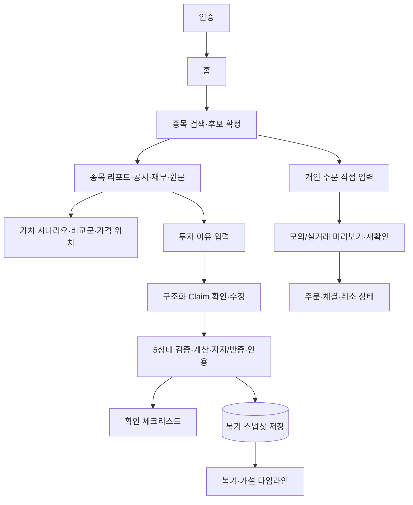

# 제품 범위 — 대학생 투자자를 위한 근거 검증 Agent

이 문서는 제품의 **전체 완료 범위**를 정의한다. 모든 등록 요구사항은 `REQUIRED`이며 단계는 의존 순서일 뿐 포함 여부를 뜻하지 않는다. 구현 계약은 [skills.md](skills.md), 작업 순서와 상태는 [backlog.md](backlog.md), 완료 조건은 [checklist.md](checklist.md)를 따른다.

## 문제 정의

대학생 소액 투자자는 공시·재무·시세 정보를 찾더라도 자신이 세운 투자 근거가 실제 데이터와 일치하는지, 어떤 기간과 수치로 확인됐는지, 반대 근거는 없는지 검증하기 어렵다.

이 서비스는 종목이나 매매 시점을 추천하지 않는다. 사용자의 자연어 판단을 검증 가능한 Claim으로 구조화하고, 공시·재무·시세·공식 외부 근거와 대조하여 계산식·인용·기준시점과 함께 판정한다. 가치 분석은 가정별 범위와 가격 위치를 설명하며 행동 지시를 생성하지 않는다.

## 범위 원칙

- 기능 A~D, S1~S23, 감사 개선안 I1~I11, 인증·UI·API·평가·배포·운영을 전부 구현한다.
- `REQUIRED` 항목은 일정 문제로 삭제하지 않는다. 선행조건이 충족되지 않으면 `BLOCKED`와 해제 조건을 기록한다.
- 외부 데이터 품질이 기준에 못 미치는 경우 기능을 거짓 결과로 대신하지 않고 `UNVERIFIABLE` 또는 `INSUFFICIENT_EVIDENCE`로 안전 종료한다.
- 기술 비목표와 안전 경계는 기능 누락이 아니다. 타인 대상 실거래, 자동 매매, 추천 문구는 구현 범위가 아니라 금지 범위다.

## 핵심 기능

### A. 종목 공부

종목명 → 회사 확정 → OpenDART 공시·재무·외부 근거 수집 → 시점·단위 정규화 → 기업개요·공시·지표 변화·확인 포인트·원문 provenance 제공.

### B. 가치 범위·가격 위치

현재·과거 시세와 재무지표 → 복수 가치 시나리오 → 동종업계 비교군과 민감도 → 모델 범위 대비 현재 가격 위치 설명. 단일 목표가와 매수·매도 행동 라벨은 제공하지 않는다.

### C. 투자 근거 검증

자연어 이유 → 원자 Claim 구조화 → 필수 근거 계획 → 결정론 숫자 검산 + 지지·반증 RAG → 인용 무결성 검사 → 5상태 판정 → 체크리스트·복기·가설 추적.

### D. 개인 주문 실행

인증된 사용자가 직접 입력하고 재확인한 지정가·수량만 본인 계좌의 증권사 API로 전달한다. 분석 결과에서 자동 호출하거나 가격·수량을 채우지 않는다. 모의투자와 sandbox를 기본으로 하며 공개 서비스·데모에서는 실거래를 비활성화한다.

## 전체 요구사항 레지스트리

| ID | 요구사항 | 범위 | 선행조건 | 스킬 | 완료 기준 위치 | 상태 |
|---|---|---|---|---|---|---|
| R01 | 종목·기업 식별 | REQUIRED | 없음 | S1 | checklist C1 | 미구현 |
| R02 | OpenDART 공시·재무·원문 수집 | REQUIRED | R01 | S2 | C2 | 미구현 |
| R03 | 시세·기업행위·외부 뉴스 근거 | REQUIRED | R01 | S13·S14 | C3 | 미구현 |
| R04 | 시점·정정·단위 정합성·재무 계산 core | REQUIRED | R02·R03 | S3·S15 | C4 | 미구현 |
| R05 | 종목 공부 리포트 A | REQUIRED | R04·R09 | S4·S11·S20 | C5 | 미구현 |
| R06 | 가치 범위·가격 위치 B | REQUIRED | R03·R04 | S5·S6·S21 | C6 | 미구현 |
| R07 | Structured Claim | REQUIRED | R01 | S7·S23 | C7 | 미구현 |
| R08 | 필수 근거 계획·결정론 검산 | REQUIRED | R04·R07 | S16·S17 | C8 | 미구현 |
| R09 | RAG·반증·인용 무결성 | REQUIRED | R02·R03·R07·R08 | S18·S19·S20·S23 | C9 | 미구현 |
| R10 | 5상태 검증·체크리스트 C | REQUIRED | R08·R09 | S8·S9·S11 | C10 | 미구현 |
| R11 | 복기·가설 추적·사용자 데이터 정책 | REQUIRED | R10 | S10·S22 | C11 | 미구현 |
| R12 | 골든 평가·품질 게이트 | REQUIRED | R01~R11·R13 | I9 | C12-A·C12-B | 미구현 |
| R13 | FastAPI·React·인증·사용자 격리 | REQUIRED | R05~R11 | S1~S11·S13~S23 | C13 | 미구현 |
| R14 | 배포·관측·백업·운영 | REQUIRED | R12·R13 | S1~S11·S13~S23 | C14 | 미구현 |
| R15 | 개인 주문 D | REQUIRED | R11·R12·R13·R14 | S12 | C15 | 미구현 |

R12의 최종 완료는 R01~R11과 R13의 API·UI·인증 통합 결과를 모두 평가한 뒤 가능하다. 단, 평가 harness·threshold registry·record/replay 기반인 C12-A는 T05에서 먼저 구현하고 각 기능이 추가될 때마다 확장한다.

## 감사 개선안 I1~I11

| ID | 구현 결정 |
|---|---|
| I1 | S7 Structured Claim으로 전부 구현 |
| I2 | S16 결정론 검산으로 전부 구현 |
| I3 | 공통 5상태 Verdict와 S16 집계 계약으로 구현 |
| I4 | S15 전체 Temporal Integrity로 구현 |
| I5 | S17 Required-Evidence Planner로 구현 |
| I6 | S19 지지·반증 검색과 I9 A/B 평가로 구현 |
| I7 | S20 인용 게이트와 S11 원문 하이라이트로 구현 |
| I8 | S21 비교군 구성으로 구현. 품질 기준 미달 시 안전 종료까지가 완료 동작 |
| I9 | 버전된 골든셋·자동 평가·CI 차단 게이트로 구현 |
| I10 | S22 역사 replay와 신규 공시 재검증으로 구현 |
| I11 | S23 LLM 보안 게이트와 공격 fixture로 구현 |

## 사용자 흐름

1. 회원 가입·로그인 또는 인증된 개인 세션을 시작한다.
2. 종목을 검색하고 유사 종목 후보 중 회사를 확정한다.
3. 기업 리포트와 공시·재무·시세 기준시점을 확인한다.
4. 복수 가치 시나리오, 비교군 구성과 현재 가격 위치를 확인한다.
5. 자신이 판단한 이유를 자연어로 입력한다.
6. 시스템이 분리·구조화한 Claim을 확인하고 모호한 항목을 수정한다.
7. Claim별 지지·반박·부족·검증불가 결과, 계산식, 반대 근거와 원문 인용을 확인한다.
8. 확인 체크리스트를 완료하고 분석 스냅샷을 저장한다.
9. 신규 공시 이후 가설 변화와 반복 판단 패턴을 확인한다.
10. 개인 실행 경로에서는 사용자가 별도로 입력한 지정가·수량을 주문 미리보기에서 재확인한 뒤 모의 또는 개인 실거래 주문을 전송한다.

## 화면 흐름

## 화면 목록

1. 인증·계정 관리
2. 홈·종목 검색·후보 선택
3. 종목 공부 리포트
4. 가치 시나리오·비교군·가격 위치
5. 투자 이유 입력·Claim 확인 편집기
6. Claim별 검증·상충 근거·계산 상세
7. 공시 원문·인용 하이라이트
8. 확인 체크리스트
9. 복기 로그·패턴·가설 타임라인
10. 데이터 부족·외부 장애·지원 범위 안내
11. 개인 주문 입력·미리보기·상태·이력
12. 운영자용 provider·평가·비용·오류 상태

## 기술 아키텍처

- **Frontend**: React + Vite. 모든 화면의 loading, empty, partial, stale, provider-error 상태와 접근성·모바일을 구현한다.
- **Backend API**: FastAPI + Pydantic schema. 인증·권한, 표준 오류 envelope, background job과 trace를 제공한다.
- **Deterministic Core**: 일반 Python 모듈로 정규화·계산·판정·인용 검사를 구현한다.
- **Agent Orchestration**: LangGraph는 S8 검색 반복·조건부 경로에만 사용한다.
- **LLM**: Upstage Solar(solar-pro3, OpenAI 호환 API) Structured Outputs를 S4·S7·S8·S11에 사용하고 S23 보안 게이트를 통과시킨다.
- **Relational Storage**: PostgreSQL에 사용자·기업·공시·raw fact·derived metric·Claim·Evidence·Verdict·복기·주문·trace를 저장한다. migration과 보존·삭제 정책을 구현한다.
- **Vector Retrieval**: Chroma에 checksum·버전·종목·날짜 metadata를 포함한 공시·외부 문서 청크를 저장한다.
- **Sources**: OpenDART, 공식 시세·거래소·기업행위 provider, 허용된 뉴스·공식기관 provider, 개인 주문용 증권사 adapter.
- **Quality**: pytest 기반 unit/contract/integration/E2E/adversarial/performance 평가, lint·type check·security scan과 CI gate.
- **Operations**: 배포, secrets, 암호화, 로그·metrics·trace·alert, backup/restore, rollback, incident runbook을 구현한다.

## 안전 경계

- 가치 범위는 가정과 방법별 시나리오이며 단일 목표가가 아니다.
- 가격 위치는 `BELOW/WITHIN/ABOVE_MODEL_RANGE/INSUFFICIENT`처럼 중립적으로 표현한다.
- 커뮤니티 소문, 비교군 품질 미달, 외부 원천 부재는 사실 근거로 승격하지 않는다.
- 공개 배포에서 타인 계좌 실거래를 제공하지 않는다.
- S12는 사용자 직접 입력·2단계 확인·idempotency·한도·kill switch·감사 로그를 필수로 한다.
- 실제 실거래 활성화는 코드 완료와 별개로 사용자 자격증명·증권사 권한·법률·컴플라이언스 gate를 통과해야 한다.

## 전체 완료 정의

다음 조건을 모두 만족해야 프로젝트가 완료된다.

- R01~R15가 모두 `IMPLEMENTED`다.
- S1~S23과 I1~I11의 checklist가 모두 통과한다.
- A/B/C는 실제 provider와 장애 fallback을 포함해 E2E로 동작한다.
- D는 paper/sandbox E2E와 주문 상태·중복 방지·취소·부분체결 테스트를 통과한다.
- 수치 consistency, temporal leakage, citation, 사용자 격리와 인젝션 품질 게이트를 통과한다.
- React·FastAPI·DB·vector store가 배포 환경에서 동작하고 backup/restore·rollback을 재현한다.
- 알려진 데이터 한계, 지원 범위, 법률·운영 경계를 사용자와 운영 문서에 공개한다.
