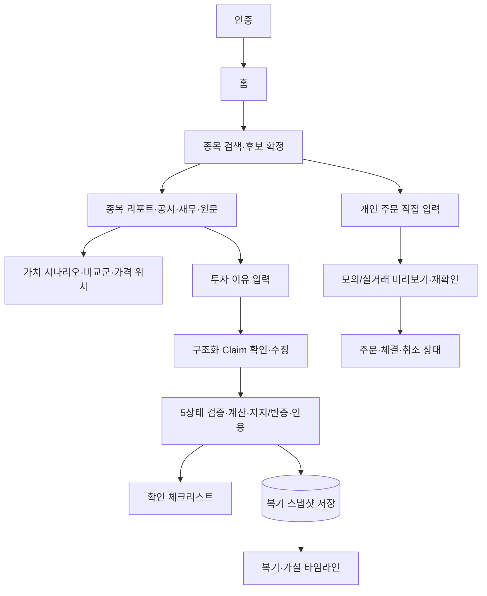

# 제품 범위 — 대학생 투자자를 위한 근거 검증 Agent

이 문서는 제품의 **전체 완료 범위**를 정의한다. 모든 등록 요구사항은 `REQUIRED`이며 단계는 의존 순서일 뿐 포함 여부를 뜻하지 않는다. 구현 계약은 [skills.md](skills.md), 작업 순서와 상태는 [backlog.md](backlog.md), 완료 조건은 [checklist.md](checklist.md)를 따른다.

## 문제 정의

대학생 소액 투자자는 공시·재무·시세 정보를 찾더라도 자신이 세운 투자 근거가 실제 데이터와 일치하는지, 어떤 기간과 수치로 확인됐는지, 반대 근거는 없는지 검증하기 어렵다.

이 서비스는 종목이나 매매 시점을 추천하지 않는다. 사용자의 자연어 판단을 검증 가능한 Claim으로 구조화하고, 공시·재무·시세·공식 외부 근거와 대조하여 계산식·인용·기준시점과 함께 판정한다. 가치 분석은 가정별 범위와 가격 위치를 설명하며 행동 지시를 생성하지 않는다.

### 타깃 사용자·핵심 시나리오

**페르소나**: 소액으로 개별 종목에 직접 투자하는 대학생. 공시·재무 원문을 읽을 시간과 훈련은 부족하지만, 들은 근거를 그대로 믿고 넘어가고 싶어하지 않는다.

대표 시나리오 3개는 각각 핵심 기능과 1:1로 대응한다.

- **C(근거 검증)**: "유튜브에서 '○○전자 영업이익 2배'라는 말을 듣고 사실인지 확인하고 싶다."
- **A(종목 공부)**: "계좌에 있는 종목이 최근 무슨 공시를 냈는지, 정정된 건 없는지 훑고 싶다."
- **B(가치 범위·가격 위치)**: "지금 가격이 내 예상 대비 어느 위치인지, 어떤 가정에서 그런지 알고 싶다."

### 기존 대안과 차별점

| 대안 | 출처 추적 | 기준시점 | 결정론 검산 | 반증 제시 |
|---|---|---|---|---|
| 증권사 리포트 | 제한적(애널리스트 서술) | 발행일만 표시 | 없음(애널리스트 판단) | 없음 |
| 토스증권류 MTS | 부분적(시세·공시 링크) | 실시간 위주, 과거 판단 근거 재확인 어려움 | 없음 | 없음 |
| 종목 커뮤니티 | 없음(익명 주장) | 없음 | 없음 | 없음, 확증편향을 오히려 강화 |
| 범용 챗봇(직접 질문) | 불확실(환각 가능) | 불명확 | 없음(LLM 자기평가) | 요청 시에만, 비체계적 |
| 본 제품 | 원문 위치·공식 URL 필수 | `as_of`·공시 접수일 필수 표시 | 코드가 검산, LLM이 덮어쓰지 못함 | S19 반증 검색을 항상 병행 |

챌린지 심사에서 "기존 서비스와 뭐가 다르냐"는 질문에 대한 답은 이 표의 오른쪽 세 열이다 — 출처 추적 자체는 기존 대안도 일부 제공하지만, 결정론 검산과 반증 제시를 동시에 하는 대안은 없다.

## 범위 원칙

- 기능 A~D, S1~S23, 감사 개선안 I1~I11, 인증·UI·API·평가·배포·운영을 전부 구현한다.
- `REQUIRED` 항목은 일정 문제로 삭제하지 않는다. 선행조건이 충족되지 않으면 `BLOCKED`와 해제 조건을 기록한다.
- 외부 데이터 품질이 기준에 못 미치는 경우 기능을 거짓 결과로 대신하지 않고 `UNVERIFIABLE` 또는 `INSUFFICIENT_EVIDENCE`로 안전 종료한다.
- 기술 비목표와 안전 경계는 기능 누락이 아니다. 타인 대상 실거래, 자동 매매, 추천 문구는 구현 범위가 아니라 금지 범위다.

## 핵심 기능

### A. 종목 공부

종목명 → 회사 확정 → OpenDART 공시·재무·외부 근거 수집 → 시점·단위 정규화 → 기업개요·공시·지표 변화·확인 포인트·원문 provenance 제공.

### B. 가치 범위·가격 위치

현재·과거 시세와 재무지표 → 복수 가치 시나리오 → 동종업계 비교군과 민감도 → 모델 범위 대비 현재 가격 위치 설명. 단일 목표가와 매수·매도 행동 라벨은 제공하지 않는다.

B는 특정 매수 가격이나 행동 지시가 아니라 **지금 가격이 정당화되려면 어떤 가정이 참이어야 하는가**를 보여준다 — 사용자는 그 가정을 자신이 믿는지만 판단하면 된다.

### C. 투자 근거 검증

자연어 이유 → 원자 Claim 구조화 → 필수 근거 계획 → 결정론 숫자 검산 + 지지·반증 RAG → 인용 무결성 검사 → 5상태 판정 → 체크리스트·복기·가설 추적.

### D. 개인 주문 실행

인증된 사용자가 직접 입력하고 재확인한 지정가·수량만 본인 계좌의 증권사 API로 전달한다. 분석 결과에서 자동 호출하거나 가격·수량을 채우지 않는다. 모의투자와 sandbox를 기본으로 하며 공개 서비스·데모에서는 실거래를 비활성화한다.

검증에서 끝나면 사용자는 결국 다른 앱에서 충동적으로 주문하게 된다. D는 검증과 행동 사이의 단절을 **의도적으로 유지한 채** 루프를 닫는 레퍼런스 구현이며, 분석 결과가 주문으로 자동 연결되지 않음을 코드로 증명하는 것 자체가 이 제품의 안전 원칙(주문 분리) 시연이다. D는 backlog.md 구현 순서상 최후순위(T14)이며, A/B/C가 모두 동작한 뒤에만 착수한다.

## 전체 요구사항 레지스트리

| ID | 요구사항 | 범위 | 선행조건 | 스킬 | 완료 기준 위치 | 상태 |
|---|---|---|---|---|---|---|
| R01 | 종목·기업 식별 | REQUIRED | 없음 | S1 | checklist C1 | IMPLEMENTED |
| R02 | OpenDART 공시·재무·원문 수집 | REQUIRED | R01 | S2 | C2 | IMPLEMENTED |
| R03 | 시세·기업행위·외부 뉴스 근거 | REQUIRED | R01 | S13·S14 | C3 | 미구현 |
| R04 | 시점·정정·단위 정합성·재무 계산 core | REQUIRED | R02·R03 | S3·S15 | C4 | IMPLEMENTED |
| R05 | 종목 공부 리포트 A | REQUIRED | R04·R09 | S4·S11·S20 | C5 | 미구현 |
| R06 | 가치 범위·가격 위치 B | REQUIRED | R03·R04 | S5·S6·S21 | C6 | 미구현 |
| R07 | Structured Claim | REQUIRED | R01 | S7·S23 | C7 | 미구현 |
| R08 | 필수 근거 계획·결정론 검산 | REQUIRED | R04·R07 | S16·S17 | C8 | 미구현 |
| R09 | RAG·반증·인용 무결성 | REQUIRED | R02·R03·R07·R08 | S18·S19·S20·S23 | C9 | 미구현 |
| R10 | 5상태 검증·체크리스트 C | REQUIRED | R08·R09 | S8·S9·S11 | C10 | 미구현 |
| R11 | 복기·가설 추적·사용자 데이터 정책 | REQUIRED | R10 | S10·S22 | C11 | 미구현 |
| R12 | 골든 평가·품질 게이트 | REQUIRED | R01~R11·R13 | I9 | C12-A·C12-B | 미구현 |
| R13 | FastAPI·React·인증·사용자 격리 | REQUIRED | R05~R11 | S1~S11·S13~S23 | C13 | 미구현 |
| R14 | 배포·관측·백업·운영 | REQUIRED | R12·R13 | S1~S11·S13~S23 | C14 | 미구현 |
| R15 | 개인 주문 D | REQUIRED | R11·R12·R13·R14 | S12 | C15 | 미구현 |

R12의 최종 완료는 R01~R11과 R13의 API·UI·인증 통합 결과를 모두 평가한 뒤 가능하다. 단, 평가 harness·threshold registry·record/replay 기반인 C12-A는 T05에서 먼저 구현하고 각 기능이 추가될 때마다 확장한다.

**확장 후보(REQUIRED 아님)**: T03·T04 완료 후 확장 후보 — 차트 지표 결정론 검산(사용자가 제시한 차트 기반 주장이 실제 시세 데이터와 일치하는지 확인, 신호 해석·매매 판단 금지) · 조건 기반 종목 필터(사용자가 지정한 조건에 맞는 검증 후보 좁히기, 추천·순위화 금지). 범위에 편입하려면 별도로 R 레지스트리에 등록해야 하며, 이 문장만으로 REQUIRED가 되지 않는다.

## 감사 개선안 I1~I11

| ID | 구현 결정 |
|---|---|
| I1 | S7 Structured Claim으로 전부 구현 |
| I2 | S16 결정론 검산으로 전부 구현 |
| I3 | 공통 5상태 Verdict와 S16 집계 계약으로 구현 |
| I4 | S15 전체 Temporal Integrity로 구현 |
| I5 | S17 Required-Evidence Planner로 구현 |
| I6 | S19 지지·반증 검색과 I9 A/B 평가로 구현 |
| I7 | S20 인용 게이트와 S11 원문 하이라이트로 구현 |
| I8 | S21 비교군 구성으로 구현. 품질 기준 미달 시 안전 종료까지가 완료 동작 |
| I9 | 버전된 골든셋·자동 평가·CI 차단 게이트로 구현 |
| I10 | S22 역사 replay와 신규 공시 재검증으로 구현 |
| I11 | S23 LLM 보안 게이트와 공격 fixture로 구현 |

## 사용자 흐름

1. 회원 가입·로그인 또는 인증된 개인 세션을 시작한다.
2. 종목을 검색하고 유사 종목 후보 중 회사를 확정한다.
3. 기업 리포트와 공시·재무·시세 기준시점을 확인한다.
4. 복수 가치 시나리오, 비교군 구성과 현재 가격 위치를 확인한다.
5. 자신이 판단한 이유를 자연어로 입력한다.
6. 모호한 항목이 있을 때만 확인 질문에 답한다(모호하지 않은 Claim은 요약 카드로 자동 진행).
7. Claim별 지지·반박·부족·검증불가 결과, 계산식, 반대 근거와 원문 인용을 확인한다.
8. 확인 체크리스트를 완료하고 분석 스냅샷을 저장한다.
9. 신규 공시 이후 가설 변화와 반복 판단 패턴을 확인한다.
10. 개인 실행 경로에서는 사용자가 별도로 입력한 지정가·수량을 주문 미리보기에서 재확인한 뒤 모의 또는 개인 실거래 주문을 전송한다.

## 화면 흐름

## 화면 목록

1. 인증·계정 관리
2. 홈·종목 검색·후보 선택
3. 종목 공부 리포트
4. 가치 시나리오·비교군·가격 위치
5. 투자 이유 입력·Claim 확인 편집기
6. Claim별 검증·상충 근거·계산 상세
7. 공시 원문·인용 하이라이트
8. 확인 체크리스트
9. 복기 로그·패턴·가설 타임라인
10. 데이터 부족·외부 장애·지원 범위 안내
11. 개인 주문 입력·미리보기·상태·이력
12. 운영자용 provider·평가·비용·오류 상태

## 기술 아키텍처

- **Frontend**: React + Vite. 모든 화면의 loading, empty, partial, stale, provider-error 상태와 접근성·모바일을 구현한다.
- **Backend API**: FastAPI + Pydantic schema. 인증·권한, 표준 오류 envelope, background job과 trace를 제공한다.
- **Deterministic Core**: 일반 Python 모듈로 정규화·계산·판정·인용 검사를 구현한다.
- **Agent Orchestration**: LangGraph는 S8 검색 반복·조건부 경로에만 사용한다.
- **LLM**: Upstage Solar(solar-pro3, OpenAI 호환 API) Structured Outputs를 S4·S7·S8·S11에 사용하고 S23 보안 게이트를 통과시킨다.
- **Relational Storage**: PostgreSQL에 사용자·기업·공시·raw fact·derived metric·Claim·Evidence·Verdict·복기·주문·trace를 저장한다. migration과 보존·삭제 정책을 구현한다.
- **Vector Retrieval**: Chroma에 checksum·버전·종목·날짜 metadata를 포함한 공시·외부 문서 청크를 저장한다.
- **Sources**: OpenDART, 공식 시세·거래소·기업행위 provider, 허용된 뉴스·공식기관 provider, 개인 주문용 증권사 adapter.
- **Quality**: pytest 기반 unit/contract/integration/E2E/adversarial/performance 평가, lint·type check·security scan과 CI gate.
- **Operations**: 배포, secrets, 암호화, 로그·metrics·trace·alert, backup/restore, rollback, incident runbook을 구현한다.

## 안전 경계

- 가치 범위는 가정과 방법별 시나리오이며 단일 목표가가 아니다.
- 가격 위치는 `BELOW/WITHIN/ABOVE_MODEL_RANGE/INSUFFICIENT`처럼 중립적으로 표현한다.
- 커뮤니티 소문, 비교군 품질 미달, 외부 원천 부재는 사실 근거로 승격하지 않는다.
- 공개 배포에서 타인 계좌 실거래를 제공하지 않는다.
- S12는 사용자 직접 입력·2단계 확인·idempotency·한도·kill switch·감사 로그를 필수로 한다.
- 실제 실거래 활성화는 코드 완료와 별개로 사용자 자격증명·증권사 권한·법률·컴플라이언스 gate를 통과해야 한다.

## 릴리스 마일스톤

챌린지 마감과 데모 시점이 모두 2026-07-20(월)~2026-07-26(일) 사이로 확정됐다(2026-07-13 사용자 지시 "마감일은 다음주, 데모도 다음주까지" — 정확한 요일은 미정이며 확인되는 대로 갱신한다). 남은 REQUIRED 범위(S3~S23 대부분, 기능 A/B/C/D 전체, 배포·운영)는 현재 완료 폭(T00~T02, 16개 중 3개)의 4~5배이므로 다음주 안에 R01~R15 전체를 완료하는 것은 현실적으로 불가능하다. 이 절은 범위 원칙의 "REQUIRED 항목은 일정 문제로 삭제하지 않는다"를 그대로 유지한 채, **어느 시점에 무엇을 시연 가능한 상태로 만들지**만 정의한다 — 마감 시점에는 도달한 마일스톤까지 시연하고 나머지는 backlog.md에 `대기`/`BLOCKED`로 남긴다.

**즉시 리스크**: M1(T04+T05)조차 T03(시세·외부 근거 수집)을 선행조건으로 하며, T03은 [prerequisites.md](prerequisites.md)의 사용자 결정(시세 provider·뉴스 allowlist 확정, fix_instructions.md F6)이 아직 없어 착수할 수 없다. 다음주 마감을 고려하면 이 결정이 최대한 빨리 나와야 M1이 물리적으로 가능하다.

| 마일스톤 | 완료 조건 | 시연 시나리오 | 다음주 내 도달 가능성 |
|---|---|---|---|
| M1 (수직 슬라이스) | T04+T05 완료 | 종목명으로 공시·재무 API를 호출하면 정규화된 재무지표 1~2개가 기준시점과 함께 JSON으로 반환된다(Swagger/curl 데모 — 화면 UI는 T08·T11 범위라 M1에는 포함되지 않는다) | 낙관적 — T03 provider 결정이 즉시 나올 경우에만 |
| M2 | T06+T07 완료 | 자연어로 투자 이유를 입력하면 Claim으로 쪼개지고, 각 Claim이 5상태 verdict 중 하나로 판정되며 계산식과 원문 인용이 함께 보인다(이 제품의 차별점, 심사 데모의 중심) | 낮음 — 마감 이후로 이월될 가능성이 높음 |
| M3 | T08~T11 완료 | 종목 리포트와 가치 범위·가격 위치 화면이 실제 데이터로 채워진다(첫 화면 UI 데모는 이 시점) | 매우 낮음 |
| M4 | T12~T15 완료 | 평가 게이트를 통과한 상태로 배포되고, 개인 주문(paper)까지 동작한다 | 매우 낮음 |

M1의 완료 조건(T04+T05)은 backlog.md 기준 temporal integrity·재무 계산·평가 기반만 포함하며 UI 작업을 포함하지 않는다 — 화면 데모가 필요하면 별도로 T08 일부를 앞당기는 명시적 범위 변경이 있어야 하고, 그전까지 M1 시연은 API 응답 확인으로 한정한다.

R01~R15 REQUIRED 원칙과 [backlog.md](backlog.md)의 BLOCKED 규칙은 그대로 유지한다 — 이 표는 시연 범위를 정의할 뿐 기능을 범위에서 삭제하지 않는다.

## 제품 성공 지표

C12 품질 게이트(엔지니어링 지표)와 별개로 사용자 관점 성공 지표를 정의한다. 확인 체크리스트 완료율·재방문 검증 비율은 T10 복기 데이터로 바로 계산 가능하지만, 인용 열람 지표는 별도 계측이 필요하다(아래 명시).

- 검증 1건당 사용자가 원문 인용을 실제로 연 횟수 ≥ 1 — 근거를 형식적으로 보여주는 것을 넘어 실제로 확인하는지 측정. **측정에는 citation open 이벤트 저장이 필요하며 checklist.md C11에 별도 항목으로 등록했다(현재는 미구현, T10 범위)** — 이 지표를 등록만 하고 계측이 없으면 측정 불가 상태로 남는다
- 확인 체크리스트 완료율
- 재방문 검증 비율 — 같은 사용자가 두 번째 검증을 수행하는 비율

## 전체 완료 정의

다음 조건을 모두 만족해야 프로젝트가 완료된다.

- R01~R15가 모두 `IMPLEMENTED`다.
- S1~S23과 I1~I11의 checklist가 모두 통과한다.
- A/B/C는 실제 provider와 장애 fallback을 포함해 E2E로 동작한다.
- D는 paper/sandbox E2E와 주문 상태·중복 방지·취소·부분체결 테스트를 통과한다.
- 수치 consistency, temporal leakage, citation, 사용자 격리와 인젝션 품질 게이트를 통과한다.
- React·FastAPI·DB·vector store가 배포 환경에서 동작하고 backup/restore·rollback을 재현한다.
- 알려진 데이터 한계, 지원 범위, 법률·운영 경계를 사용자와 운영 문서에 공개한다.
