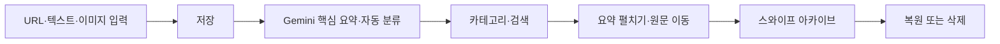

# Later 제품 계획

## 문제 정의

사용자는 YouTube, Instagram, X, 커뮤니티와 웹을 보다가 유용한 정보를 “나중에
봐야지” 하며 저장합니다. 하지만 저장 위치가 흩어지고 내용과 저장 이유를 잊어 실제
재사용으로 이어지지 않습니다. Later는 저장 비용을 낮추고 AI 요약·분류·검색으로
재발견 가능성을 높입니다.

## 대상 사용자

- SNS와 웹에서 생활·공부·취업·쇼핑·뷰티 꿀팁을 자주 저장하는 사용자
- 북마크와 스크린샷이 쌓여 필요한 정보를 다시 찾지 못하는 사용자
- 긴 콘텐츠의 핵심을 먼저 확인한 뒤 원문을 볼지 결정하고 싶은 사용자

## 현재 사용자 흐름

## 제공 가치

- 폴더와 태그를 먼저 정하지 않아도 되는 빠른 저장
- 한국어 제목과 구체적인 핵심 요약
- 대·소분류와 통합 검색을 통한 재발견
- 출처 아이콘과 사이트명으로 원문 맥락 확인
- AI 장애에도 저장을 이어가는 fallback

## 현재 제약

- 로그인과 사용자별 데이터 격리가 없어 단일 데모 데이터셋을 사용합니다.
- Instagram Reel 등 서버가 영상 원문을 받지 못하는 플랫폼은 공개 캡션까지만 분석합니다.
- 리마인더 알림과 공유 시트는 디자인만 존재하며 실제 발송·공유 연동은 미구현입니다.
- 직접적인 OCR 서비스는 사용하지 않으며 Gemini 이미지 이해로 스크린샷을 분석합니다.

## 후속 로드맵

1. 인증, 사용자 소유권과 Supabase RLS
2. 원문 확보 수준을 표시하는 분석 출처·신뢰도 UI
3. 사용자가 업로드한 영상·스크린샷 기반의 플랫폼 제한 보완
4. 사용자 설정 기반 리마인더와 웹 푸시
5. 모바일 공유 시트와 Apple 단축어
6. 시맨틱 검색과 개인화된 재발견 추천
