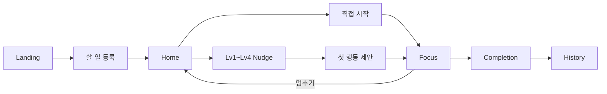
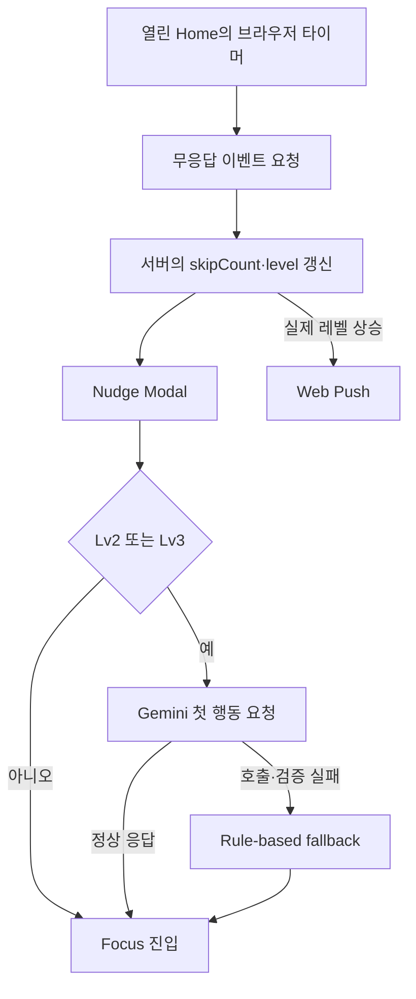

# 잔소리봇 기획서

> **잔소리봇 - 미루는 대학생을 위한 학업 실행 도우미**
>
> 계획은 세우지만 정작 시작하는 순간에 미루게 되는 대학생을 위한 서비스입니다.
> 사용자가 왜 시작하지 못하는지 회피 이유를 확인하고,
> 현재 상황에 맞는 작은 첫 행동을 제안하여 실제 실행까지 이어지도록 돕습니다.
> 회피 이유 확인 → 개입 수준 조절 → 작은 첫 행동 제안 → Focus → 완료 기록의 흐름으로, 사용자가 실제 행동을 시작하고 끝까지 이어가도록 돕습니다.

## 바로 확인하기

- 🌐 [실제 서비스](https://hub-nine-beta.vercel.app)
- 🎬 [최종 데모 영상](https://drive.google.com/file/d/1_tKh2aWoZt9ywHCqrCNtarDGJgTCTJ9s/view?usp=sharing)
- 💻 [소스 코드](https://github.com/minsss42/hub)

## 초기 프로토타입

아래 자료는 1주차에 핵심 가설과 화면 흐름을 빠르게 검증하기 위해 만든 초기 버전입니다.
현재 최종 서비스와는 화면 구성, 디자인과 기능 범위가 일부 다릅니다.

- 📎 [1주차 초기 프로토타입](./initial-prototype.html)
- 🖼️ [초기 프로토타입 화면](https://github.com/minsss42/hub/wiki/초기-프로토타입-화면)

## 1. 문제 정의

### 1-1. 실제 경험 및 불편함

- 과제, 시험공부, 발표 준비처럼 해야 할 일은 알지만 첫 행동을 시작하기 어렵습니다.
- 계획은 세우지만 지키게 만드는 강제성이 없어 매번 살짝 늦게 시작합니다.
- 혼자 진행하다 보니 체계적으로 이끌어주는 사람이 없습니다.
- 일반적인 일정 관리 도구는 무엇을 언제 해야 하는지는 알려주지만, 시작을 가로막는 이유와 지금 할 수 있는 행동까지 연결해 주지는 않습니다.

### 1-2. 기존 서비스와의 차이

| 서비스   | 강점                        | 잔소리봇이 다루는 차이                |
| -------- | --------------------------- | ------------------------------------- |
| TodoMate | 할 일 관리, 공부 기록, 공유 | 회피 이유를 확인하고 첫 행동으로 연결 |
| Todoist  | 일정과 프로젝트 관리        | 실행 직전의 부담을 낮추는 개입 제공   |
| Forest   | 타이머 기반 집중 유지       | 집중 이전의 시작 단계까지 지원        |

> 상세한 유사 서비스 조사와 디자인 판단 근거는 `docs/design-research.md`에 정리되어 있습니다.

## 2. 해결 방식

잔소리봇은 다음 흐름으로 사용자의 실행을 돕습니다.

**회피 이유 확인 → 개입 수준 조절 → 작은 첫 행동 제안 → Focus → 완료 기록**

- 할 일을 등록할 때 예상되는 회피 이유를 함께 남깁니다.
- 반응이 늦어질수록 Lv1~Lv4로 개입 강도를 높입니다.
- 사용자가 지금 바로 수행할 수 있는 작은 행동을 제안합니다.
- Focus에서 실행을 이어가고 결과를 Completion과 History에 기록합니다.

## 3. 핵심 사용자 / 페르소나

**"김벼락" — 대학교 3학년, 과제/프로젝트/시험이 겹치는 학기**

- **과제 유형마다 미루는 이유가 다릅니다.**
  - 시험공부는 항상 벼락치기로 몰아서 합니다.
  - 팀 프로젝트는 무엇부터 준비해야 할지 몰라 착수 자체가 늦습니다.
  - 개인 과제는 하기 싫다는 이유로 자꾸 미룹니다.
- **캘린더/투두 앱을 써본 적 있지만 오래 사용하지 못합니다.**
  - 알림은 오지만 "시간 됐어요"만 반복되어 결국 무시하게 됩니다.
  - 정작 시작을 도와주는 기능은 없었습니다.
- **옆에서 한 번씩 콕 집어 말해주면 다시 시작하는 편**
  - 완전히 혼자 있을 때는 계속 미루지만, 친구가 "그거 언제 해?"라고 물으면 그제야 시작합니다.
  - 잔소리봇은 이처럼 누군가 한 번씩 물어봐 주는 효과를 서비스로 구현합니다.

잔소리봇은 누군가 옆에서 현재 상태를 확인하고 시작하도록 도와주는 경험을
웹 서비스로 구현합니다.

## 4. 사용자 시나리오

1. **랜딩페이지**: 서비스가 해결하는 문제와 사용 흐름을 확인합니다.
2. **할 일 등록**: 제목, 유형, 선택적인 시작 예정 시간, 마감 D-day와 예상 회피 이유를 등록합니다.
3. **홈 화면**: 현재 상태, 오늘의 여정, 진행 중·시작 예정·완료 할 일을 확인합니다.
4. **잔소리봇 알림**: 열린 Home에서 예약된 개입 시각이 되면 Lv1~Lv4 메시지를 확인합니다.
   - Lv1: 회피 이유를 다시 확인하고, 가볍게 시작을 독려합니다.
   - Lv2: 유형과 회피 이유를 기반으로 현재 상황에 맞는 첫 행동(마이크로태스크)을 제안합니다.
   - Lv3: 이전 제안, 현재 회피 이유, 검증된 완료 근거를 참고해 다른 첫 행동을 다시 제안합니다.
   - Lv4: 실제 마감 D-day를 언급하며 즉시 시작을 유도하는 강한 개입을 제공합니다.
5. **첫 행동 선택**: 직접 시작하거나, 개입 단계에서 제안받은 첫 행동으로 시작합니다.
6. **포커스 모드**: 경과 시간을 확인하며 작업하고 완료 또는 멈추기를 선택합니다.
7. **완료**: 완료 결과를 확인하고 개입이 도움이 되었는지 피드백을 남깁니다.
8. **히스토리**: 완료 기록을 리스트·캘린더로 확인하고 최근 실행 추이를 돌아봅니다.

피드백은 저장되지만 다음 개입에 자동 반영되지는 않습니다. 또한 현재 개입 예약은
열린 Home 화면의 브라우저 타이머가 담당하므로, 페이지를 닫은 뒤 서버가 지정 시각에
자동 발송하는 구조는 아직 구현되지 않았습니다.

## 5. 핵심 기능

### ① 회피 이유 기반 등록과 개입

사용자는 할 일과 함께 예상되는 회피 이유를 선택하거나 직접 입력합니다. Home의 개입은
무응답 횟수와 마감 긴급도를 반영한 Lv0~Lv4 수준을 사용하며, 단계에 따라 메시지와
요구하는 행동의 강도가 달라집니다.

- **Lv1**: 가볍게 시작을 권하고 회피 이유를 확인합니다.
- **Lv2**: Gemini가 작은 첫 행동을 제안합니다.
- **Lv3**: 회피 이유를 다시 확인하고, 완료 기록에서 확인된 근거가 있으면 이를 참고해
  다른 첫 행동을 제안합니다.
- **Lv4**: 마감 압박을 명확히 전달하고 즉시 시작을 강하게 권합니다.

### ② Gemini 첫 행동 생성과 fallback

Lv2·Lv3에서는 제목, 유형, 회피 이유 등 현재 요청에 필요한 정보를 서버에서 Gemini로
전달해 마이크로태스크를 생성합니다. 응답 형식과 품질을 검증하며, 설정 누락을 제외한
호출 실패나 유효하지 않은 응답에는 규칙 기반 첫 행동을 반환해 흐름이 중단되지 않게 합니다.

### ③ Focus와 완료 기록

직접 시작과 Nudge를 통한 시작을 구분해 Focus에 전달합니다. Focus 세션은 브라우저
세션 저장소를 이용해 복구하며, 완료 시 집중 시간과 진입 정보가 기록됩니다. 완료 직후에는
도움됨·아쉬움 피드백을 저장할 수 있습니다.

### ④ History와 연속 완료

History는 완료 기록을 리스트와 캘린더로 보여 줍니다. 이번 주 완료 수, 집중 시간,
평균 개입 진입 레벨, 날짜 기반 연속 완료일과 최근 7일 완료 추이를 제공합니다.
연속 완료일은 Asia/Seoul 날짜를 기준으로 완료 이벤트에서 계산합니다.

### ⑤ Web Push

사용자가 알림을 허용하면 브라우저 PushSubscription을 서버에 저장하고, 열린 Home의
개입 처리에서 실제 레벨이 상승할 때 VAPID Web Push를 발송합니다. Service Worker가
Push를 받아 시스템 알림을 표시하고 클릭 시 서비스로 연결합니다.

- Desktop Chrome·Edge: 실기기 수신 확인
- iPhone 홈 화면 PWA: 실기기 수신 확인
- Android Chrome 실기기: 미검증

Web Push 전송 기능과 서버 예약 발송은 별개입니다. 현재는 외부 Cron이나 영속화된
`nextNudgeAt`을 기반으로 페이지가 닫힌 상태에서도 예약 시각을 처리하지 않습니다.

### ⑥ Shared Journey 관련 기능

Shared Journey는 개입 수준을 함께 걸어가는 여정으로 표현하는 UI입니다. Landing에서
개념을 소개하고, Home의 대표 할 일 Hero와 Focus에서 Lv0~Lv4에 대응하는 캐릭터와
날씨 배경을 보여 줍니다. Completion에서는 완료 캐릭터와 시각 효과로 성공 경험을 연결합니다.
시간대별 테마나 실제 이동 경로 애니메이션은 현재 범위에 포함되지 않습니다.

## 6. 화면 흐름

### 6-1. 사용자 흐름

### 6-2. 개입과 첫 행동 생성

## 7. 현재 구현 범위와 향후 계획

### 7-1. 현재 구현된 제품 범위

- Landing, Register, Home, Nudge, Focus, Completion, History 사용자 흐름
- Express API, Prisma와 Supabase PostgreSQL을 통한 할 일·이벤트·완료 기록 저장
- 회피 이유와 무응답 횟수, 마감 긴급도를 반영한 Lv0~Lv4 개입
- Gemini 첫 행동 생성과 규칙 기반 fallback
- Focus 세션 저장·복구와 완료 피드백 저장
- History 리스트·캘린더, 요약 지표와 최근 7일 완료 추이
- 날짜 기반 연속 완료일
- Web Push와 Service Worker 기반 시스템 알림
- Shared Journey의 레벨별 캐릭터·날씨 UI

### 7-2. 기술 구성

| 영역       | 사용 기술                                         |
| ---------- | ------------------------------------------------- |
| 프런트엔드 | React, Vite                                       |
| API        | Express (Vercel Serverless Function)              |
| 데이터     | Prisma, Supabase PostgreSQL                       |
| AI         | Gemini API, rule-based fallback                   |
| 알림·PWA   | Web Push, VAPID, Service Worker, Web App Manifest |
| 배포       | Vercel                                            |

### 7-3. 주요 설계 결정

- 챗봇 대화창보다 기존 할 일 화면에 Nudge Modal을 결합해 현재 행동을 바로 선택하게 합니다.
- 회피 이유는 자동 추론하지 않고 사용자가 직접 선택하거나 입력합니다.
- 큰 계획 대신 한 번에 수행할 수 있는 첫 행동 하나를 제안합니다.
- Gemini 실패가 핵심 사용자 흐름을 중단하지 않도록 규칙 기반 fallback을 둡니다.
- 직접 시작과 개입 후 시작을 구분하고, 완료 기록에서 실제 실행 결과를 확인합니다.
- Preview의 demo 간격과 Production의 실제 간격은 배포 환경 설정으로 구분합니다.

#### 환경별 개입 간격

개입 간격은 환경뿐 아니라 마감까지 남은 날짜에 따라 달라집니다. 아래 값은 현재
레벨에서 다음 레벨에 도달하기까지 기다리는 시간입니다.

| 환경       | 마감 구간                |  Lv1 |   Lv2 |  Lv3 |  Lv4 |
| ---------- | ------------------------ | ---: | ----: | ---: | ---: |
| Preview    | 7일 이상 또는 마감 없음  | 즉시 |  40초 | 25초 | 15초 |
| Preview    | 3~6일                    | 즉시 |  28초 | 18초 | 10초 |
| Preview    | 1~2일                    | 즉시 |  18초 | 12초 |  6초 |
| Preview    | 오늘 마감 또는 기한 초과 | 즉시 |  10초 |  6초 |  3초 |
| Production | 7일 이상 또는 마감 없음  | 즉시 | 120분 | 60분 | 30분 |
| Production | 3~6일                    | 즉시 |  60분 | 40분 | 20분 |
| Production | 1~2일                    | 즉시 |  30분 | 20분 | 10분 |
| Production | 오늘 마감 또는 기한 초과 | 즉시 |  15분 | 10분 |  5분 |

Preview는 짧은 시간 안에 단계별 개입을 확인하기 위한 demo 설정이며,
Production은 실제 사용자 흐름을 고려한 간격을 사용합니다. 두 환경은
`VITE_NUDGE_MODE`로 구분하며, 값이 없으면 Production 빌드는 `production`,
로컬 개발은 `demo`를 기본값으로 사용합니다. Lv4에 도달한 뒤에는 같은 Lv4 간격을
반복해서 사용합니다.

### 7-4. 현재 한계

- 인증과 사용자별 데이터 분리가 없는 단일 사용자 구조입니다.
- 알림 예약 시각의 서버 영속화와 외부 scheduler·Cron 처리가 구현되지 않았습니다.
- Focus 중 전체 Task의 서버 알림을 일시중지하는 구조가 없습니다.
- 저장된 피드백을 다음 개입에 자동 반영하지 않습니다.
- 일부 사용자 시나리오와 오류 처리에 대한 E2E 보강이 필요합니다.
- Android Chrome Web Push는 실제 기기에서 검증되지 않았습니다.

### 7-5. 향후 개선

- 서버가 Task별 다음 개입 시각을 저장하고 외부 Cron으로 안전하게 처리하는 알림 구조
- 인증과 사용자별 Task·Push 구독 분리
- 충분한 사용 기록과 동의를 전제로 한 피드백 기반 개인화
- 외부 캘린더 연동과 더 다양한 오류·복구 시나리오 검증

정식 Pomodoro, 시간대별 Journey 테마, 소셜·경쟁 기능은 현재 제품 기능이 아니라
향후 검토 가능한 아이디어입니다.

---

## 관련 문서

- 📄 [AI 개발 워크플로우](https://github.com/minsss42/hub/blob/main/docs/workflow.md)
- 🗂️ [화면 구조 (Wireframe)](https://github.com/minsss42/hub/blob/main/docs/wireframe.md)
- 🎨 [디자인 컨셉](https://github.com/minsss42/hub/blob/main/docs/design-concept.md)
- 🔍 [디자인 리서치](https://github.com/minsss42/hub/blob/main/docs/design-research.md)
- ✅ [개발 체크리스트](https://github.com/minsss42/hub/blob/main/docs/checklist.md)
