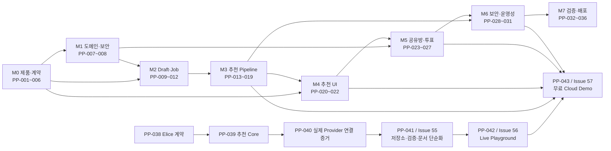

# 플레이스픽 AI 구현 Roadmap

## 문서 역할

이 문서는 구현 순서와 선행 관계만 보여 주는 DAG다. Task의 현재 상태, 담당자,
완료 기준과 토론은 `gdh0730/hub`의 GitHub Issue가 유일한 정본이다. 이 문서에는
Issue 상태, 진행률, 완료 증거와 Work Record 링크를 복제하지 않는다.

Work Record는 Task가 실제로 시작될 때만 만든다. 시작하지 않은 Task를 위해
`planned` Work Record를 미리 만들지 않는다. 완료된 실행 증거는
[archive](archive/README.md), 포트폴리오 관점의 검증된 결론은
[Case Study](case-studies/README.md)에서 찾는다.

## 전체 DAG

PP-037의 Approval Gate·Provider Gateway 기반은 MVP에 사용하지 않는 것으로 종료한다.
그 결정의 배경과 폐기 이유는 [ADR-0009](adr/ADR-0009-mock-local-live-gateway-boundary.md)와
[ADR-0014](adr/ADR-0014-mvp-direct-provider-and-simplified-trust-boundary.md)에 남긴다.

## Task 선행 관계

아래 표는 상태표가 아니다. Issue 상태를 확인하거나 변경할 때는 GitHub Issue만
사용한다.

| Task | 목적 | 선행 Task |
| --- | --- | --- |
| PP-001 | 서비스 경계와 사용자 여정 | 없음 |
| PP-002 | HTTP·보안·오류·멱등성 계약 | PP-001 |
| PP-003 | 도메인·상태·점수·보존 정책 | PP-001 |
| PP-004 | API·Worker·Outbox·이벤트 구조 | PP-001, PP-003 |
| PP-005 | Naver·Elice Provider 정책 | PP-001 |
| PP-006 | 프런트 UX·접근성 명세 | PP-001, PP-002 |
| PP-007 | Flyway·도메인·JPA 경계 | PP-002~004 |
| PP-008 | 익명 세션·capability·CSRF·오류 | PP-002, PP-003 |
| PP-009 | 조건 추출 port·schema·Eval | PP-002, PP-003, PP-005 |
| PP-010 | Draft 생성·조회·수정·만료 | PP-007~009 |
| PP-011 | 추천 Job 202·Outbox·멱등성 | PP-004, PP-007, PP-008, PP-010 |
| PP-012 | Streams relay·retry·DLQ | PP-004, PP-007, PP-011 |
| PP-013 | Naver Local·Blog adapter | PP-005 |
| PP-014 | 후보 정규화·중복 제거·근거 | PP-007, PP-013 |
| PP-015 | 결정론적 점수·Top 3·완화 | PP-003, PP-014 |
| PP-016 | 근거 기반 이유·fallback | PP-003, PP-005, PP-009, PP-015 |
| PP-017 | Worker 전체 pipeline·복구 | PP-012~016 |
| PP-018 | 추천 상태·결과 API | PP-002, PP-017 |
| PP-019 | 추천 진행 SSE | PP-004, PP-017, PP-018 |
| PP-020 | Next.js 프런트 기반 | PP-006 |
| PP-021 | 입력·조건 검토 UI | PP-010, PP-020 |
| PP-022 | 진행·결과·공유 UI | PP-018~020 |
| PP-023 | 투표방 생성·조회·만료 | PP-007, PP-008, PP-018 |
| PP-024 | 투표 변경·삭제·동시성 | PP-008, PP-023 |
| PP-025 | 방 SSE·최종 확정 | PP-004, PP-023, PP-024 |
| PP-026 | 참여자 투표·주최자 확정 UI | PP-020, PP-022~025 |
| PP-027 | 비식별 제품 이벤트 | PP-002, PP-008, PP-023, PP-024 |
| PP-028 | Cache·rate limit·quota | PP-005, PP-009, PP-013, PP-017, PP-024 |
| PP-029 | 실제 Provider runtime 연결 | PP-005, PP-009, PP-013, PP-028 |
| PP-030 | 보안·개인정보·데이터 수명 | PP-007, PP-008, PP-020, PP-023, PP-027~029 |
| PP-031 | 메트릭·대시보드·Runbook | PP-012, PP-017, PP-024, PP-028~030 |
| PP-032 | 전체 자동 검증 matrix | PP-001~031 |
| PP-033 | 승인된 배포 Live E2E | PP-029~032 |
| PP-034 | k6 부하 실험과 기준선 | PP-017, PP-024, PP-031, PP-032 |
| PP-035 | Java 17 운영 image·Demo 구성 | PP-020, PP-029~032 |
| PP-036 | 최종 release·Case Study | PP-033~035 |
| PP-037 | 폐기된 Gate·Gateway 기반 | PP-005; MVP DAG에서 제외 |
| PP-038 | Elice LLM Local Live 계약 | PP-005 |
| PP-039 | 동기 추천 Core와 단계별 검증 | PP-009, PP-013~016, PP-038 |
| PP-040 | Naver→Elice 실제 Core 연결 검증 | PP-039 |
| [PP-041](https://github.com/gdh0730/hub/issues/55) | 저장소·검증·문서 단순화 | PP-040 |
| [PP-042](https://github.com/gdh0730/hub/issues/56) | 실제 값이 보이는 Live Playground | PP-041 |
| [PP-043](https://github.com/gdh0730/hub/issues/57) | 무료 Cloud Demo 배포 | PP-042, 제품 경로 PP-007~035 |

Task를 시작할 때 GitHub Issue를 `in progress`로 바꾸고 필요한 경우에만 Work Record를
만든다. 완료할 때 Issue의 성공 기준, PR과 검증 증거를 대조한다. 현재 실행 순서나 완료
증거는 이 DAG에 복제하지 않는다.
