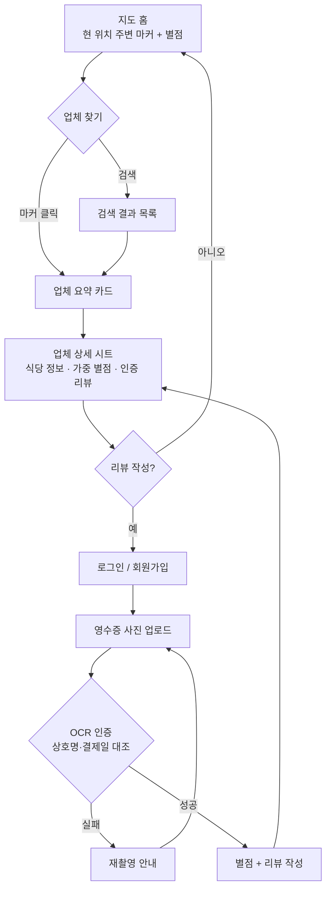

# 기획서 (docs/plan.md)

## 문제 정의

처음 가본 동네에서 식당을 고르는 사람이, 네이버지도는 별점이 없어 전체 평을 한눈에 알 수 없고 카카오맵은 방문 인증 없는 리뷰가 섞여 있어, 어느 가게가 진짜 괜찮은지 판단하기 어렵다.

## 사용자 시나리오

1. 처음 방문한 동네에서 점심 먹을 곳을 찾기 위해 서비스에 접속해 지도를 연다.
2. 현재 위치 주변의 식당 마커들과 각 업체의 가중 별점을 확인한다.
3. 별점이 높은 식당의 상세 페이지에 들어가 긍정 리뷰 / 아쉬운 리뷰 탭과 공감(좋아요)을 많이 받은 리뷰를 훑어보고, 모든 리뷰가 영수증 인증 리뷰임을 확인해 믿고 방문을 결정한다.
4. 식사 후, 받은 영수증을 촬영해 업로드한다. OCR이 상호명·결제일을 검증하면 별점과 리뷰를 작성한다.
5. 이후 다른 이용자들이 이 리뷰에 좋아요를 누르면, 그 공감도가 해당 업체의 가중 별점에 반영된다 (작성일로부터 90일간).

## 핵심 기능 (2개)

- 기능 A — 영수증 OCR 인증 리뷰: 리뷰 작성 시 영수증 사진 업로드가 필수이며, OCR로 상호명·결제일을 추출해 해당 업체와 대조한다. 결제일 30일 이내 영수증만 인정하고, 이미지 해시·승인번호로 중복 사용을 차단한다. 인증을 통과한 리뷰만 등록·집계된다.
- 기능 B — 가중 별점 (좋아요 반영 + 90일 부스트): 5점 별점을 기본으로 하되, 좋아요를 받은 리뷰는 `가중치 = 1 + log₂(1 + 좋아요 수)`로 총점에 더 크게 반영된다. 이 좋아요 가중치와 상위 노출 효과는 리뷰 작성일로부터 90일간만 유지되며, 이후에는 가중치가 기본값(1)으로 복귀해 오래된 인기 리뷰가 현재 평판을 왜곡하지 않도록 한다. 리뷰는 긍정(4~5점)/아쉬움(1~3점) 탭으로 나눠 보여준다.

## 서비스 범위

핵심 서비스는 네이버지도 API와 지도형 UI 위에서 업체 정보를 탐색하고, 영수증 인증 리뷰를 확인·작성하는 것이다. 예약은 주된 기능이 아니며, 필요하면 추후 외부 링크나 부가 기능 수준으로만 검토한다.

## 화면 흐름

